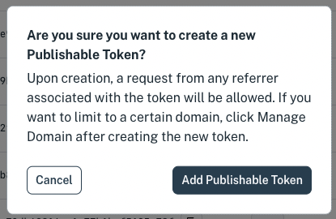
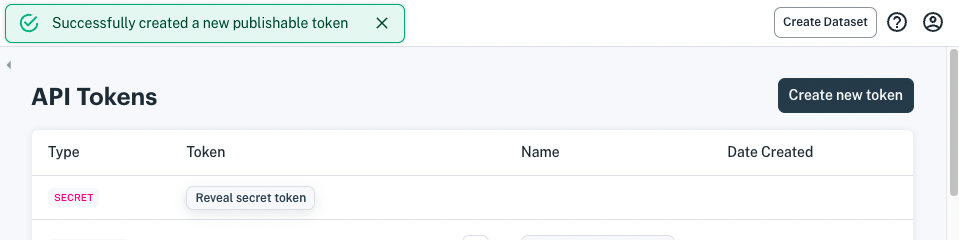
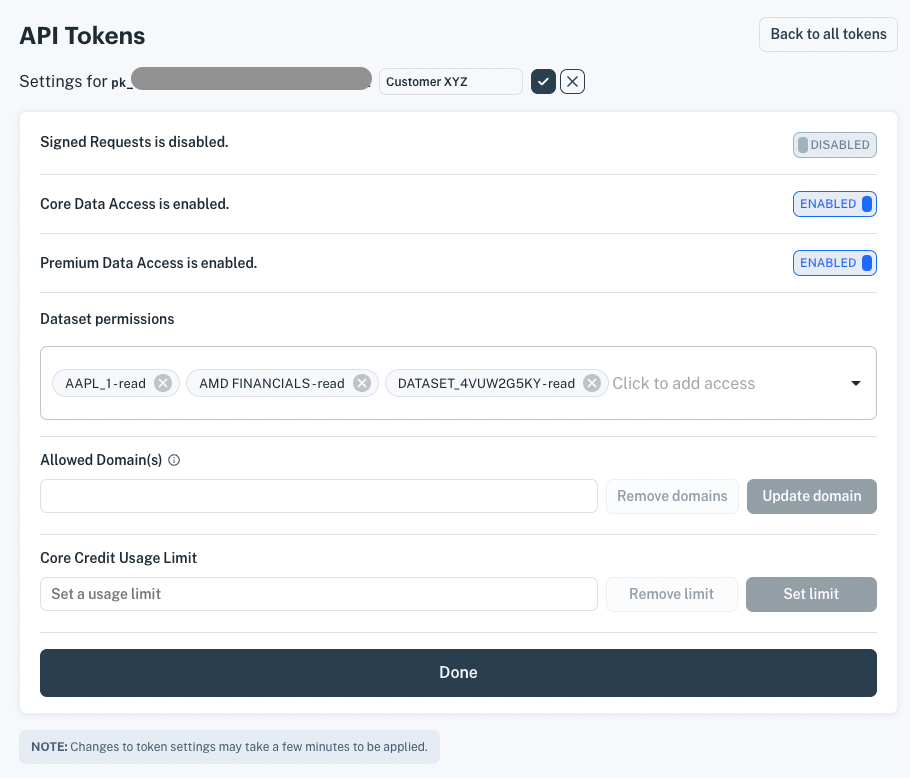

# Access and Security

You can grant users access to individual datasets, core data, and premium data by giving them public API tokens. 

> **Important:** Your secret token allows you to perform any action on your data and account. NEVER share your secret token publicly.

Here's how to create and use a public API token.

1. Navigate to **Access & Security > API Tokens**. The API Tokens page appears, listing your tokens in order, oldest to newest.

1. Click **Create new token**. A dialog window appears and asks if you are sure you want to add a publishable token.
    
    
    
1. Click **Add publishable token**. A new publishable token is added to the bottom of the token list.
    
    
    
1. Edit the token by finding it at the bottom of the token list and clicking on its gear icon or on its token ID. The API token form appears.

1. Define the token. 
    
    **Nickname:** Enter a meaningful name.

    **Signed Requests:** Enables requiring a signature per request.

    **Core Data Access:** Grants access to Core Data.

    **Premium Data Access:** Grants access to Premium Data (requires Premium Data subscription)

    **Dataset permissions:** Grants read/write/delete access to specified datasets.

    **Allowed Domain(s):** Leaving blank allows requests with the token from any domain. Specifying a domain(s) limits requests to be from that domain(s). Read more at [Restrict Domains For Calls Made With A Publishable Key](https://iexcloud.zendesk.com/hc/en-us/articles/1500012485021).

    **Core Credit Usage Limit:** Restricts the number of core credits available to the token.
    
    The token below, for example, can access Core Data and Premium Data, and has read access to three datasets.
    
    

1. When you're done specifying the token, click **Done**. The token's permissions take affect in a couple minutes. Then you can make the specified API calls using the token.

> **Note:** A token's permissions take affect a couple minutes after creating the token.

Now the token can be used in calling the specified APIs.

## What's Next?

Ready to call some dataset APIs? See [Getting Started with Apperate](../getting-started/getting-started-with-an-example-dataset.md).

Want to get your teammates involved? Learn how to add teammates at [Managing Users](./managing-users.md).