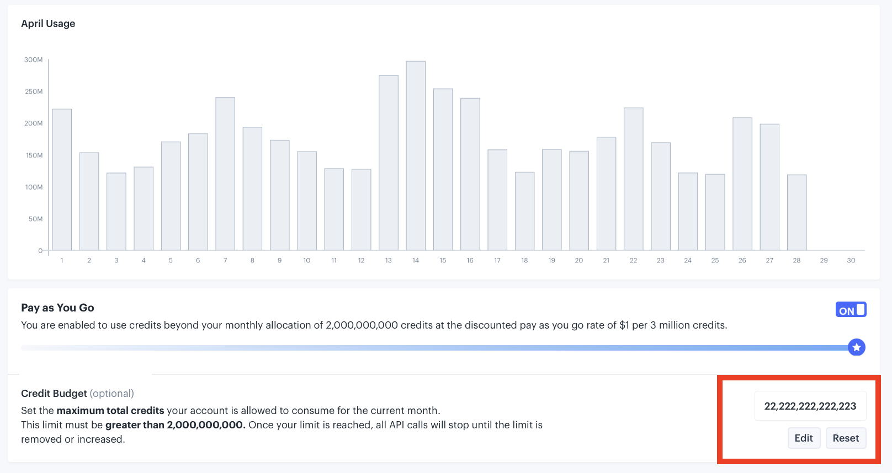

# Budgeting Credit Usage

If you have a legacy Launch, Grow, and Scale plan, you may still use the pay-as-you-go credits billing method - for either Premium Data usage or for overages if you use more credits in a given month than allocated with your plan.

<!-- pay-as-you-go credits linked to 1500012390942 -->

Since pay-as-you-go credits are not prepaid (and you can consume as many as you want on top of your plan), many users prefer to set a limit inside of their IEX Cloud Console to prevent accidental runaway usage.

You can set a “credit budget” for both core data usage and Premium Data usage. To set up, navigate to the Credit Use tab in the IEX Cloud Console and click at the top to either “Core Use” or “Premium Use.”

Under the month’s usage chart, you can set your budget.

## Premium Data credit budgets

**If you are on a legacy Launch, Grow, and Scale plan, a default budget of 100,000,000 credits was set when you enable access to your first dataset.** When this limit is reached, access to Premium Data will be paused until the end of the month or until the limit is modified. You can change this limit at any time in the IEX Cloud Console.

**Questions?** Let us know at <support@iexcloud.io>