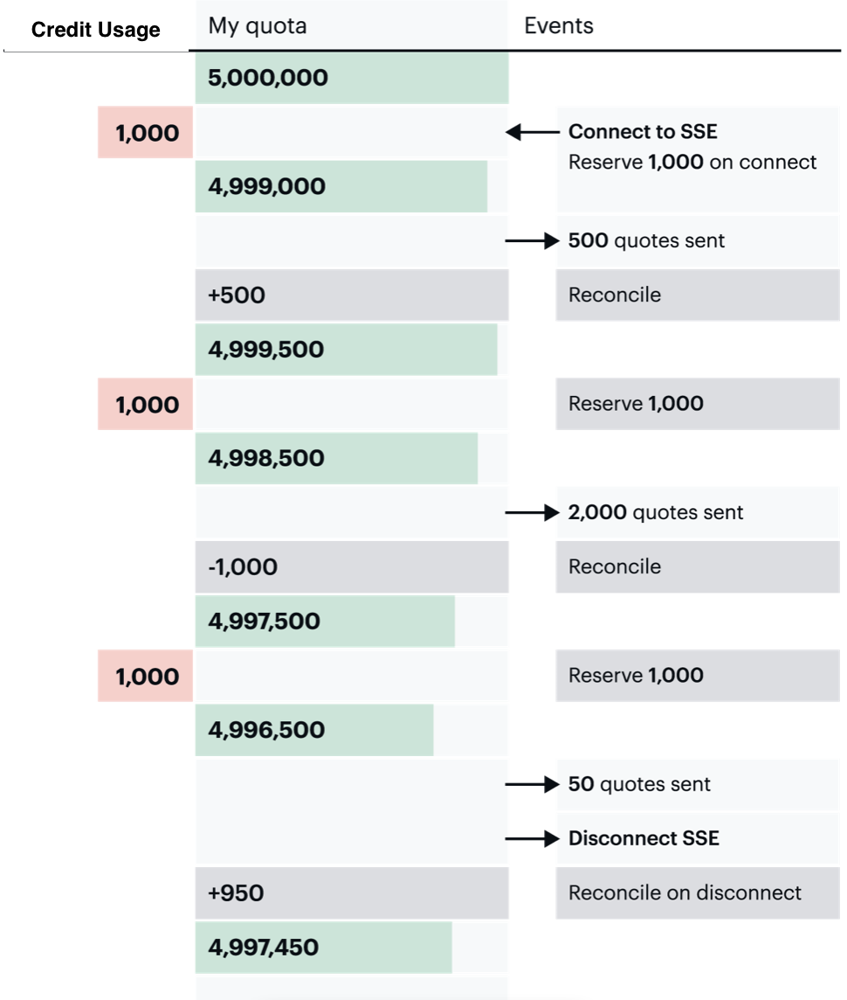

# Legacy Plan Credits and SSE Streaming

We use a special "reserve system" for streaming endpoints due to high data rates. This is similar to how a credit card puts a *hold* on an account and later reconciles the amount.

When you connect to an SSE endpoint, we validate your API token and then attempt to reserve an amount of credits (previously known as messages) from your account. If you have enough credits in your quota, or if you're on a legacy Launch, Grow, or Scale plan and you have pay-as-you-go credits enabled, we allow data to start streaming.

We keep track of the number of credits streamed to your account during the reserve interval.

Once the reserve interval expires, we reconcile usage. This means we compare the number of credits sent to the number of credits we reserved. For example, if you used 1,200 credits, you used 200 more than we reserved; so we use 200 additional credits from your account. If we only used 100 credits, we return the 900 unused credits back to your account.

After reconciling the credits, we attempt another reserve.

The reserve and reconcile process is seamless and does not impact your data stream. If we attempt to reserve credits and your account does not have enough quota and pay-as-you-go is disabled, then we disconnect the SSE streaming service. You can avoid service disruptions by ensuring you have enough packages purchased in advance, or for legacy plans, by enabling pay-as-you-go credits in the Console.

When you disconnect from an endpoint, we reconcile your credit usage immediately.

## Firehose

Legacy Business and Legacy Scale plan users can firehose-stream all symbols (except symbols from DEEP endpoints) by leaving off the symbols parameter.