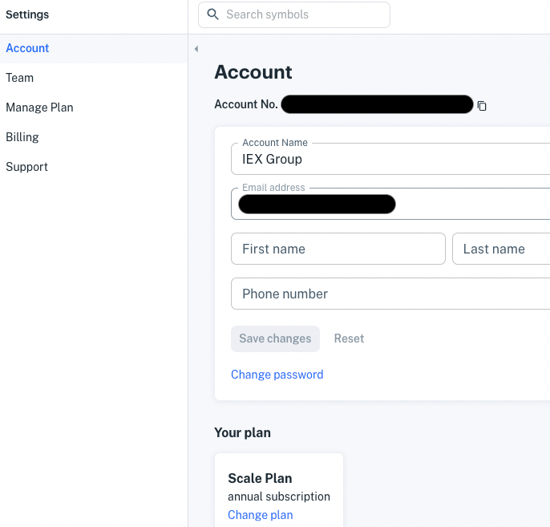
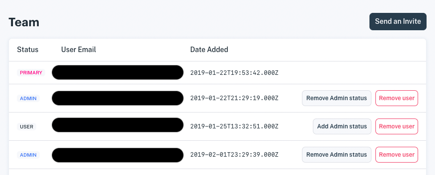
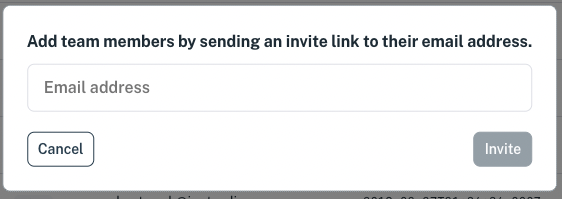

# Manage Users

Here's how to add team members to your IEX Cloud Account:

1. Click account settings (gear icon) at the bottom of left side navigation. The Account settings page appears.

    

1. Open the team settings page by clicking Team in the Settings navigation. The Team settings appear.

    

1. Draft an invitation by clicking Send an Invite. The invitation dialog appears.

    

1. Invite a team member by entering the team member email address and clicking Invite. An invitation email is sent and the team member's email address appears in the Pending Invites list, below the Team list.

    

    The invitation email provides a link to sign up.

After the team member accepts the agreement terms and creates an account, the IEX Cloud console appears for the new team member. The new team member is added to your Team list.

You can manage the team member's privilege status by toggling the admin status button. Click **Add Admin Status** to add admin privileges or click **Remove Admin Status** to remove them. 

You can remove a team member by clicking the remove icon (x) for that team member.

Now you know how to manage team membership and team member privileges.