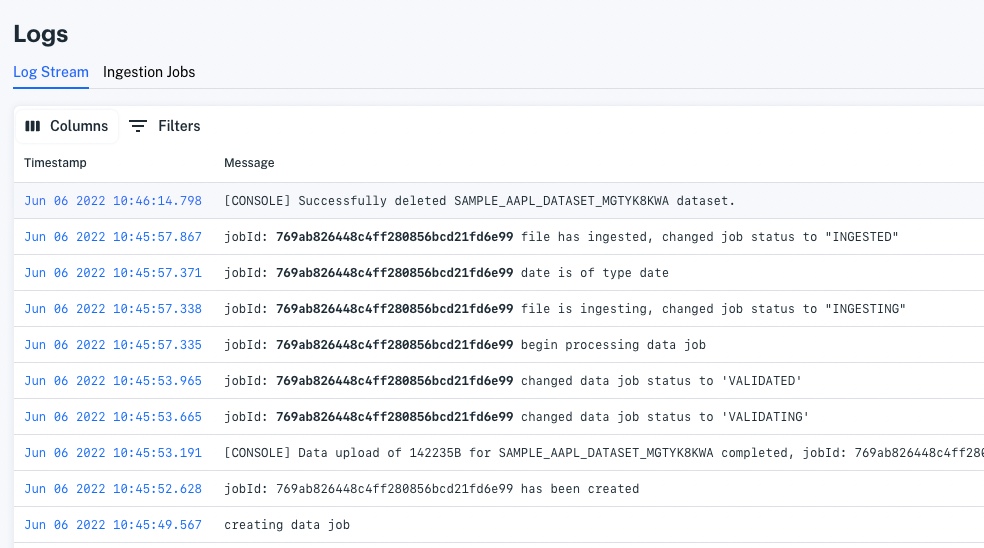
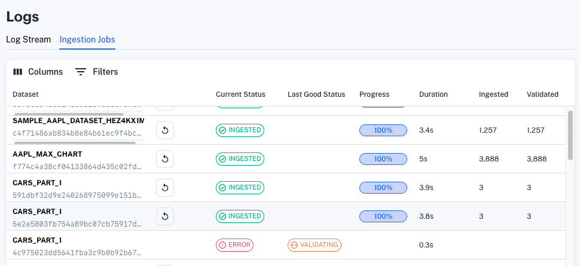

# Monitoring Deployments

Apperate logs your workspace activities. The logs capture basic things such as when items are created, updated, and deleted and process milestones associated with dataset validation, data ingestion, and more. Click on **Logs** in the navigation to show the log pages.

## Log Stream

The **Log Stream** lists activity messages in descending chronological order, most recent messages are at the top. Ingestion jobs include a `JobId`.

For example, the messages for the data ingestion job in the image above include the *769ab8\** job ID. These messages capture the following data ingestion milestones:

1. Creating the data ingestion job (i.e., job `769ab8*`)
1. Data upload
1. Data validation
1. Data processing (i.e., populating the table)
1. Ingestion completion

The Log Stream shows process milestones and the timing of concurrent processes.

## Ingestion Logs

The **Ingestion Logs** page lists each data ingestion job and provides status, record ingestion/validation count, processing times, duplicate record handling type, and data source type. You can use the **Columns** and **Filters** drop downs to show the columns you want and filter on the jobs.

If ingestion fails, the **Last Good Status** column indicates how far the job progressed (e.g., *Validating*). Click on **Current Status** to see the offending error message.  

> **Tip:** To get additional context for an ingestion, search the **Log Stream** for messages mentioning the job ID (shown in the **Datasets** column under the dataset name).

If ingestion completes, the **Current Status** is *Ingested*.

Invalid records are excluded from ingestion. A document icon in the Invalid Records column links to the ingestion job\'s invalid record list.

Click the Invalid Records icon to download a CSV file of the invalid lines.

You can re-run a successful job by clicking the retry job icon (curved arrow) next to the dataset name.

## Related Topics

[Understanding Datasets](../managing-your-data/understanding-datasets.md)

[Glossary](../reference/glossary.md)