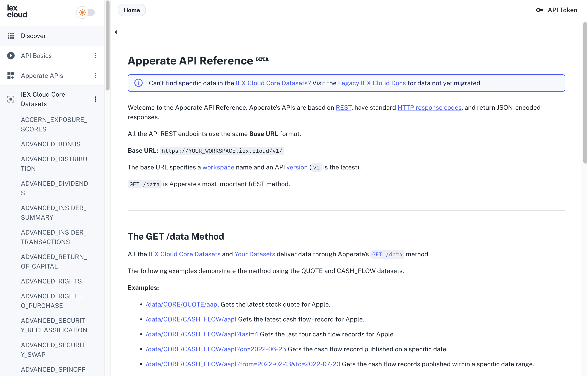
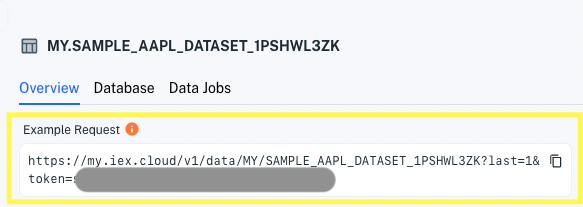

# Using Apperate's APIs

Apperate's APIs are based on [REST](https://en.wikipedia.org/wiki/Representational_state_transfer), have resource-oriented URLs, and return JSON-encoded responses and standard HTTP response codes. 

The [Apperate API Reference](https://iexcloud.io/docs/) (<https://iexcloud.io/docs/>) site describes Apperate's data endpoints and APIs.



```{important} We are in the process of migrating legacy IEX Cloud Core Data to IEX Cloud Core Datasets in Apperate. IEX Cloud's API reference is currently split between Apperate's [API Reference](https://iexcloud.io/docs/) and the [Legacy API Reference](https://iexcloud.io/docs/api/). If the [API Reference](https://iexcloud.io/docs/) doesn't list the data you want, please check the [Legacy API Reference](https://iexcloud.io/docs/api/).
```

The tutorials in this section compliment the API Reference by demonstrating how to complete different tasks using the APIs.

Here are some of the API-related topics.

## Querying Data

The Data API's [`GET /data`](https://iexcloud.io/docs/apperate-apis/data/get-data) endpoint returns data from the dataset you specify. The endpoint supports using windowing functions for [Querying Datasets](../search-data/querying-datasets.md). [Your Datasets](https://iexcloud.io/docs/datasets) pages and [IEX Cloud Core Datasets](https://iexcloud.io/docs/core) pages describe each dataset's `GET /data` endpoint parameters and response attributes.

```{important} We are in the process of migrating legacy IEX Cloud Core Data to IEX Cloud Core Datasets in Apperate. IEX Cloud's API reference is currently split between Apperate's [API Reference](https://iexcloud.io/docs/) and the [Legacy API Reference](https://iexcloud.io/docs/api/). If the [API Reference](https://iexcloud.io/docs/) doesn't list the data you want, please check the [Legacy API Reference](https://iexcloud.io/docs/api/).
```

The **Example Request** on each dataset's **Overview** page demonstrates using the `GET /data` endpoint on that dataset.



[Querying Datasets](../search-data/querying-datasets.md) demonstrates applying windowing functions to the queries.

## Other Data Operations

Instructions for creating, reading, updating, and deleting (CRUD) data records are in this section's articles. The [Data API reference pages](https://iexloud.io//docs/apperate-apis/data) describe the endpoints.

## Operations for Data-Related Entities

API instructions for managing datasets, sources, schedules, credentials, logs, and more are being applied to articles here. 

## Getting an API OAS Document

The [`GET /openapi-doc` endpoint](https://iexcloud.io/docs/apperate-apis/advanced/get-openapi-json) returns a JSON file that specifies the [Apperate APIs](https://iexcloud.io/docs/apperate-apis) per the OpenAPI Specification (OAS). You can generate a client SDK for your favorite language using the JSON file. 

## What's Next

- [Apperate API Reference](https://iexcloud.io/docs/): Visit the API Reference to get familiar with Apperate's APIs. 

- [Query Data](../search-data.md): Query data using Apperate's Data API or using the iex.js library. 