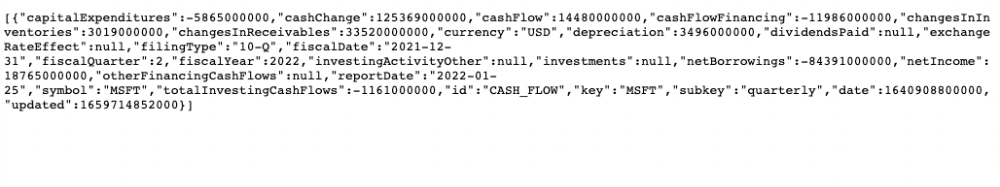
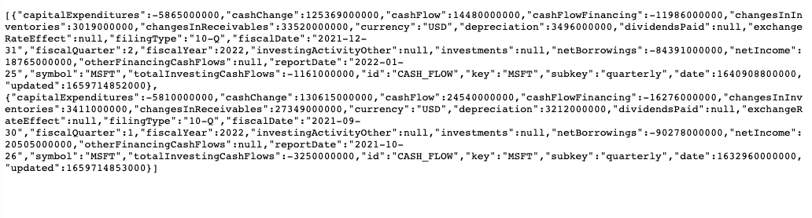

# Apperate's Secret Sauce

Now that you understand [what Apperate is](./what-is-iex-cloud-apperate.md), and the performance and reliability it provides, check out the key features that set Apperate apart from other data cloud providers. Here are the key "ingredients" to Apperate's "secret sauce":

- Safer, Cleaner Data
- Data Identifier Translation
- A Simple, Powerful Data API

## Safer, Cleaner Data

When you load data into Apperate, it automatically generates a data schema and indexes. You can keep them or adjust them the way you want. Apperate validates all incoming data against the schema, storing the valid records and rejecting the invalid records. It reports each validation failure to a downloadable log file.

The following video demonstrates data validation using a file containing a bad record.

<video width="320" height="240" controls>
  <source src="../_static/data-validation-demonstration.mp4" type="video/mp4">
Your browser does not support the video tag.
</video>

By stiff-arming the invalid data and providing an error log right away, you can keep your data safe and clean, and can address rejected data.

## Data Identifier Translation

It's common to reference the same data records using different identifiers (indexes). In the financial data, for example, a particular security can be represented using various types of identifiers, including CUSIP, FIGI, INET, ISIN, and more. Apperate's SmartLinks feature translates security identifiers automatically, enabling you and your customers to query the data using ticker symbols you prefer. 

The following video demonstrates how Apperate enables you to query across equivalent security identifiers and join data on the identifiers.

<video width="320" height="240" controls>
  <source src="../_static/joining-on-normalized-aapl-data.mp4" type="video/mp4">
Your browser does not support the video tag.
</video>

Identifiers can change, of course. Company spinoffs and mergers, for example, result in new and modified security identifiers. Apperate tracks these changes and implements SmartLinks for them, so you can reference the securities without missing a beat.

Apperate SmartLinks takes care of all this, giving you powerful data functionality and freeing you to concentrate on building your business, instead of spending time and money mapping security identifiers and tracking their changes.

## A Simple, Powerful Data API

In Apperate, you get data by calling the `GET /data/` HTTP method + **dataset path** -- everything else is boilerplate.

For example, a URL like the one below gets data from a dataset called `SOME_DATASET` in your workspace.

> https://**yourworkspace**.iex.cloud/**version**/data/**yourworkspace**/`SOME_DATASET`?token=**yourtoken**

**Boilerplate items:**

- **yourworkspace:** Your [workspace](./getting-started-with-apperate.md#create-a-workspace) name serves as your subdomain and your dataset namespace.
- **version:** `v1` is the latest [API version](https://iexcloud.io/docs/api-basics/versioning).
- **yourtoken:** An [API token](../administration/access-and-security.md) permissioned to access the dataset.

Apperate's [Core datasets](./production-ready-core-data.md) are just as easy to query. Get cash flow data with a URL like this:

> https://**yourworkspace**.iex.cloud/v1/data/CORE/CASH_FLOW?token=**yourtoken**

> **See Also:** The [Core Data](https://iexcloud.io/docs/core) API reference pages describe all the Core endpoints.

Dataset records are uniquely identified by these indexes:

- **key:** A required column that serves as the primary index.
- **subkey:** (optional) If specified for a column, the column is required and serves as a secondary, additional index.
- **date:** If specified for a column, the column is required and serves as a time-windowing index. If not specified, Apperate transparently uses the record's creation timestamp.

The following queries return a record and range of records using the key and date indexes. 

### Search for a Specific Record

Set the key value as a path parameter and set the date the `on` query parameter to get a specific cash flow record.

Query:

> https://**yourworkspace**.iex.cloud/v1/data/CORE/CASH_FLOW/MSFT?on=2021-12-31&token=**yourtoken**

Result:

### Search for a Range of Records

Set the key value and set the date range using the `from` and `to` query parameters.

Query:

> https://**yourworkspace**.iex.cloud/v1/data/CORE/CASH_FLOW/MSFT?from=2021-07-01&to=2021-12-31&token=**yourtoken**

Result:

> **See Also:** The [GET /data](https://iexcloud.io/docs/apperate-apis/data/get-data) page describes all the parameters available for querying data.

You can call all Apperate API REST endpoints in the language you want. Apperate's [iex.js library](../developer-tools/iexjs-library.md) makes JavaScript calls a snap and our [OpenAPI document](https://iexcloud.io/docs/apperate-apis/advanced/get-openapi-json) enables you to generate SDKs in many popular languages.

Now you know Apperate's recipe that fuels application development success! Bon appetite!!

## What's Next

[Get Started with Apperate](./getting-started-with-apperate.md) now that you're familiar with its game-changing features.

Or check out these articles to discover more of what Apperate offers:

- [Write and Read a Record](./write-and-read-a-record.md): shows you how easy it is to write data to an Apperate table and retrieve the resulting record using the iex.js client.

- [Production-Ready Core Data](./production-ready-core-data.md): highlights the 5+ terabytes of financial data built in to Apperate and accessible via the Data API `GET /data` endpoint. This includes real-time data such as equity quotes and news, and historical data such as cash flow, dividends, company information and much much more.