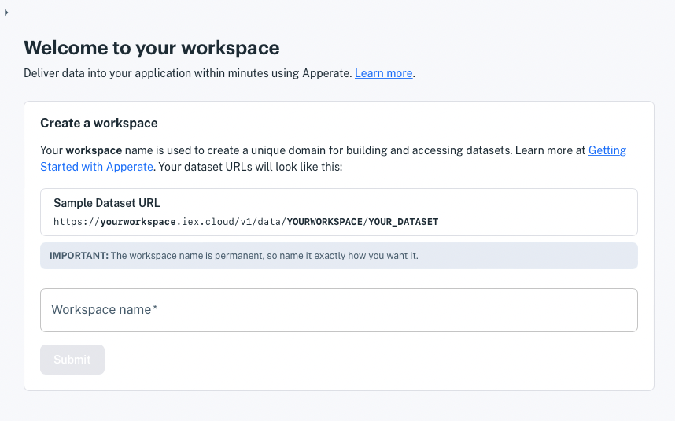

# Creating a Workspace

A *workspace* is your unique domain for writing data and querying it, and delivering data to a apps. Your workspace name appears in your API URLs and is used in Apperate API calls, such as `GET /data/:workspace`.

**Base URL:**

```
https://WORKSPACE.iex.cloud/v1
```

**Example Workspace URL:**

```
https://mycompany.iex.cloud/v1
```

In the URL above, the workspace name `mycompany` is the subdomain of `iex.cloud`.

It's time to create a workspace.

**Prerequisites:**

- **IEX Cloud Apperate account** - Create one [here](https://iexcloud.io/cloud-login#/register).
- **Apperate workspace** - See [Creating a Workspace](../getting-started/creating-a-workspace.md). 

## Steps

Here's how to create a workspace:

1. Click on the link in your invitation email. The welcome page appears and prompts you to create your workspace.

    

1. Name your workspace.

    ``` {important} The workspace name is permanent, so make sure to name it exactly how you want it.
    ```

    Workspace names have the following requirements.

    **Name requirements:**

    - Starts with a letter
    - Ends with a letter or number
    - Uses only lowercase alphanumeric characters and dashes
    - Is between 2-63 characters long
    - DOES NOT consist of ALL numeric values

1. After agreeing to the terms, click **Submit**. The **Create a dataset** page appears.

    

Your workspace is created and ready for delivering data to your apps!

## What's Next

Since you're on the **Create a Dataset** page, why not continue with creating a dataset?

Got a CSV or JSON data file? Simply drop it onto any console page, and Apperate creates a new dataset from it! [Getting Started with Apperate](./getting-started-with-apperate.md) explains all that Apperate creates for new datasets and the options available from the dataset's **Overview** page, and more.

Or you can [create a dataset from our example data file](./getting-started-with-apperate.md) to experience creating a new database schema, adding those records to a dataset, and accessing the records via auto-generated APIs.

You can also create a dataset schema without data, write a record to it using the data API, and fetch that record using dataset's auto-generated API. [Writing and Fetching a Data Record](../getting-started/writing-and-fetching-a-record.md) shows you how.

Lastly regarding new datasets, you can explore various ways of [Migrating and Importing Data](../migrating-and-importing-data.md), including [loading data from an AWS S3 bucket](source/migrating-and-importing-data/loading-data-from-aws-s3.md) and [loading data from a URL](../migrating-and-importing-data/loading-data-from-a-url.md). You can even [schedule data ingestion](../migrating-and-importing-data/scheduling-data-ingestion.md) from any of the data sources.

If you are interested in using IEX Cloud Core Financial Data in your apps, **Cancel** out of the **Create a Dataset** page and get started with core data at [Using IEX Cloud Core Financial Data](../using-core-data.md).

``` {note} The Create a Dataset button is available on console top menu bar, from the console **Home** page, and from the **Datasets** pages.
```
