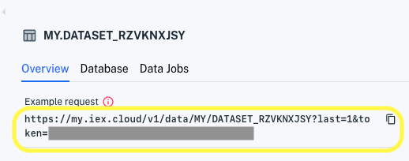

# Getting Started with Apperate

Here we'll set up a workspace and then in a matter of seconds make data available for apps to use.

**Important:** If you don't already have an IEX Cloud account, create one [here](https://iexcloud.io/cloud-login#/register).

## Setting Up Your Workspace

A *workspace* is your unique domain for writing data and querying it, and delivering data to your apps. Your workspace name appears in your API URLs.

**Workspace URL format:**

```
https://WORKSPACE.iex.cloud/...
```

**Example Workspace URL:**

```
https://mycompany.iex.cloud/...
```

In the URL above, the workspace name `mycompany` is used as a subdomain of `iex.cloud`. 

Here's how to create your workspace:

1. Click on the link in your invitation email. The welcome page appears and prompts you to create your workspace.

    

1. Name your workspace.

    > **Important:** The workspace name is permanent, so make sure to name it exactly how you want it.

    Workspace names have the following requirements.

    **Name requirements:**

    - Starts with a letter
    - Ends with a letter or number
    - Uses only lowercase alphanumeric characters and dashes
    - Is between 2-63 characters long
    - DOES NOT consist of ALL numeric values

1. After agreeing to the terms, click **Submit**. The **Create a dataset** page appears.

    

Your workspace is created and ready for delivering data to your apps!

## Delivering Data

Here you will load IEX Cloud's sample data file and then access the loaded data from an auto-generated REST endpoint.

1. If you're not already in the **Create a dataset** page, click **Create a dataset** at the top right of the console. The **Create a dataset** page appears. The image below highlights the sample file link that you will click in the next step.

    

    Optionally, enter a more meaninfgul the dataset ID.

1.  In the **Create a dataset** page, keep the source type set to **Local file** and load the sample data file by clicking **Try using our sample file**. Apperate loads the data into a new dataset, generates a REST endpoint for the dataset, and shows the dataset overview in the console.

    

    Notice these fields:

    - **Example request** is a REST endpoint URL for getting the dataset's last row.
    - **Rows** shows the dataset's row count is 1,257.
    - **Detected symbol** is the data property designated as the primary index. Apperate makes a best effort to determine a primary index. 
    
    > **Note:** you can change the primary index and other parts of the dataset schema using the schema editor available by clicking **Edit schema**.

    The **HTTP request** panel shows the dataset's last row as a JSON object.

    ```json
    [
        {
            "close": 148.64,
            "date": "2021-10-25",
            "high": 149.37,
            "low": 147.6211,
            "open": 148.68,
            "symbol": "AAPL",
            "volume": 50720556
        }
    ]
    ```

1. Get your dataset's last row by clicking the **Example request** URL.

    

    The URL opens in a new browser tab and the response appears as a JSON object.

    ```json
    [{"close":148.64,"date":"2021-10-25","high":149.37,"low":147.6211,"open":148.68,"symbol":"AAPL","volume":50720556}]
    ```

You just loaded data into IEX Cloud Apperate and retrieved it using an auto-generated REST API! It's just that easy to make data available to your apps!!

## What's Next

After creating a dataset, you can edit its schema to meet your needs. For more information on working with dataset schemas, please see [Understanding Datasets](../managing-your-data/understanding-datasets.md).

Here you loaded data from a file but you can load data from other sources, including URLs and AWS S3 buckets. To learn more about using other sources and scheduling automated data ingestion, check out [Migrating and Importing Data](../migrating-and-importing-data.md).

Otherwise, learn how to write a record to a dataset as you would write from an application, and then fetch that record. [Writing and Fetching a Record](./writing-and-fetching-a-record.md) shows you how.