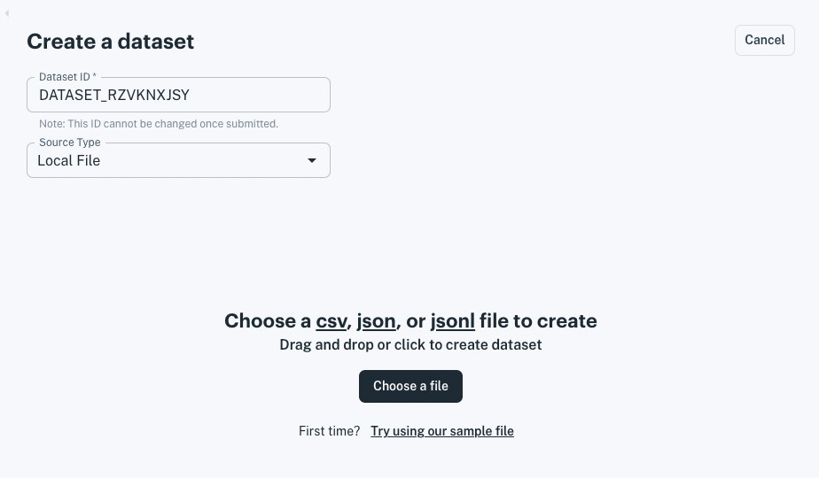

# Getting Started with Apperate

> **Note:** IEX Cloud Apperate is available exclusively to select Early Access Program participants If you would like to participate in the Early Access Program or Beta, please email us at `product@iexcloud.io`.

Here we'll set up a workspace, give you a quick tour of Apperate, and then go through an example of delivering data for apps to use.

**Important:** If you don't already have an IEX Cloud account, create one [here](https://iexcloud.io/cloud-login#/register).

## Setting Up Your Workspace

A *workspace* is your unique domain for writing data and querying it, and delivering data to your apps. Your workspace name appears in your API URLs.

**Workspace URL format:**

```
https://WORKSPACE.iex.cloud/v1/...
```

**Example Workspace URL:**

```
https://mycompany.iex.cloud/v1/...
```

In the URL above, the workspace name `mycompany` is used as a subdomain of `iex.cloud`. 

Here's how to create your workspace:

1. Click on the link in your Early Access program invitation email. The welcome page appears and prompts you to create your workspace.

    

1. Name your workspace.

    > **Important:** The workspace name is permanent, so make sure to name it exactly how you want it.

    Workspace names have the following requirements.

    **Name requirements:**

    - Starts with a letter
    - Ends with a letter or number
    - Uses only lowercase alphanumeric characters and dashes
    - Is between 2-63 characters long
    - DOES NOT consist of ALL numeric values

1. After agreeing to the terms, click **Submit**. The **Create a dataset** page appears.

    

Your workspace is created and ready for delivering data to your apps!

## Example: Delivering Data

Here you will load IEX Cloud's sample data file and then access the loaded data from a REST endpoint.

1. If you're not already in the **Create a dataset** page, click **Create a dataset** at the top right of the console. The **Create a dataset** page appears. The image below has **Use IEX Cloud's sample file** highlighted for clicking in the next step.

    

1.  In the **Create a dataset** page, load the sample data file by clicking **Use IEX Cloud's sample file** in the bottom right. The file uploads and the **Edit schema** interface appears.

    

    **Dataset ID** - Name your dataset by giving it a unique ID. On data ingestion, Apperate makes a best effort to name your dataset, using the data source name (e.g., file name). If a dataset exists with that name, Apperate suggests a suffix to make the dataset ID unique. 

    > **Important:** The `_system` prefix (case-insensitive) is reserved for Apperate system tables and columns. Do not start any dataset or dataset property names with `_system`.

    **Properties (table)** The product makes a best effort to derive data property names using the column names the dataset provides and to derive data types from the data values. Lastly, Apperate attempted to determine a Unique Index composed of a primary index key, secondary index key (optional), and date index key.

    In this case, Apperate correctly set *symbol* as the primary index key and *date* as the date index key. The property types were detected correctly too. We could set a secondary index key too, but we will decline.

    There are more options and content below the *Properties* table.

    

    **Sample API Call** - Shows a URL for getting data from the dataset using the current Unique Index.

    **Unique Index Example** - Illustrates the current Unique Index, composed of the Primary index, Secondary index (optional), and Date index.

    **Opt in to IEX Cloud's Metadata Graph** - Provides the opportunity to map a property to IEX Cloud's metadata data graph of [financial identifiers](../reference/financial-identifiers.md). This allows you to enrich your dataset by joining it to IEX Cloud core equities data or any other dataset that is also opted in. Furthermore, you can ingest data into and query for data in this dataset using IEX Cloud's supported financial identifiers.

    > **See Also:** You can learn more about dataset schemas by reading [Understanding Datasets](../managing-your-data/understanding-datasets.md).

    IEX Cloud correctly identified the *symbol* property as containing financial identifiers and therefore opted the dataset in to IEX Cloud's metadata graph.
    
    Since this schema defines our dataset the way we want, click **Create Dataset Now**. The product builds and stores your dataset and your dataset overview appears.

    

    **Milestone alert!** You just loaded data, defined the data's types and its unique time series compatible index, and generated its auto-documented API! Let's access the data, next.

1.  In your dataset overview, get your dataset's last record by clicking the **Example Request** URL.

    

    The URL opens in a new browser tab and the REST endpoint JSON response appears.

    

You just loaded data into the IEX Cloud Apperate and retrieved it using an auto-generated RESTful API! It's just that easy to get data to your apps!!

**Bonus step - visit your API docs** by clicking **Open API Docs**
in your dataset's overview page. Your API docs structure appears.


> **Tip:** You can document your dataset properties in the schema editor. To edit your dataset schema, click **Edit Schema** in the dataset's overview page.

Congratulations on making data available using a dataset!

## What's Next

Now that you are familiar with creating a dataset from the sample data, you can create datasets using your own data. See [Migrating and Importing Data](../migrating-and-importing-data.md) for details. 

Want to learn more about creating and managing datasets? Read [Understanding Datasets](../managing-your-data/understanding-datasets.md).

Otherwise, learn how to write a record to Apperate, just as you would write from an application, and then fetch that record. See [Writing and Fetching a Record](./writing-and-fetching-a-record.md)

---
[Go to Docs Home](https://github.com/iexcloud/docs/blob/main/README.md)