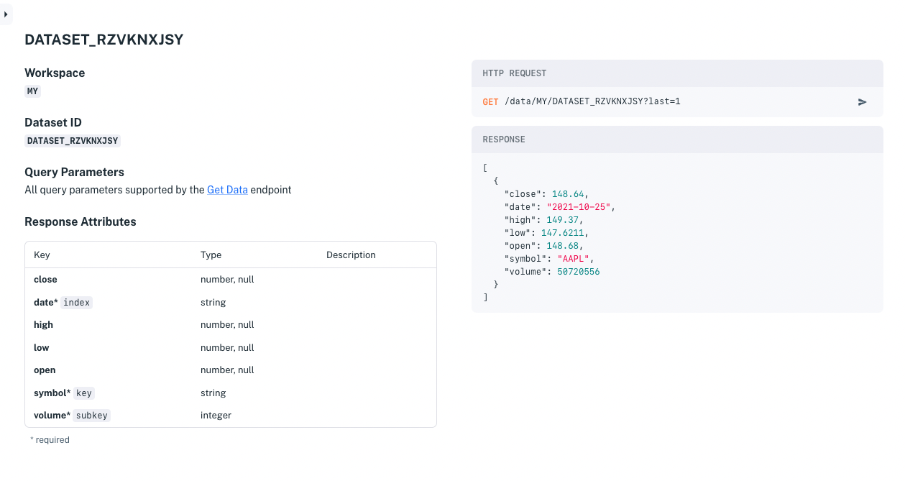

# Get Started with Apperate

A great way to get familiar with Apperate is to write data to it and access that data. Apperate stores data in [datasets](../reference/glossary.md#dataset); they're schema-based database tables that come with additional benefits. Datasets can store any data model, and are optimized for time series data. For each dataset, Apperate automatically generates a permissioned API and API docs.

Here's how we'll get started with Apperate:

1. Create a workspace
1. Load data and generate a dataset for it in one step 
1. Read data from the dataset endpoint

``` {attention} If you don't already have an **IEX Cloud Apperate account**, create one [here](https://iexcloud.io/cloud-login#/register).
```

## Create a Workspace

A [*workspace*](../reference/glossary.md#workspace) is your unique domain for writing data to Apperate and querying data (your data and Apperate's built-in core financial data) from Apperate. Your workspace name appears in your [API Base URL](../interacting-with-your-data/apperate-api-basics.md).

**Base URL Format:**

```
https://WORKSPACE.iex.cloud/v1
```

**Base URL Example:**

```
https://mycompany.iex.cloud/v1
```

Workspace name `mycompany` in the URL above, is the subdomain of `iex.cloud`.

``` {important} The workspace name is permanent, so make sure to name it exactly how you want it.
```

Create your workspace:

1. Click on the link in your invitation email. The **Create a Workspace** page appears.

    

1. Name your workspace and agree to the terms when you're ready. Then create your workspace by clicking **Submit**. The **Create a dataset** page appears.


Your workspace is ready for storing new data and accessing built-in Core Data! It's time to load some data into Apperate.

## Load Data in One Step

Here you will create a dataset from a data file.

``` {note} If you're not already in the **Create a dataset** page, click **Create a dataset** at the top right of the console. 
```

On the **Create a dataset** page, name your dataset and keep the source type set to **Local file**. Load the sample data file by clicking **Try using our sample file**.


Your new dataset's **Overview** page appears.


``` {seealso} For **Overview** page details, see [Dataset Overview Page](../reference/dataset-overview-page.md) reference.
```

Let's test drive the dataset by reading data from it.

## Read the Data

From the Overview page, read data from your new dataset by clicking the **Example request** URL.


The URL opens in a new browser tab and the request returns a JSON object containing the dataset's last record.

```json
[
    {
        "close": 148.64,
        "date": "2021-10-25",
        "high": 149.37,
        "low": 147.6211,
        "open": 148.68,
        "symbol": "AAPL",
        "volume": 50720556
    }
]
```

``` {tip} The **Example request** URL uses the [Data API](https://iexcloud.io/docs/apperate-apis/data/). You can use the URL as a base on which to query the dataset using other parameters and values. See [Querying Datasets](../interacting-with-your-data/querying-data/querying-datasets.md) for examples.
```

## Visit Your API Docs

From the Overview page, you can visit your dataset API docs by clicking **Open Docs**. Your API docs page, like the one shown below, opens in a new tab.



Your auto-documented dataset is ready for consumption.

You just loaded data into Apperate and retrieved a record from the dataset using the dataset's API! It's just that easy to store data in Apperate and make that data available to your apps!!

## What's Next

After creating a dataset, you can edit its schema however you like. For more information on managing datasets, please see [Understanding Datasets](../managing-your-data/understanding-datasets.md).

Here are key features to dive into next:

- [Read and Write Data](./write-and-read-a-record.md) demonstrates creating a dataset manually and using Apperate's Data API to write data to the dataset and read the data back. This simulates what you'd do in storing/retrieving your application's custom data (e.g., user data).

- [Production-Ready IEX Cloud Core Data](./production-ready-core-data.md) introduces Apperate's built-in core financial datasets and [Using Core Data](../using-core-data.md) guides you in using them.

- [Migrate and Import Data](../migrating-and-importing-data.md) provides tutorials for loading data from various data sources including these:

    - [AWS S3 buckets](../migrating-and-importing-data/loading-data-from-aws-s3.md)
    - [URLs](../migrating-and-importing-data/loading-data-from-a-url.md)
    - [Files](../migrating-and-importing-data/loading-data-from-a-file.md)