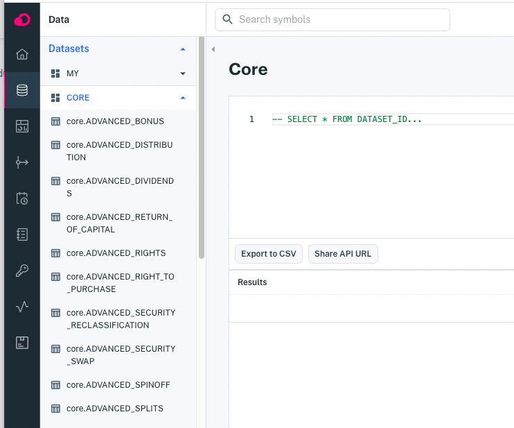
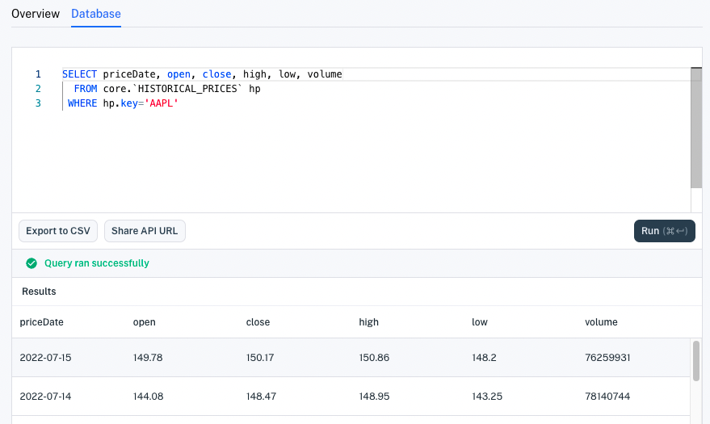
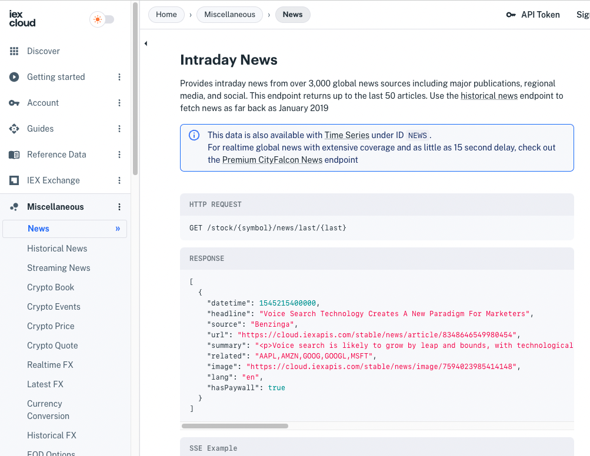

# Production-Ready Core Data

IEX Cloud Apperate comes with 5+ terabytes of built-in data to power fintech applications and more. Here are some of the data types:

- Stocks / Equities
- Forex / Currencies
- Options
- Futures
- Commodities
- Economic Data
- Rates
- News
- Symbols / Mappings

```{important} Apperate includes only historical time series Core Data at this time. We are in the process of migrating real-time legacy data, including stock quotes, into Apperate. In the meantime, please see the [Legacy API Reference](https://iexcloud.io/docs/api/) for the real-time legacy data.
```

Let's explore the Core Data.

## Exploring Core Data

All the data is available at REST API endpoints, and much of the data is available as [datasets](../reference/glossary.md#dataset) (requires Apperate plan) that you can also use in [views](../managing-your-data/creating-and-managing-views.md). Apperate lists these datasets (Core Data) at [**Data > Datasets > Core**](https://iexcloud.io/console/datasets/core).



Like all Apperate datasets, you can access their records via REST endpoints and via the dataset SQL editor.



The [Apperate API Reference](https://iexcloud.io/docs/) describes all the Core Data REST endpoints.



Now you're familiar with Core Data.

## What's Next

If you want to use IEX Cloud Core Data in your apps, please see [Using IEX Cloud Core Financial Data](../using-core-data.md).

If you need to store application data, learn how at [Writing and Fetching a Data Record](../getting-started/writing-and-fetching-a-record.md).

If you have data that you'd like to use with your apps, pull it into Apperate as demonstrated in [Migrating and Importing Data](../migrating-and-importing-data.md).

```{note} IEX Cloud documentation for the legacy plan subscribers is at <https://iexcloud.io/docs/api/>.
```