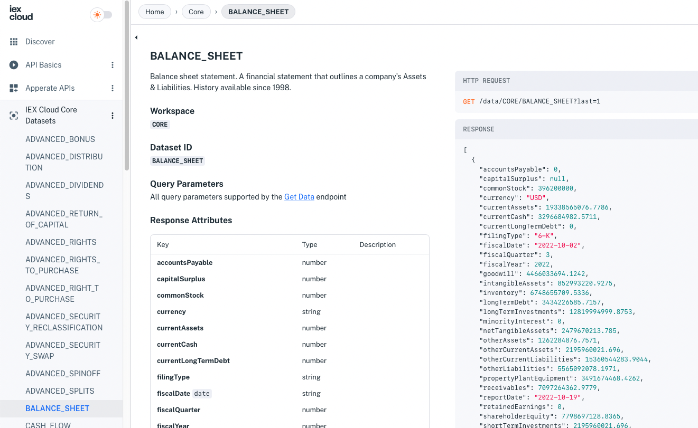
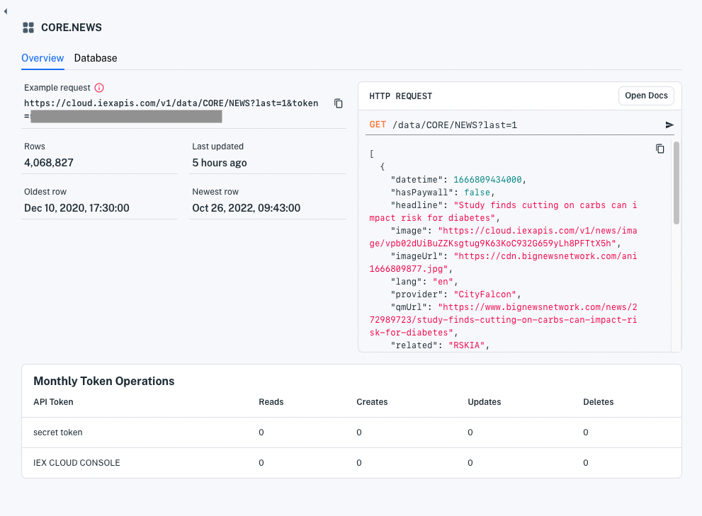
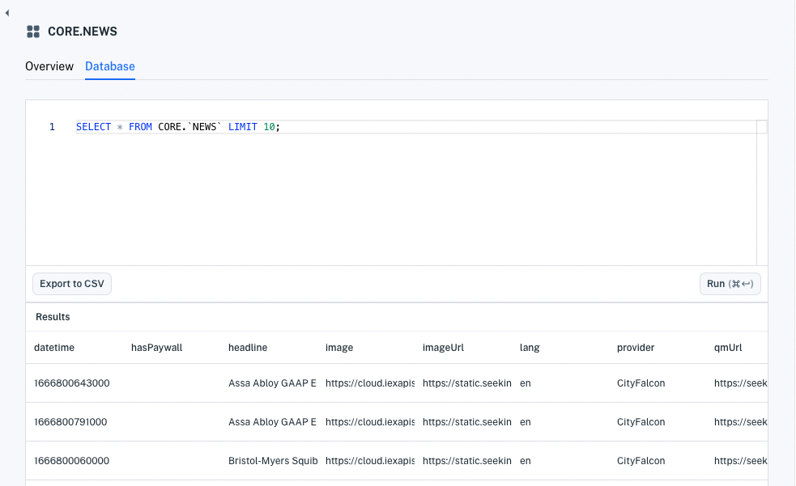
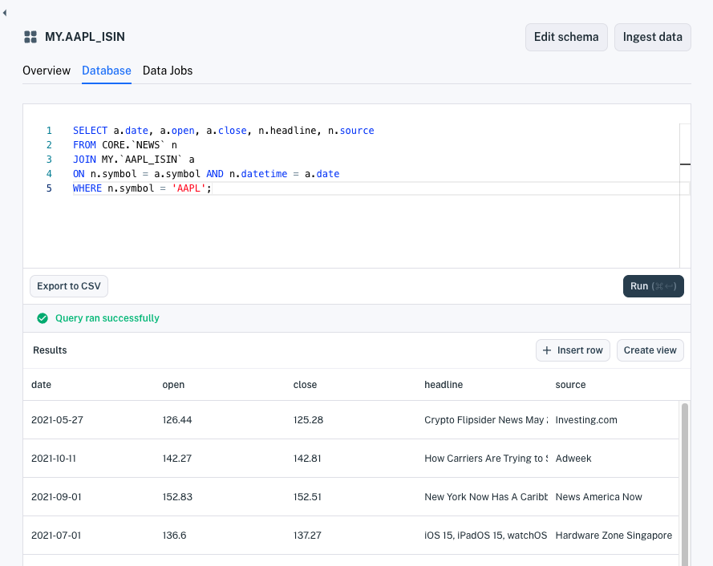

# Production-Ready IEX Cloud Core Financial Data

IEX Cloud Apperate comes with 5+ terabytes of built-in data to power fintech applications and more. Here are some of the data types:

- Stocks / Equities
- Forex / Currencies
- Options
- Futures
- Commodities
- Economic Data
- Rates
- News
- Symbols / Mappings

All the data is available via REST endpoints and much of the data is available as [datasets](../reference/glossary.md#dataset) (requires an Apperate plan) that you can join together to make [views](../managing-your-data/creating-and-managing-views.md).

```{important} We are in the process of migrating legacy IEX Cloud Core Data to IEX Cloud Core Datasets in Apperate. IEX Cloud's API reference is currently split between Apperate's [API Reference](https://iexcloud.io/docs/) and the [Legacy API Reference](https://iexcloud.io/docs/api/). If the [API Reference](https://iexcloud.io/docs/) doesn't list the data you want, please check the [Legacy API Reference](https://iexcloud.io/docs/api/).
```

```{note} IEX Cloud documentation for the legacy plans is at <https://iexcloud.io/docs/api/>.
```

Here we'll show you a Core Financial Data endpoint page and tour a Core Financial Dataset in the console.

## Explore Core Financial Data Endpoints

In the [API Reference](https://iexcloud.io/docs/), the [IEX Cloud Core Datasets](https://iexcloud.io/docs/core) section lists the IEX Cloud Core Financial Dataset endpoint reference pages. 

For example, the image below shows the Balance Sheet page.



Each endpoint reference page specifies the workspace, dataset ID, and response attributes, and includes an example HTTP request and response.

The [Legacy API Reference](https://iexcloud.io/docs/api/) describes core data endpoints that have not yet been migrated to Apperate datasets.

You can get core data by calling the REST endpoints. The following articles demonstrate querying core data.

- [Get Real-Time IEX Cloud Core Financial Data](../using-core-data/getting-real-time-core-financial-data.md)
- [Get Historical IEX Cloud Core Financial Data](../using-core-data/getting-time-series-core-financial-data.md)
- [Querying Datasets](../interacting-with-your-data/querying-data/querying-datasets.md)

## Query Core Financial Data in the Console

The console (requires an Apperate plan) provides Core Financial Dataset information and a SQL interface. The Core Financial Datasets are available in the console at [**Data &rarr; Datasets &rarr; Core**](https://iexcloud.io/console/datasets/core).


Click the name of a Core Financial Dataset to see its overview. Here's the News dataset overview.



The **Overview** provides these things:

- Example request you can execute (click it) and use as basis for your requests
- **Open Docs** reference page link
- Dataset statistics
    - Row count
    - Last update time
    - Oldest row date
    - Newest row date
    - CRUD operation count by console users
    - CRUD operation count per [API token](../administration/access-and-security.md)

Click the **Database** tab to open the **Database** page.



The **Database** page has an editor for running queries. You can [create database views](../using-core-data/using-normalized-financial-data.md) and export query results to CSV files.



The IEX Cloud Core Financial Datasets offer a lot of data and it's [normalized by Apperate SmartLinks](../reference/glossary.md#smartlink) too!

## What's Next

Now that you've been introduced to IEX Cloud Core Financial Data, here are some topics to consider next.

[Using Core Financial Data](../using-core-data.md): These articles demonstrate querying real-time and time series data, and leveraging normalized financial symbols. 

[Migrating and Import Data](../migrating-and-importing-data.md): These articles demonstrate loading data from various data sources, including AWS S3 buckets, URLs, and files.

[Writing and Reading a Record](../getting-started/write-and-read-a-record.md): Shows you how to write individual data records to Apperate and read them back.

[Managing Your Data](../managing-your-data.md): This section provides guides that explain dataset schemas, creating views, and creating datasets via the Datasets API.

[Interacting With Your Data](../interacting-with-your-data.md): These articles introduce Apperate API basics, show how to query datasets, and demonstrate updating data.

```{note} IEX Cloud documentation for the legacy plans is at <https://iexcloud.io/docs/api/>.
```