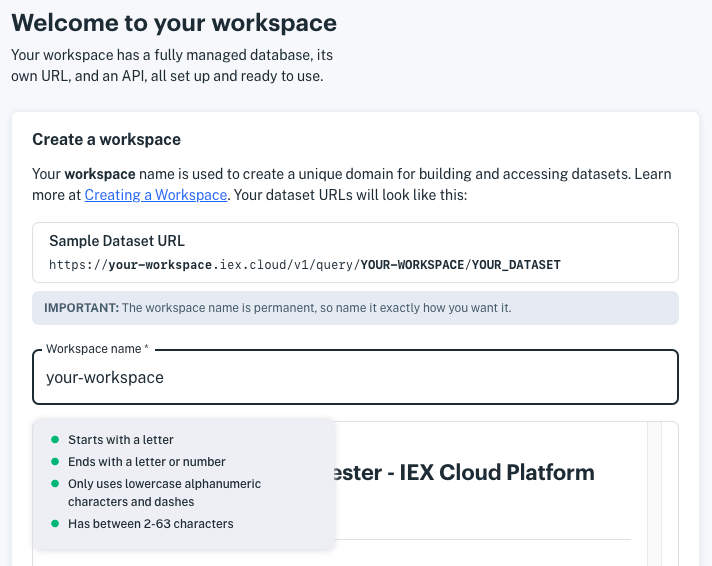
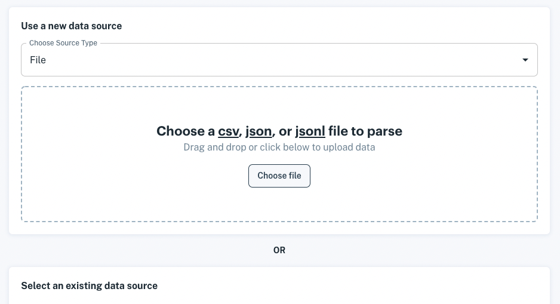

# Setting Up Your Workspace

> **Note:** IEX Cloud Apperate is available exclusively to select Early Access Program participants If you would like to participate in the Early Access Program or the upcoming Beta, please email us at `product@iexcloud.io`.

A *workspace* is your unique domain for writing data and querying it, and delivering data to your apps. Your workspace name appears in your API URLs.

Here is the URL format with respect to the workspace name and an example URL.

**Workspace URL format:**

```
https://WORKSPACE.iex.cloud/v1/data/WORKSPACE/
```

**Example Workspace URL:**

```
https://mycompany.iex.cloud/v1/data/MYCOMPANY/
```

It's time to create your workspace.

## Creating Your Workspace

Here's how to create your workspace:

1. Click on the link in your Early Access program invitation email. The welcome page appears and prompts you to create your workspace.

    

1. Name your workspace.

    > **Important:** The workspace name is permanent, so make sure to name it exactly how you want it.

    Workspace names have the following requirements.

    **Name requirements:**

    - Starts with a letter
    - Ends with a letter or number
    - Uses only lowercase alphanumeric characters and dashes
    - Is between 2-63 characters long
    - DOES NOT consist of ALL numeric values

1. Agree to the terms and then click **Submit**. The **Create a dataset** page appears.

    

Your workspace is created and ready for delivering data to your apps!

## What's Next

To continue with the example of delivering data to apps, see [Getting Started with an Example Dataset](./getting-started-with-an-example-dataset.md).

If you want to start importing data for your apps, see one of the following articles:

- [Loading Data from a URL](https://iexcloud.zendesk.com./5794922253459-loading-data-from-a-URL)
- [Loading Data from AWS S3](../migrating-and-importing-data/loading-data-from-aws-s3.md)
- [Loading Data from a File](../migrating-and-importing-data/loading-data-from-a-file.md)

If you want to sign up your teammates, click the gear icon at the bottom of the console nav and select **Team**. Team management is demonstrated [here](../administration/managing-users.md).