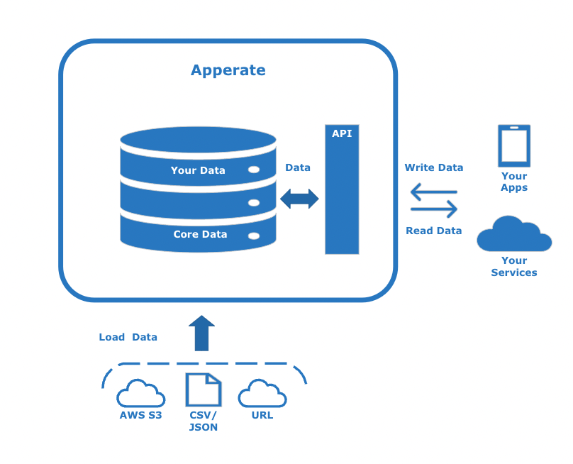
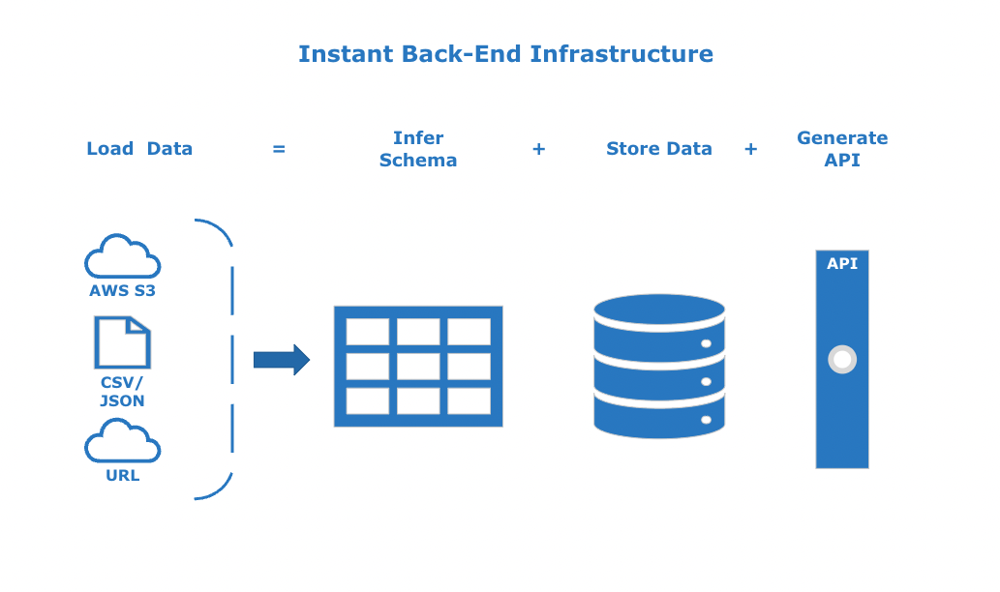

# What is Apperate?

IEX Cloud Apperate is an application database that delivers data and back-end infrastructure to applications. It combines the capabilities of data ingestion, normalization, transformation, observability, and delivery, all in one end-to-end solution for application development. 

This diagram shows the general data flow with Apperate.

Here we describe key features that set Apperate apart from other databases.

## Purpose-Built for Data-Driven Apps

Apperate enables you to connect [data sources](../reference/glossary.md#data-source) to your applications in seconds. You can load data from AWS S3 buckets, URLs, or CSV/JSON files on-demand or per a schedule. In one-step [dataset](../reference/glossary.md#dataset) (table) creation, Apperate infers your data types, constructs a schema, validates the data, and generates REST API endpoints automatically.

The following diagram shows the back-end infrastructure you get on loading new data.

Apperate enables you to build back-end infrastructures quickly, while giving you flexibility to modify infrastructure and data whenever you want. Manage your data using Apperate's no-code tooling including the schema editor, SQL editor, and database UI, or use [Apperate's API](../interacting-with-your-data/apperate-api-basics.md). 

## Safer, Cleaner Data Through Validation

When you load data into Apperate, it automatically generates a data schema and indexes. You can keep them or adjust them the way you want. Apperate validates all incoming data against the schema, storing the valid records and rejecting the invalid records. It reports each validation failure to a downloadable log file.

The following video demonstrates Apperate detecting invalid data during data ingestion.

[Video download link (this will render in nice a video image on our site)](../_static/data-validation-demonstration.mp4)

<video width="320" height="240" controls>
  <source src="../_static/data-validation-demonstration.mp4" type="video/mp4">
Your browser does not support the video tag.
</video>

By stiff-arming the invalid data and providing an error log right away, you can keep your data safe and clean, and can address rejected data.

## Data Matching via Identifier Translation

A common requirement is to be able to reference the same data record using different identifiers (indexes). In the financial data, for example, a particular security can be represented using various types of identifiers, including CUSIP, FIGI, INET, ISIN, and more. Apperate's [SmartLinks](../reference/glossary.md#smartlink) feature translates security identifiers automatically, enabling you and your customers to query the data using ticker symbols you prefer. 

The following video shows how Apperate enables you to query across equivalent security identifiers and join data on the identifiers.

[Video download link (this will render in a nice video image on our site)](../_static/joining-on-normalized-aapl-data.mp4)

<video width="320" height="240" controls>
  <source src="../_static/joining-on-normalized-aapl-data.mp4" type="video/mp4">
Your browser does not support the video tag.
</video>

Identifiers can change, of course. Company spinoffs and mergers, for example, result in new and modified security identifiers. Apperate tracks these changes and implements SmartLinks for them, so you can reference the securities without missing a beat.

Apperate SmartLinks takes care of all this, giving you powerful data functionality and freeing you to concentrate on building your business, instead of spending time and money mapping security identifiers and tracking their changes.

## Platform Reliability, Automatic Scaling, and Backups

Apperate's high-performance architecture is built for rapid growth and enterprise scale. Data is stored to provide low latency access--our average observed read latency is <10ms. Our system currently handles 1.5 billion API calls per day and we sustain 1m data operations per second daily. Data storage is distributed and redundant, providing high availability, continuous backups, and recoverability. Scaling is seamless as you focus on using data in your apps.

## Governance and Monitoring

Dataset access and permissions are authorized via [API tokens](../administration/access-and-security.md) (keys), which you create and share as you like. You can limit tokens to specific domains and can set each token's data read/write/update/delete privileges. We also provide cryptographically signed request options. 

Apperate tracks activities and makes usage statistics and logs available. Each dataset's overview page shows usage counts per API token and for the dataset overall. [Logs](../administration/monitoring-deployments.md) are persisted for workspace CRUD operations and process milestones, associated with dataset validation, data ingestion, and more.

## Built-in Fintech Data

Apperate includes 5+ terabytes of curated, institutional-grade financial data ([Core Data](./production-ready-core-data.md)). The data is accessible in the console, SQL editor, and via REST API endpoints.

> **Important:** Apperate's Core Data is a subset of IEX Cloud Core Data. It includes time series data and will eventually include real-time data. To access all IEX Cloud data, including real-time stock data, please see the [Legacy API Reference](https://iexcloud.io/docs/api/).

## What's Next

Now that you understand what Apperate is, it's time to start using it. [Get Started with Apperate](./getting-started-with-apperate.md) is next.
