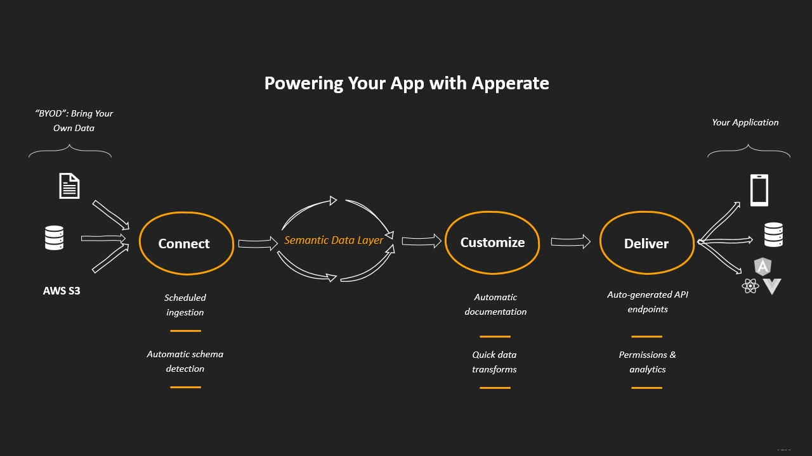

# What is Apperate?

IEX Cloud Apperate is an application database that delivers data and back-end infrastructure to applications. Apperate combines the capabilities of data ingestion, normalization, transformation, observability, and delivery, all in one end-to-end solution for application development. It supports multiple data model concepts and specializes in time series data.

Here are some of Apperate's key characteristics.

## Purpose-Built for Data-Driven Apps

Apperate enables you to configure data delivery from sources to your applications in seconds. You can load data from AWS S3 buckets, URLs, or CSV/JSON files on-demand or per a schedule. In <!-- one-step --> [dataset](../reference/glossary.md#dataset) creation, Apperate infers data types, constructs a schema, validates the data, and generates REST API endpoints automatically, so you can confidently focus on delivering reliable data to your apps.



Apperate enables you to build back-end infrastructures quickly, while giving you flexibility to modify infrastructure and data whenever you want. Manage your data using Apperate's no-code tooling including the schema editor, SQL editor, and database UI, or use [Apperate's API](../interacting-with-your-data/apperate-api-basics.md). 

## Fine-Tuned for Fintech

Apperate is grounded in the IEX Cloud team's deep understanding of fintech data needs. It includes a semantic data layer for [normalizing financial data views](../managing-your-data/defining-schemas/normalization.md) and has production-ready financial data built-in.

The semantic data layer allows you to refer to an equity using any supported [financial identifier type](../reference/financial-identifiers.md). Apperate relates equivalent symbols across the different types. You can, for example, use a CUSIP symbol to query datasets that refer to equities using ISIN, FIGI, or another supported type. Apperate, in effect, *normalizes* the financial identifiers.

Apperate includes curated, institutional-grade time series financial data ([Core Data](./production-ready-core-data.md)). It is available as datasets for accessing via REST API endpoints and using with views.

``` {important} Apperate's Core Data is a subset of IEX Cloud Core Data that includes only time series data. To access all IEX Cloud data, including real-time stock data, please see the [Legacy API Reference](https://iexcloud.io/docs/api/).
```

## Platform Reliability, Automatic Scaling, and Backups

Apperate's high-performance architecture is built for rapid growth and enterprise scale. Data is stored to provide low latency access--our average observed read latency is <10ms. Our system currently handles 1.5 billion API calls per day and we sustain 1m data operations per second daily. Data storage is distributed and redundant, providing high availability, continuous backups, and recoverability. Scaling is seamless as you focus on using data in your apps.

## Governance and Monitoring

Dataset access and permissions are authorized via [API tokens](../administration/access-and-security.md) (keys), which you create and share as you like. You can limit tokens to specific domains and can set each token's dataset read/write/update/delete privileges. We also provide cryptographically signed request options. 

Apperate tracks activities and makes usage statistics and logs available. Each dataset's overview page shows usage counts per API token and for the dataset overall. [Logs](../administration/monitoring-deployments.md) are persisted for workspace CRUD operations and process milestones, associated with dataset validation, data ingestion, and more.

## What's Next

Now that you understand what Apperate is, it's time to start using it. [Get Started with Apperate](./getting-started-with-apperate.md) is next.
