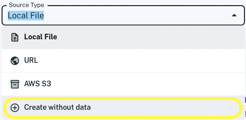
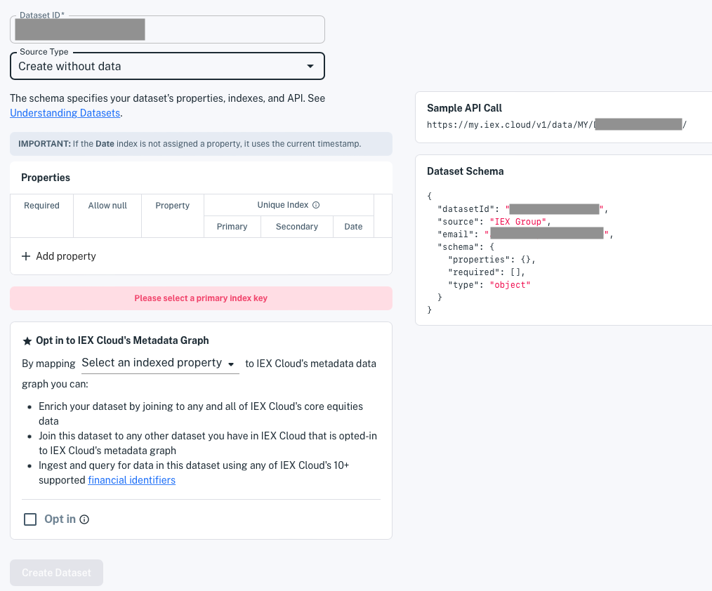
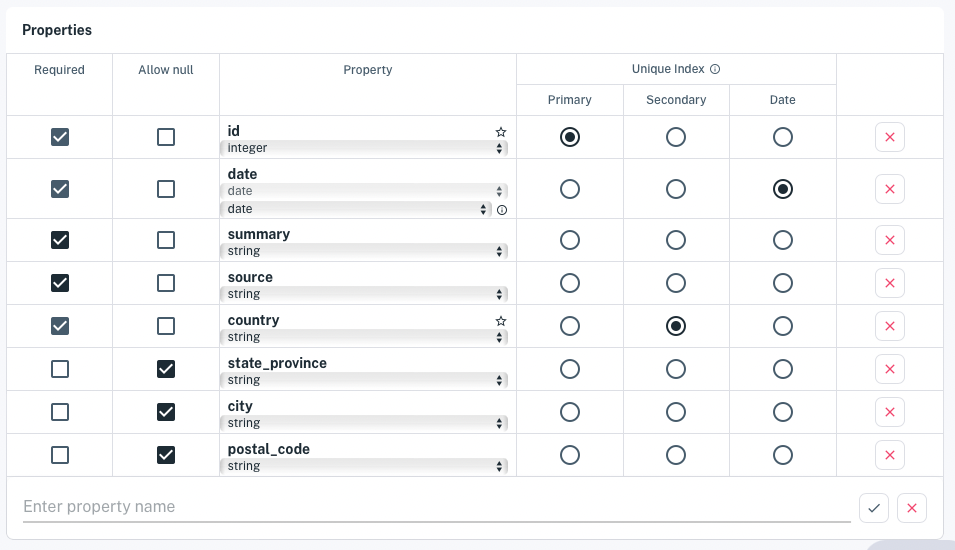

# Write and Read a Record

As with any database, you can write individual records to Apperate and read them back. You can do this manually in the UI or do it programmatically using the REST API.

Here we'll add a record and get it back using the REST API. We'll create a dataset for news events (e.g., news related to financial data), add a news event record, and fetch that record.

**Prerequisites:**

- **IEX Cloud Apperate account** - Create one [here](https://iexcloud.io/cloud-login#/register).
- **Apperate workspace** - See [Creating a Workspace](./getting-started-with-apperate.md#create-a-workspace). 

Let's start with creating a dataset from a simple schema.

## Creata a Dataset for Your Schema

Here are models for the example dataset schema and data record.

**Dataset schema**

| Property | Index | Required | Allow null |
| -------- | ----- | -------- | ---------- |
| id (integer)            | Primary | x |   |
| date (date &rarr; date)      | Date | x |   |
| summary (string)        |   | x |   |
| source (string)         |   | x |   |
| country (string)        | Secondary | x |   |
| state_province (string) |   | x |   |
| city (string)           |   |   | x |
| zip_code (string)       |   |   | x |

**Data record**

| **Property**   | **Value** |
| -------------- | --------------------------- |
| id             | 12345 |
| date           | 2022-06-13 |
| summary        | Gold mother-load discovered |
| source         | Doug Dig |
| country        | USA |
| state_province | Yukon |
| city           | Dawson City |
| zip_code       | Y0B 0A3 |

Here's how to create a dataset based on the models:

1. In the console, click **Create a dataset**. The dataset creation page appears.

    

1. Enter an arbitrary dataset ID, like `FLASH_NEWS_DATASET`.

1. For **Source type** select **Create without data**.

    

    ```{tip} Another easy way to create a dataset is to upload a sample data file (CSV or JSON) with the column names and an example record. Apperate automatically makes a best effort to detect column data types and indexes. See [Loading Data From a File](../migrating-and-importing-data/loading-data-from-a-file.md) to learn how.
    ```

    The schema editor appears.

    

1. In the **Properties** section's **+ Add Property** field, enter your properties.

    ```{tip} A fast way to add properties is enter their names only and hit **Enter** after each one. After adding them by name, update each property's type and attributes in the table.
    ```

    The properties appear in the **Properties** table.

    

    In the **Property** column:
    
    - Select *number* for the `id` property's type.
    - Select *date &rarr; date* (format) for the `date` property.
    - Select *string* for all other properties.

    In the **Unique Index** column area:

    - Set `id` as the **Primary** index
    - Set `country` as the **Secondary** index
    - Set `date` as the **Date** index

    ```{note} For Primary and Secondary index properties, the empty star icon in a property box's top-right corner allows you to opt in either property to Apperate's financial metadata graph. For example, if you opt in an index property that holds financial symbols, Apperate's metadata graph associates the symbols with equivalent symbols from 10+ [financial identifier](../reference/financial-identifiers.md) types. The opted in property uses Apperate [SmartLinks](../reference/glossary.md#smartlink).
    ```
    
    
    
1. When you're done specifying the dataset, click **Create dataset**. The dataset overview appears.

    

    The dataset has no rows, but the **Example request** field and **HTTP Request** panel refer to the auto-generated REST API endpoint.

    **Example request**

    ```
    https://WORKSPACE.iex.cloud/v1/data/MY/FLASH_NEWS_DATASET?last=1&token=TOKEN
    ```
    
    **HTTP Request**
    
    ```
    GET /data/MY/FLASH_NEWS_DATASET
    ```

1. Click **Open Docs**. The dataset's `GET /data` endpoint reference page appears.

Your dataset is ready for data.

## Write a Record

You'll add the example news record into the dataset using the Data API's [`POST /data`](https://iexcloud.io/docs/apperate-apis/data/ingest-data) method.

Add a news record by entering the following command, replacing WORKSPACE with your workspace name and SK_TOKEN with your secret token value.

```bash
curl -H "Content-Type: application/json" 
 -X POST "https://WORKSPACE.iex.cloud/v1/data/WORKSPACE/FLASH_NEWS_DATASET?token=SK_TOKEN" 
 -d '[{"id": 12345, "summary": "Gold mother-load discovered.", "source": "Doug Dig", "country": "Canada", "state_province": "Yukon", "city": "Dawson City", "zip_code": "Y0B 0A3", "date": "2022-06-13"}]'
```

**Response:**

```
{
    "success": true,
    "message": "Data upload of 196B for FLASH_NEWS_DATASET completed, jobId: cd0b432203474ac7b67e9a97d54a420d has been created",
    "jobId": "cd0b432203474ac7b67e9a97d54a420d",
    "jobUrl": "/v1/jobs/MY/ingest/cd0b432203474ac7b67e9a97d54a420d"
}
```

News of Doug Dig's gold discovery is now in the dataset and available to read from the dataset's auto-generated API.

<!-- TODO end the writing article here. Link to reading/fetching article. Jim
## What's Next

Now that you've written to Apperate, why not read that data back? Learn how at [Reading Data From Apperate](./reading-data-from-apperate.md).

If you're interested in loading data other ways or migrating data to Apperate, please visit [Migrating and Importing Data](../migrating-and-importing-data.md).
-->

## Read the Record

You can fetch the record using a `GET /data/:workspace/:id/:key?/:subkey?` request. The [GET /data](https://iexcloud.io/docs/apperate-apis/data/get-data) API reference provides the REST endpoint details. 

The endpoint queries the dataset using a Primary index (key), an optional Secondary index (subkey), and a Date index (via the **on** request parameter).

Open the following URL in your browser, replacing the `WORKSPACE` and `SK_TOKEN` with your values. 

```
https://WORKSPACE.iex.cloud/v1/data/WORKSPACE/FLASH_NEWS_DATASET/12345?token=SK_TOKEN
```

**Response:**

```javascript
[
    {
        "city": "Dawson City",
        "country": "Canada",
        "id": 12345,
        "source": "Doug Dig",
        "state_province": "Yukon",
        "summary": "Gold mother-load discovered.",
        "zip_code": "Y0B 0A3",
        "date": "2022-06-13"
    }
]
```

You "struck gold"! Well, not really ... you just verified the new event record that Doug Dig struck gold.

## What's Next

Did you know that Apperate comes with 5+ terabytes of built-in financial data? See [Production-Ready Core Data](./production-ready-core-data.md) to learn more.

If you're ready to start importing your own existing data, go to [Migrating and Importing Data](../migrating-and-importing-data.md).

And if you want to perform more operations on your data, see [Interacting with Your Data](../interacting-with-your-data.md).