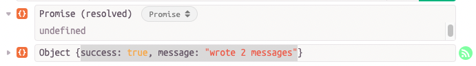
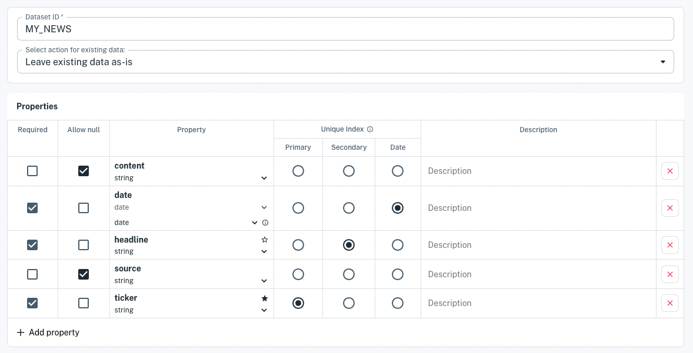
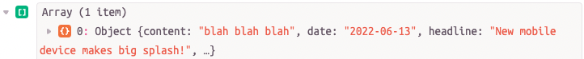

# Write and Read Data

Apperate makes writing data a snap. You can write data via the console or do it programmatically using Apperate's RESTful [Data API](https://iexcloud.io/docs/apperate-apis/data/). Apperate's [iex.js JavaScript library](../developer-tools/iexjs-library.md) (iexjs) makes API calls even easier by wrapping them in JavaScript methods.

Here we'll use the iexjs library to write data to Apperate and to retrieve that data.

The `apperate.write()` iexjs method expects incoming data as an array of objects (specified using JSON). Apperate creates data records from the objects.

For example, you could write news events using an array like this one:

```javascript
[
    {
        "headline": "New mobile device makes big splash!",
        "content": "blah blah blah ...",
        "ticker": "AAPL",
        "source": "IEX Underground",
        "date": "2022-07-13"
    },
    {
        "headline": "Space traveler bids are stacking up",
        "content": "You may know some of these celebrities and billionares ...",
        "ticker": "AMZN",
        "source": "IEX Underground",
        "date": "2022-07-14"
    }
]
```

The [Write Data](https://iexcloud.io/docs/apperate-apis/data/write-data) reference page describes the `POST /write` method and its parameters.

Let's write the above data to Apperate.

## Write the Data with apperate.write()

Here's how to write data using the `apperate.write()` [iexjs](https://www.npmjs.com/package/@apperate/iexjs) JavaScript library method.

1. Open an npmjs environment, such as [RunKit](https://npm.runkit.com/%40apperate%2Fiexjs).

    

    Optionally, you can install iexjs using [npm](https://www.npmjs.com):
    
    ```bash
    npm install --save iexjs
    ```

1. Copy the following code into your editor and replace the `"CAPITALIZED"` parameter values mentioned below. 

    **Code:**

    ```javascript
    const {Client} = require("@apperate/iexjs")
    const client = new Client({api_token: "SECRET_TOKEN", version: "VERSION"});
    client.apperate.write({
        workspace: "WORKSPACE", 
        id: "DATASET", 
        data: [{"headline": "New mobile device makes big splash!", "content": "blah blah blah ...", "ticker": "AAPL", "source": "IEX Underground", "date": "2022-07-13"}, { "headline": "Space traveler bids are stacking up", "content": "You may know some of these celebrities and billionares ...", "ticker": "AMZN", "source": "IEX Underground", "date": "2022-07-14"}]})
            .then((res) => {
                console.log(res);
        });
    ```

    The first two lines of code import the iexjs `Client` definition and instantiate a `Client` respectively. The last line loads data into the target dataset by calling the `apperate.write` method, passing in an Apperate workspace, dataset ID, and the data object array.

    **Replace:**

    - `SECRET_TOKEN` (your [secret API token](../reference/glossary.md#secret-token-secret-key))
    - `VERSION` (i.e., current version is `v1`)
    - `WORKSPACE` (your [workspace](../reference/glossary.md#workspace) name)
    - `DATASET` (the ID of an existing dataset to populate or a new dataset to create)
    - `data:` value (your object array)

1. Run the code. Apperate writes the data records to the target dataset and returns a response like below.

    ```javascript
    {success: true, message: "wrote 2 messages"}
    ```

    If the dataset doesn't exist already, Apperate creates a new dataset, giving it the name you specified and inferring its schema from the data you provided.

Here's what the response looks like in RunKit.



That was fast and easy, right?! If you opted to generate a new dataset, let's examine it.

## Examine the Generated Dataset

1. In the Console, go to the [Datasets](https://iexcloud.io/console/datasets/) page, click on your Workspace, and refresh the page. The listing includes your dataset.

1. Click on the name of the dataset. The dataset overview appears.

1. Click **Edit Schema**. The schema editor appears. 

    

    Notice the index assignments and types. Apperate selected the `ticker` property as the Primary Index (aka *key*), and also selected Secondary (*subkey*) and Date (*date*) indexes. The indexes combine to uniquely identify the dataset records.

    ``` {note} You can update the schema as you like. See [Modify a Data Schema](../managing-your-data/updating-a-dataset-schema.md) for details.
    ```

Let's search the target dataset for the data you wrote.

## Query the Data

You can query the data just as easily as you wrote it. Here we'll retrieve a data record using the iexjs library's `apperate.queryData` method. 

1. In your app or RunKit, enter the following code and make sure to replace the CAPITALIZED values \\.

    **Code:**

    ```javascript
    const {Client} = require("@apperate/iexjs")
    const client = new Client({api_token: "SECRET_TOKEN", version: "VERSION"});
    client.apperate.queryData({
        workspace: "WORKSPACE", 
        id: "DATASET", 
        data: [{"key": "AMZN"}]})})
            .then((res) => {
                console.log(res);
        });
    ```

    The `apperate.queryData` method's `data` parameter takes an object array that includes a `key` index, and may also include a `subkey` and/or `date` index. The code above just uses a `key` index. Here are the the respective attributes for mapping them in your object array:
    
    - `key`: Primary index
    - `subkey`: Secondary index
    - `on`:  Query parameter to search on a Date index.

    ``` {note}
    A dataset's [API docs](https://iexcloud.io/docs/) indicate all applicable data indexes (e.g., key, subkey, date). 
    ```

1. Run the code. Apperate returns the matching records in a query response and prints it. 

Here's what the query response looks like in RunKit.



Congratulations! You wrote data to Apperate and queried that data.

## What's Next

Now that you know how to write and query data, here are some topics to consider next:

[Search Data](../interacting-with-your-data.md): These articles show various ways to query data.

[Managing Your Data](../managing-your-data.md): These guides explain dataset schema fundamentals, creating views, and creating datasets via the  Datasets API.

[Production-Ready IEX Cloud Core Financial Data](./production-ready-core-data.md): Introduces Apperate's 5+ terabytes of built-in financial data available for enriching your fintech applications.

[Load Data](../migrating-and-importing-data.md): These tutorials show you how to load data from a URL, an AWS S3 bucket, and more.