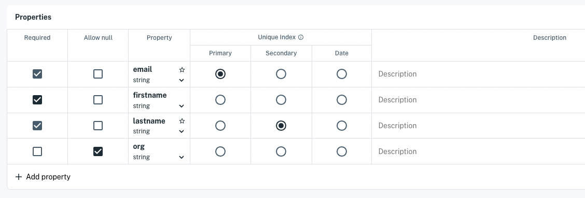

# Write and Read Data

Apperate makes writing data a snap. You can write data via the console or do it programmatically using Apperate's RESTful [Data API](https://iexcloud.io/docs/apperate-apis/data/). For JavaScript, the [iex.js JavaScript library](../developer-tools/iexjs-library.md) (iexjs) makes writing data even easier by wrapping the Data API in JavaScript methods. Here we'll use the iexjs library to write data and to retrieve that data.

The `apperate.write()` iexjs method takes an object array (specified using JSON) as input and creates data records from the objects.

For example, you could write application user data from an array like this one:

```javascript
[
    {
        "firstname": "Jasmine",
        "lastname": "Doe",
        "email": "jasmine.doe@foo.org",
        "org": "Foo LLC"
    }
]
```

``` {note} The object array can include as many objects as you like; though the write method is intended for writing one or a few records in real time. [Load Data](../load-data.md) describes recommended ways for writing large numbers of records in a single call.
```

``` {seealso} The [Write Data](https://iexcloud.io/docs/apperate-apis/data/write-data) reference page describes the underlying *POST /write* method and its parameters.
```

Let's write the above data to Apperate.

## Write Data with apperate.write()

Here's how to write data using the `apperate.write()` [iexjs](https://www.npmjs.com/package/@apperate/iexjs) JavaScript library method.

1. Open an npmjs environment, such as [RunKit](https://npm.runkit.com/%40apperate%2Fiexjs).

    

    Optionally, you can install iexjs with [npm](https://www.npmjs.com) and use iexjs locally:
    
    ```bash
    npm i @apperate/iexjs
    ```

1. Copy the following code into your editor and replace the CAPITALIZED parameter values mentioned below. 

    **Code:**

    ```javascript
    const {Client} = require("@apperate/iexjs")
    const client = new Client({api_token: "SECRET_TOKEN", version: "VERSION"});
    client.apperate.write({
        workspace: "WORKSPACE", 
        id: "DATASET", 
        createDatasetOnDemand: true, 
        data: [{"firstname": "Jasmine", "lastname": "Doe", "email": "jasmine.doe@foo.org", "org": "Foo LLC"}]})
            .then((res) => {
                console.log(res);
            });
    ```

    The first two lines of code import the iexjs `Client` definition and instantiate it. The `apperate.write` method call writes data from the `data` parameter into the target dataset specified by the `id` and `workspace` parameters. The `createDatasetOnDemand: true` setting (optional) instructs Apperate to create the dataset if it doesn't exist already.

    **Replace in the Code**

    | Placeholder | Replace with ... |
    | --- | --- |
    | `SECRET_TOKEN` | Your [secret API token](../reference/glossary.md#secret-token-secret-key) |
    | `VERSION` | Apperate API version (`v1` is the current version) |
    | `WORKSPACE` | Your [workspace](../reference/glossary.md#workspace) name |
    | `DATASET` | Target dataset ID (the ID of an existing dataset to populate or a new dataset to create) |

1. Run the code. Apperate writes the data record to the target dataset and returns a response like this:

    ```javascript
    {success: true, message: "wrote 1 messages"}
    ```

    If the dataset doesn't exist already, Apperate creates a new dataset, giving it the name you specified and inferring its schema from the data you provided.

Here's what the response looks like in RunKit.


That was fast and easy, right?! Let's examine the generated dataset.

## Check the Generated Dataset

1. In the Console, go to the [Datasets](https://iexcloud.io/console/datasets/) page, click on your Workspace name, and refresh the page. The listing includes your dataset.

    

1. Click on the name of the dataset. The dataset overview appears.

    

1. Click **Edit Schema**. The schema editor appears. 

    

    Apperate made a best effort to determine your data types and properties to index. But let's adjust the schema to better fit the data and how we want to use it. Since email addresses are unique and lastnames are a good secondary identifier, let's use them as the dataset's Primary Index (aka *key*) and Secondary Index (*subkey*), respecfively.

1. Make `email` the **Primary** index and `lastname` the **Secondary** index.

    

1. Save your changes by clicking **Update Dataset**.

    ``` {note} You can update the schema as you like. See [Modify a Data Schema](../managing-your-data/updating-a-dataset-schema.md) for details.
    ```

1. In the dataset overview page, view the dataset's docs by clicking **Open Docs**.

    

    Notice that the **Response Attributes** `email` and `lastname` are labeled `*key` and `*subkey`. This shorthand indicates they're your Primary and Secondary indexes.

    ``` {note}
    A dataset's [API docs](https://iexcloud.io/docs/) indicate all applicable data indexes (e.g., key, subkey, date). 
    ```

Let's search the target dataset for the data you wrote using the `email` and `lastname` values as `key` and `subkey` values.

## Query the Data

You can read the data just as easily as you wrote it. Let's retrieve a data record using the iexjs library's `apperate.queryData` method. 

1. In your app or RunKit, enter the following code to query on the user's email address and last name. Make sure to replace the CAPITALIZED values too.

    **Code:**

    ```javascript
    const {Client} = require("@apperate/iexjs")
    const client = new Client({api_token: "SECRET_TOKEN", version: "VERSION"});
    client.apperate.queryData({
        workspace: "WORKSPACE", 
        id: "DATASET", 
        data: [{"key": "jasmine.doe@foo.org", "subkey": "Doe"}]})
            .then((res) => {
                console.log(res);
    });
    ```

    The `apperate.queryData` method's `data` parameter takes an object array that includes a `key` index, and may also include a `subkey` and/or `date` index. To get the data record we wrote earlier, our `apperate.queryData` call above passes in an email address as a `key` index value and a lastname as the `subkey` index value.

1. Run the code. Apperate returns the matching record in a query response and prints it. 

Here's what the query response looks like in RunKit.


Writing and reading data in Apperate is just that easy! Congratulations on using Apperate in JavaScript via iexjs!

## What's Next

Now that you know how to write and query data, here are some topics to consider next:

[Search Data](../search-data.md): These articles show various ways to query data.

[Managing Your Data](../managing-your-data.md): These guides explain dataset schema fundamentals, creating views, and creating datasets via the  Datasets API.

[Production-Ready IEX Cloud Core Financial Data](../getting-started/production-ready-core-data.md): Introduces Apperate's 5+ terabytes of built-in financial data available for enriching your fintech applications.

[Load Data](../load-data.md): These tutorials show you how to load data from a URL, an AWS S3 bucket, and more.