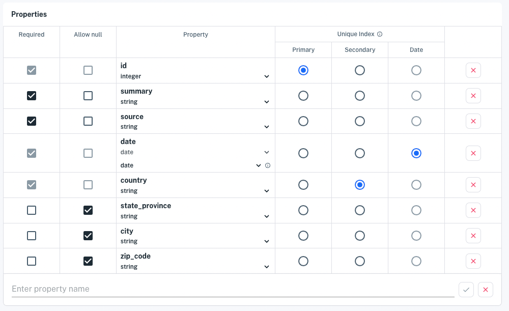

# Writing and Fetching a Record

As with any database, you can add individual records to Apperate and fetch them. You can do this manually in the UI or do it programmatically using the REST API. Here we'll demonstrate adding and fetching a record using the REST API. In this example we'll create a dataset for news events (e.g., news related to financial data), add a news even, and fetch that news event record.

Here are models for the example dataset schema and data record.

**Dataset schema**

| Required | Allow null | Property | Index |
| -------- | ---------- | -------- | ----- |
| x |   | id (integer)            | Primary |
| x |   | date (date > date)      | Date |
| x |   | summary (string)        |  |
| x |   | source (string)         |  |
| x |   | country (string)        | Secondary |
| x |   | state_province (string) |  |
|   | x | city (string)           |  |
|   | x | zip_code (string)       |  |

**Data record**

| **Property**   | **Value** |
| -------------- | --------------------------- |
| id             | 12345 |
| date           | 2022-06-13 |
| summary        | Gold mother-load discovered |
| source         | Doug Dig |
| country        | USA |
| state_province | Yukon |
| city           | Dawson City |
| zip_code       | Y0B 0A3 |

Let's start with creating the schema.

## Create a Dataset for Your Schema

The console is the easiest way to construct datasets.

1. In the console, click **Create a dataset.** The dataset creation page appears.

1. Click **Create a schema manually.** The schema editor appears.

1. In the schema editor, enter your dataset ID and properties
    
    **Dataset ID:** Enter a unique name. For example, FLASH_NEWS_DATASET. 
    
    **Properties:**
    Add each property by typing its name and clicking Enter. The properties appear in the schema table.

    > **Tip:** When creating a dataset manually, it can be easiest to first enter each property name and then update the property type and index.

    Select *number* for the id property's type.

    Select *date > date* (format) for the date property.

    Select *string* for all other properties.
    
    Set **id** as the Primary index, **country** as the Secondary index, and **date** as the Date index.
    
    
    
    Click **Create dataset** when you're done specifying the dataset. The dataset ID confirmation dialog appears.
    

1. **Create dataset now** to create the dataset. The dataset overview appears with zero rows.

Your dataset is ready for data.

## Add a Record

You'll add your news record into the dataset using a `POST /datasets/:workspace` request. The [Create a dataset](https://iexcloud.io/docs/datasets-api/create-a-dataset) API doc describes this REST endpoint.

Add a news record by entering the following command, replacing WORKSPACE and SK_TOKEN with your values.

```bash
curl -H "Content-Type: application/json" 
 -X POST "https://cloud.iexapis.com/v1/data/WORKSPACE/FLASH_NEWS_DATASET?token=SK_TOKEN" 
 -d '[{"id": 12345, "summary": "Gold mother-load discovered.", "source": "Doug Dig", "country": "Canada", "state_province": "Yukon", "city": "Dawson City", "zip_code": "Y0B 0A3", "date": "2022-06-13"}]'
```

**Response:**

```
{"success":true,"message":"Data upload of 196B for FLASH_NEWS_DATASET completed, jobId: cd0b432203474ac7b67e9a97d54a420d has been created","jobId":"cd0b432203474ac7b67e9a97d54a420d","jobUrl":"/v1/jobs/MY/ingest/cd0b432203474ac7b67e9a97d54a420d"}
```

News of Doug Dig's gold discovery is now in the dataset.

### Fetch the Record

You can fetch the record using a `GET /data/:workspace/:id/:key?/:subkey?` request. The [Query data](https://iexcloud.io/docs/datasets-api/query-data) API doc provides the REST endpoint details. 

The endpoint queries the dataset using a Primary index (key), an optional Secondary index (subkey), and a Date index (via the **on** request parameter).

Open the following URL in your browser, replacing the `WORKSPACE` and `SK_TOKEN with` your values. 

https://cloud.iexapis.com/v1/data/WORKSPACE/FLASH_NEWS_DATASET/12345?token=SK_TOKEN

**Response:**

```
[{"city":"Dawson City","country":"Canada","id":12345,"source":"Doug Dig","state_province":"Yukon","summary":"Gold mother-load discovered.","zip_code":"Y0B 0A3","date":"2022-06-13"}]
```

You "struck gold"! Well, no really ... you just verified the new event record that Doug Dig struck gold.

## What's Next

Now that you know how to add and fetch individual records, you can learn how to add and fetch records in batch. See [Apperate API Basics](../interacting-with-your-data/apperate-api-basics.md).