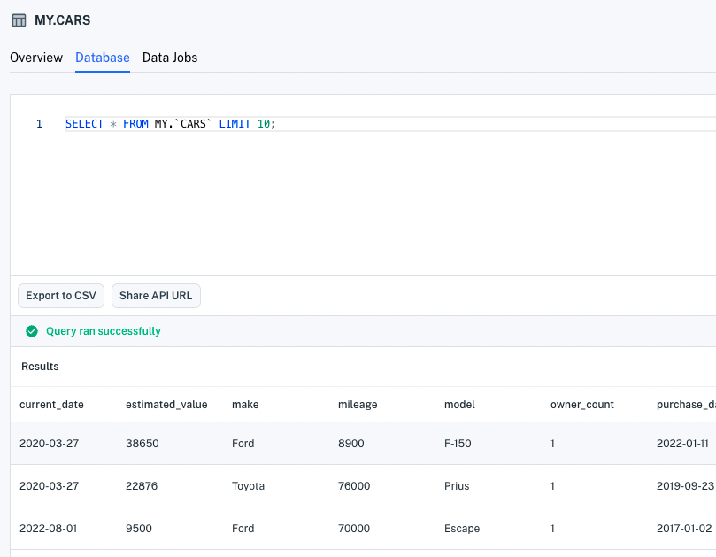

# Updating a Data Record

Updating data records is done by overwriting them. That is, you post a record data that matches the Unique ID (i.e., primary, secondary, and date indexes) and specify all the other values, change any of them you want.

Here we'll demonstrate updating a record using the UI and the Data API. 

``` {note} Values of indexed properties are immutable. If you want to "change" the value of an indexed record's property, you can in essence replace the record by adding a new record with the values you want and deleting the old record.
```

Alternatively, you can update records in the console's SQL editor.

## Updating a Record in the UI

Apperate's SQL editor is available on the **Datasets** page and in each dataset's **Database** tab. 

1. Visit the SQL editor in either the **Datasets** page or in a dataset's **Database** tab. The SQL editor appears.

    

1. Enter a SQL SELECT statement to return the data record you want to update. Then click **Run**. Apperate executes the statement and returns the matching data record.

    

    ``` {important} Make sure the record you want is in the first row. Otherwise, narrow your search so that it's the only record returned. 
    ```

    ``` {important} WHERE clauses must only operate on indexed properties (columns). See the Unique Index components [here](../managing-your-data/understanding-datasets.md#unique-index-and-examples).
    ```

1. Double click on the record in the first row. The row editor appears.

    

1. Make the field value modifications you want to any editable field. Then save your changes.

You've updated the data record. Editing records using the API is easy too.

## Overwriting a Data Record with the API

The Data API's [`POST /data/:workspace/:id`](https://iexcloud.io/docs/datasets-api/ingest-data) endpoint enables you to write new data records and overwrite existing ones. We'll do the latter by specifying the `overwrite=true` query parameter.

``` {note} If you're just getting started with the API, check out the API's [Getting Started](https://iexcloud.io/docs/getting-started) guide.
```

The `wait` query parameter is another one to consider. By default, the endpoint responds immediately after uploading the data and creating the ingestion job. If you prefer to wait for a response after ingestion job completion, set query parameter `wait=true`.

``` {note} You can also check ingestion job status in the console's [Logs pages](../administration/monitoring-deployments.md) or via the [logs API enpoint](https://iexcloud.io/docs/datasets-api/get-logs). 
```

Let's update a record with the API.

1. To specify your record update, you'll need to know its current values, including its Unique Index values (i.e., primary, secondary, and date indexes). You can fetch the record using the Data API's `GET /data/:workspace/:id/:key?/:subkey?` method as demonstrated in [Querying Datasets](./querying-data/querying-datasets.md) or using the SQL editor in the console.

    An example record is this JSON object that represents a CARS dataset Ford F-150:

    ```
    {"current_date":"2020-03-27","estimated_value":38650,"make":"Ford","mileage":8900,"model":"F-150","owner_count":1,"purchase_date":"2022-01-11","reg_state":23,"vin":"SD089VN7678997566","year":2022}
    ```

1. Change the record's values by using the [`POST /data/:workspace/:id`](https://iexcloud.io/docs/datasets-api/ingest-data) endpoint and `overwrite=true` to write a new record in its place. For example, to change the previous example record's `model` value to `F-250`, you could run a cURL command like this one, replacing `WORKSPACE`, `CARS`, and `SECRET_TOKEN` with your values:

    ```bash
    curl -H "Content-Type: application/json" -X POST "https://cloud.iexapis.com/v1/data/WORKSPACE/CARS?overwrite=true&wait=true&token=SECRET_TOKEN" -d '[{"current_date":"2020-03-27","estimated_value":38650,"make":"Ford","mileage":8900,"model":"F-250","owner_count":1,"purchase_date":"2022-01-11","vin":"SD089VN7678997566","year":2022}]'
    ```

    Since the command specifies `overwrite=true`, the record is overwritten with the new values.

    

    Since the command specifies `wait=true`, the response describes the final ingestion status. The response looks like this:

    ```javascript
    {"success":true,"message":"Ingestion job successful, 1 records ingested","jobId":"76dc437512094822806af11748987e27","jobUrl":"/v1/jobs/MY/ingest/76dc437512094822806af11748987e27"}
    ```

If you specify `wait=false` (the default), a response like the one below returns immediately, signaling data upload completion and ingestion commencement.

```javascript
{"success":true,"message":"Data upload of 198B for CARS completed, jobId: d5d126b0f8c94a7b8737cb64abed11ae has been created","jobId":"d5d126b0f8c94a7b8737cb64abed11ae","jobUrl":"/v1/jobs/MY/ingest/d5d126b0f8c94a7b8737cb64abed11ae"}
```

You're editing (and overwriting) data like a champ!

## What's Next

If you need to delete a record, use the `DELETE /data/:workspace/:id/:key/:subkey?/:date?` endpoint described in the [Delete Data](https://iexcloud.io/docs/datasets-api/delete-data) reference.

If you haven't yet checked out the various ways to query data, see [Querying Data](./querying-data.md).

Do you want to combine and transform data using views? Check out [Creating and Managing Views](../managing-your-data/creating-and-managing-views.md)