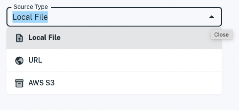
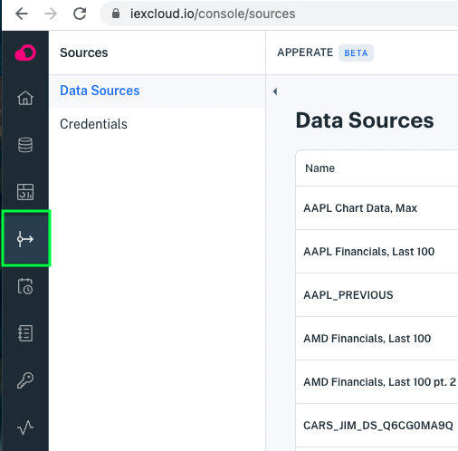
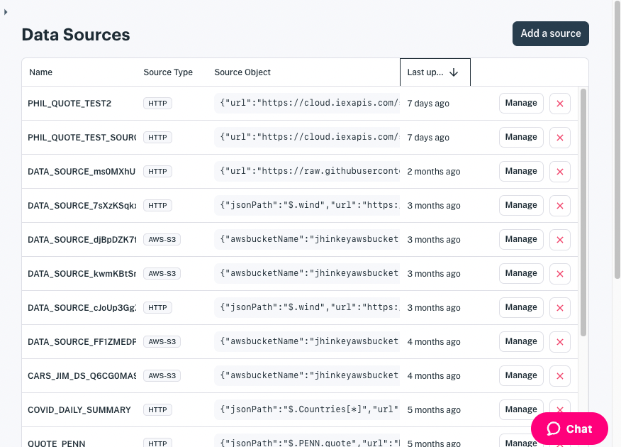
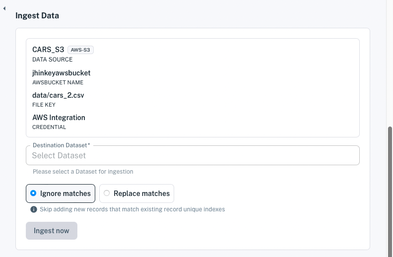
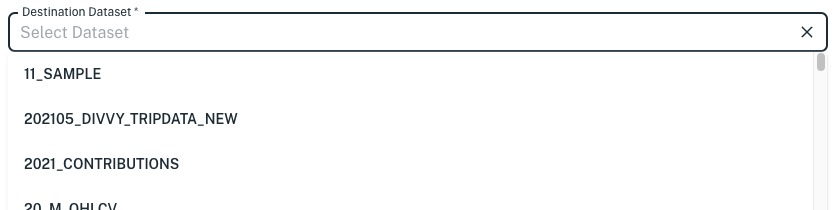

# Load More Data into a Dataset

You can load more data into an existing dataset using any of these ways:

- Load data from a new data source
- Load data from an existing data source
- Schedule data ingestion

We'll cover each of the above options. No matter the option you choose, however, you must decide how to handle when an incoming record matches (i.e., has the same [Unique Index](../reference/glossary.md#unique-index)) an existing record.

You can handle matching records in either of these ways:

- **Ignore matches:** Skip ingesting the new record. (Default)
- **Replace matches:** Overwrite the existing record with the new record.

As we over each data ingestion method, we'll call out the matched record handling options.

## Load Data from a New Data Source

You dataset's **Overview** page has an **Ingest data** button you can click to start loading more data. 

1. In the dataset's **Overview** page, click **Ingest data**. The **Upload Data** page appears.

1. Select the source type to ingest data from.

    

1. Specify the data source options and ingest the data.

    These articles show how to set up the data sources and ingest data from them.

    - [AWS S3 bucket](./loading-data-from-aws-s3.md)
    - [URL](./loading-data-from-a-url.md)
    - [File](./loading-data-from-a-file.md)

    ``` {important} **Incoming matches are ignored**. By default, Apperate skips ingesting new records that match (have same [Unique Index](../reference/glossary.md#unique-index) as) existing records. 
    ```

Data loads into your dataset.

## Load Data from an Existing Data Source

If you have already have an existing [data source](../reference/glossary.md#data-source) (e.g., that you created separately or along with your dataset), you can load new data from it.

1. In the console, go to [**Sources** &rarr; **Data Sources**](https://iexcloud.io/console/sources).

    

    The **Data Sources** page appears.

    

1. Click a data source name to open it's page. That data source's page appears.

1. In the data source page, scroll down to the **Ingest Data** section. Here's an example **Ingest Data** section:

    

1. Select a dataset from the **Destination Dataset** drop-down.

    

1. Select your option for handling matched records: **Ignore matches** or **Replace matches**.

1. When you're done specifying options, click **Ingest Data**.

Apperate loads data from the data source.

## Scheduling Data Ingestion

This last option allows you to ingest data from an existing data source into your dataset per a schedule.

``` {note} You can create a data source from the [**Data Sources**](https://iexcloud.io/console/sources) page or as a part of creating a dataset (select the **Save this data source?** option).
```

See [Schedule Data Ingestion](./scheduling-data-ingestion.md) for a demonstration on loading data automatically per a schedule you create.

Congratulations! You know three different ways to load more data into your datasets.

## What's Next?

- [Create Views](../managing-your-data/create-a-view.md) demonstrates joining datasets to create views.

- [Query Data](../search-data.md) shows how to search datasets using the `GET /data` REST endpoint and using the iex.js JavaScript Library.

- [Use Apperate's APIs](../developer-tools/use-apperate-apis.md) introduces Apperate REST endpoints to query for the exact data you want and CRUD endpoints to use Apperate programatically.