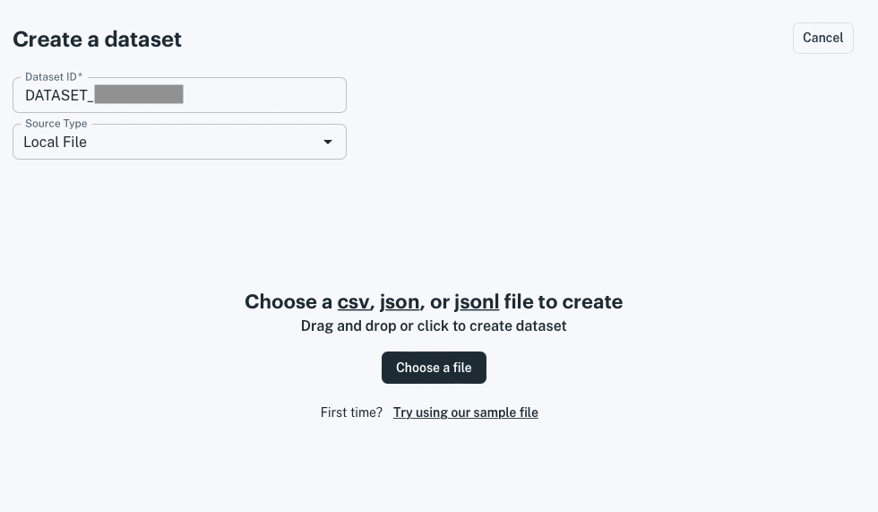
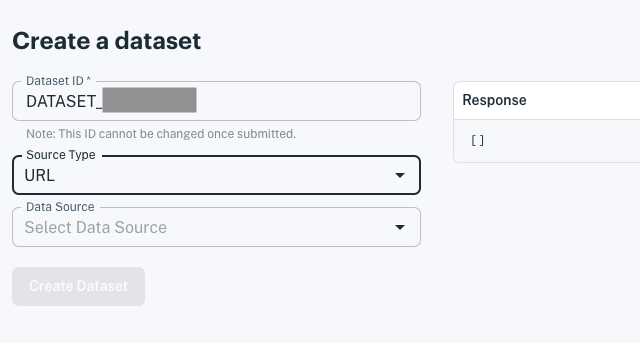
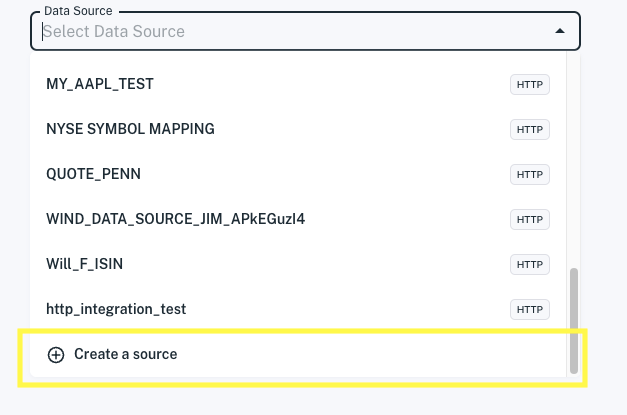
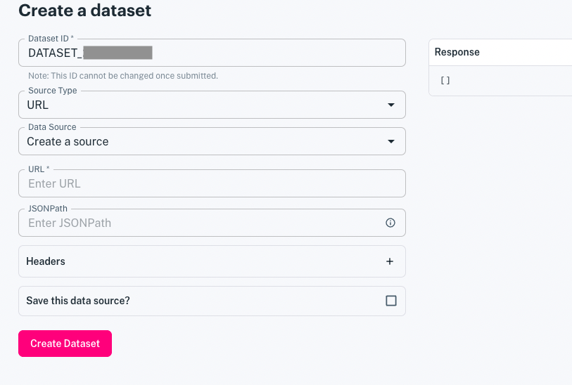
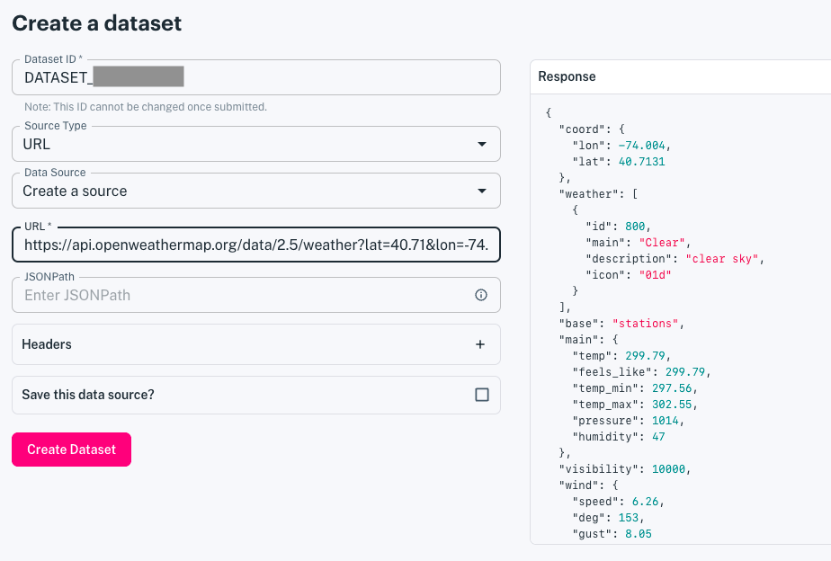
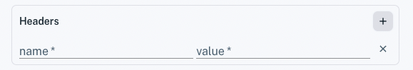
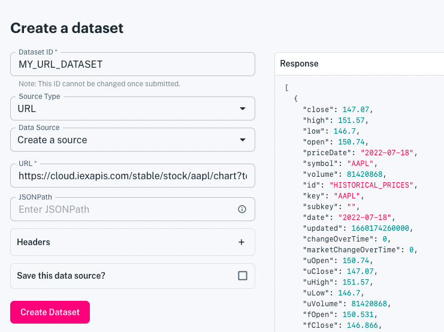
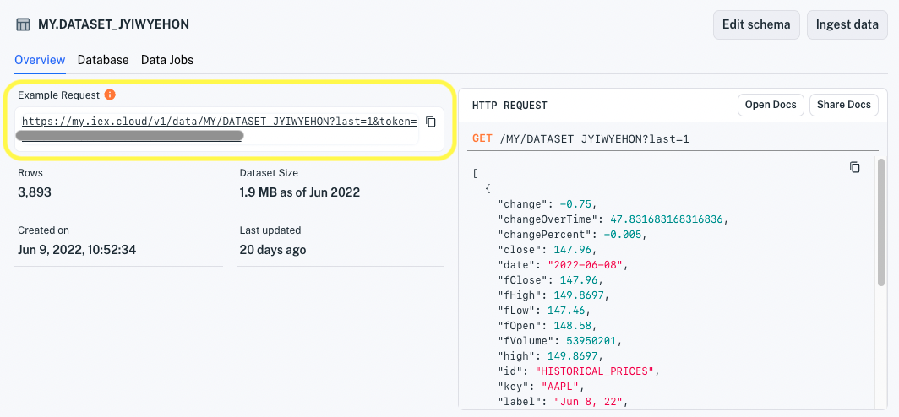

# Load Data from a URL

If there's a URL that you would like to load data from, you can connect to it and store its data in a dataset for publishing to your apps. Here you will do just that.

## Creating a Dataset with Data from a URL

1. Click **Create a Dataset** at the top of the console or from the **Datasets** page. The **Create a dataset** page appears.

    

1. For **Source Type**, choose **URL**. The **Data Source** selector appears.

    

    You can create a dataset from a new or existing data source. We'll create a new data source.

1. For **Data Source**, choose **Create a source** at the bottom of the list.

    

    The **URL**, **Headers**, and **Save this data source** options appear.

    

1. If you want to save the data source for loading more data later, select the **Save this data source?** option.

    

    ``` {note} After creating the dataset, the data source will be saved with an auto-generated name. To find the data source, navigate to **Sources** and sort the list by **Last Updated**. The data source should be one most recently updated.
    ```

1. Specify the URL that provides the data you want. The response data appears in the **Response** panel.

    

1. If your URL requires any headers, add them under **Headers** as name/value pairs.

    

1. If the URL response is in JSON, check your data's location in the **Response** panel.

    - If the data you want is in the top level records (as shown in the image below), leave the **JSONPath** field blank.
    - If the data you want is nested deeper within the JSON object, specify the path to it in the **JSONPath** field. Refer to [Access Nested JSON Data](./accessing-nested-json-data.md) for more information on specifying JSONPath values.

    ``` {important} For JSON data, Apperate requires an array of objects.
    ```

    The URL below, for example, is good because it returns a JSON object array with all data in the top level objects.

    

1. When you're done specifying the data, click **Create Dataset**. Apperate creates the dataset, loads the data into it, and shows the dataset's **Overview** page.

    

    ``` {tip} If data ingestion fails or you suspect issues, check the ingestion details in the overview's **Data Jobs**  page or navigate to **Logs**, and check  the **Log Stream** or **Ingestion Logs**. For guidance, see [Monitor Deployments](../administration/monitoring-deployments.md).
    ```

1. In the **Overview** page, fetch the last record by clicking on the **Example Request** URL. A browser tab opens to the URL and Apperate returns the record in a JSON object array. Here's an example array:

    ```json
    [
        {
            "change": -0.75,
            "changeOverTime": 47.831683168316836,
            "changePercent": -0.005,
            "close": 147.96,
            "date": "2022-06-08",
            "fClose": 147.96,
            "fHigh": 149.8697,
            "fLow": 147.46,
            "fOpen": 148.58,
            "fVolume": 53950201,
            "high": 149.8697,
            "id": "HISTORICAL_PRICES",
            "key": "AAPL",
            "label": "Jun 8, 22",
            "low": 147.46,
            "marketChangeOverTime": 47.831683168316836,
            "open": 148.58,
            "subkey": "",
            "symbol": "AAPL",
            "uClose": 147.96,
            "uHigh": 149.8697,
            "uLow": 147.46,
            "uOpen": 148.58,
            "updated": 1654736422000,
            "uVolume": 53950201,
            "volume": 53950201
        }
    ]
    ```

Congratulations! You loaded data from a URL into a dataset and it is ready to deliver that data to apps.

``` {note} To view the schema and optionally modify it, see [Modify a Data Schema](../managing-your-data/updating-a-dataset-schema.md).
```

## What's Next

Here are some things to explore doing with your new data and data source.

- [Schedule Data Ingestion](./scheduling-data-ingestion.md) shows you how to load data regularly per a schedule.

- [Load More Data into a Dataset](./load-more-data-into-a-dataset.md) explains how to ingest more data from a new or existing data source.

- [Create Views](../managing-your-data/create-a-view.md) demonstrates joining datasets to create views.

- [Use Apperate's APIs](../developer-tools/use-apperate-apis.md) introduces Apperate REST endpoints to query for the exact data you want and CRUD endpoints to use Apperate programatically.