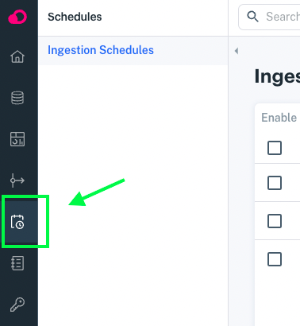
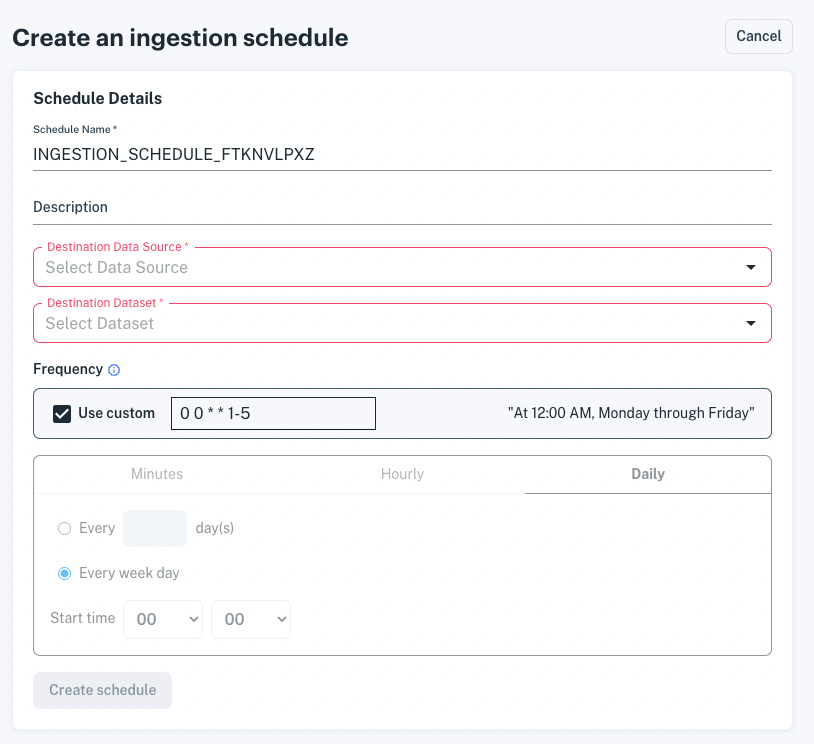
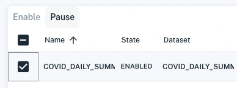
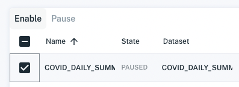

# Schedule Data Ingestion

Apperate facilitates loading (ingesting) data into a dataset at regular intervals. Schedules are easy to set up, manage, and monitor. You can enable a schedule and disable/pause it as you like.

**Requirements**

- Source: AWS S3 bucket or URL
- Dataset: Provides the table and schema for storing and indexing the data.

``` {tip} You can create a data source automatically as your create a dataset. After you create the dataset, you can verify the data source on the Data Sources page by sorting the data sources on the **Last updated** column.
```

## Configuring Your Schedule

1. Go to **Schedules &rarr; Ingestions Schedules**.

    

    The Ingestion Schedules page appears.

    

1. Start creating an ingestion schedule by clicking **Create a schedule**. The **Create an ingestion schedule** page appears.

    

1. Specify the schedule details--you'll tackle the frequency in the next step.

    **Schedule Name:** A unique name for your schedule.

    **Description (optional):** Describe your scheduled ingestion.

    **Destination Data Source:** An existing data source. To browse your data sources, go to **Sources &rarr; Data Sources**.

    **Dataset:** The data destination. To browse your datasets, go to **Data** and select your workspace dropdown.

1. In the **Frequency** section, specify the start time and interval for data ingestion.

    You can specify the frequency using either of these ways:

    - Leave **Use custom** selected and specify the start time (UTC) and frequency using cron notation. 
    
    - Unselect **Use custom** and specify the start time (UTC) and frequency in the Minutes, Hour, or Daily tab.

    When you've completed entering the frequency, click **Create Schedule**.
    
    Your schedule is created and enabled. The **Ingestion Schedules** page appears with your schedule in the list.
    
    Here's what a schedule looks like in the list.

    

If your schedule has a start time, data ingestion starts then. Otherwise, the ingestion starts immediately.

Ingestions run per the interval specified in your schedule. The **Last Run** and **Next Run** values show the timestamp of the last data ingestion and the time remaining until the next data ingestion. The **Last 30 Days** column notes the dataset rows added and error count.

For a schedule that uses an AWS S3 source, Apperate ingests **all** files that match the file pattern and have a last modified timestamp (per the bucket) that's newer than the previously uploaded file.

## Pausing Your Schedule

You can pause your schedule whenever you like. This disables further ingestions.

To pause ingestions for your schedule, select on your schedule in the list and click **Pause** at the top of the list.



``` {important} Pausing a schedule DOES NOT stop any current ingestion, it only disables upcoming ingestions.
```

``` {important} The **Ingestion Schedules** page continues to show the time until the next data ingestion for each schedule. This gives you context for enabling the schedules with regards to their upcoming ingestions.
```

## Re-enabling Your Schedule

To re-enable your ingestion schedule, select on your schedule in the list and click **Enable** at the top of the list. Your ingestions run per your schedule.



## What's Next

- [Create Views](../managing-your-data/create-a-view.md) demonstrates joining datasets to create views.

- [Load More Data into a Dataset](./load-more-data-into-a-dataset.md) explains how to ingest more data from a new or existing data source.

- [Understanding Datasets](../managing-your-data/understanding-datasets.md) explains dataset properties, constraints, indexes, and mappings.