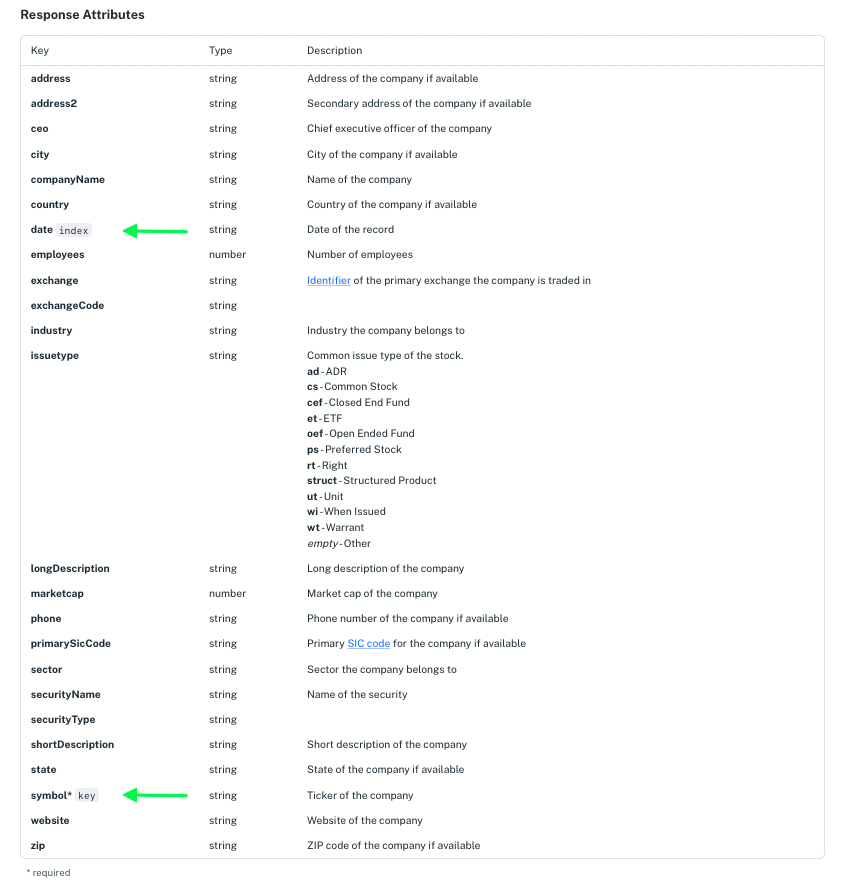
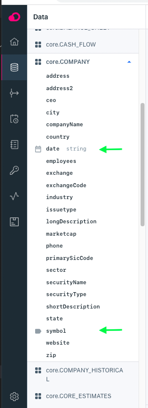
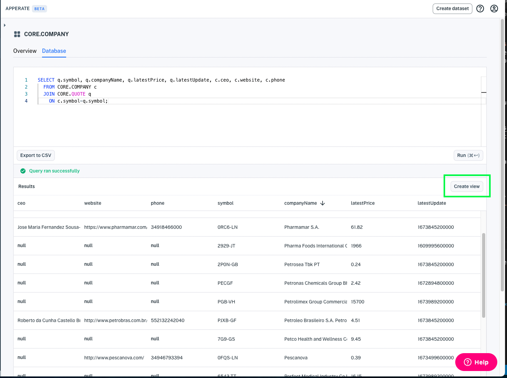
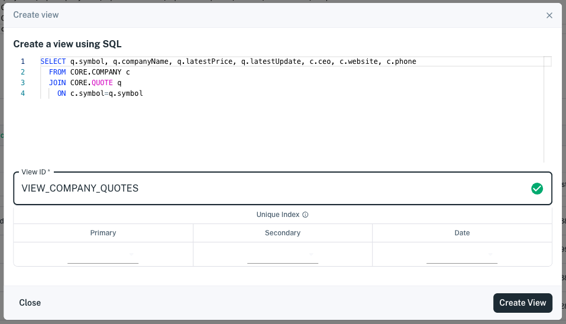
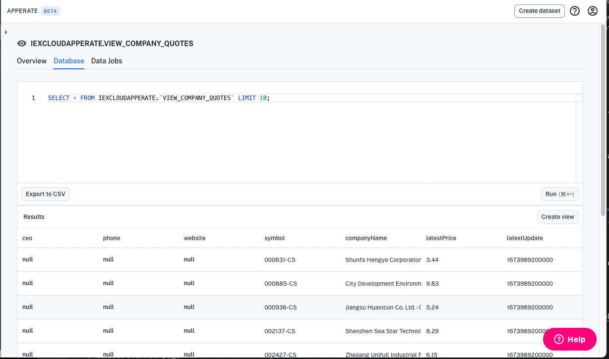
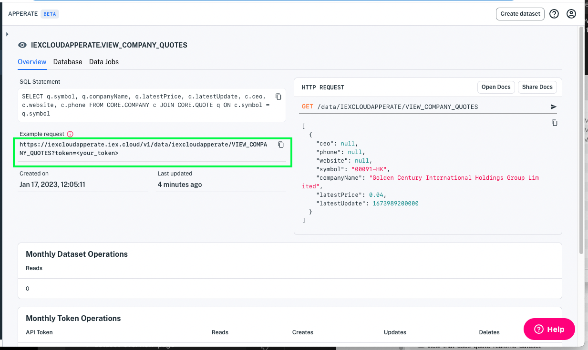
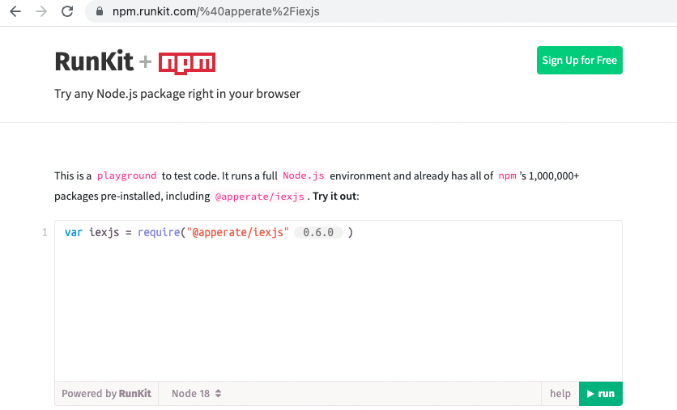

# Create a View

Views enable you to aggregate data from various datasets, transform the data, and share the resulting data with applications. An Apperate *view* is a virtual dataset created from a SQL query that joins multiple datasets. 

``` {important}
You can create views by joining private datasets and Core Datasets. QUOTE and COMPANY are the first real-time Core Dataset you can use in a view; support for more real-time Core Datasets is ongoing.
```

Here we'll create a view from two real-time Core Datasets.

## Steps

Here's how to create a view of stock prices and associated company information. The view will use data from the [QUOTE](https://iexcloud.io/docs/core/QUOTE) and [COMPANY](https://iexcloud.io/docs/core/COMPANY) Core Datasets.

1. Determine equivalent index properties to join the datasets. Here are two ways find dataset index properties:

    - In the [API reference](https://iexcloud.io/docs/), go to the dataset endpoint's docs under [Core Datasets](https://iexcloud.io/docs/core) (private datasets are under [Your Datasets](https://iexcloud.io/docs/datasets)).
    
        In the **Response Attributes** section of each dataset endpoint doc, find the attributes labeled as the `key` index, `subkey` index (optional), or `date` index. These are the index properties. For example, the arrows in the image below point to the COMPANY dataset's index properties.
  
        

    - In the console, click the **Data** icon to open the [Query Datasets](https://iexcloud.io/console/datasets) page. In the navigation, click on one of the dataset's names to expand the dataset's attribute listing. Icons indicate the dataset's `key` index, `subkey` index (optional), and `date` index properties. The arrows in the image below point to the COMPANY dataset's indexed properties.
  
        

1. Determine all the dataset properties you want to use in your view. You'll add them to your SQL query in the next step. For example, create lists of properties you want from both datasets.

    QUOTE properties:

    - `symbol`
    - `latestPrice`
    - `latestUpdate`

    COMPANY properties:

    - `symbol`
    - `companyName`
    - `ceo`
    - `website`
    - `phone`

1. In the console's [Query Datasets](https://iexcloud.io/console/datasets) page or in a **Database** page of either dataset, construct a query that selects the properties you want and joins the datasets on the equivalent index properties from the previous step.

    The following query, for example, selects properties from the COMPANY and QUOTE datasets, and joins `ON` each dataset's `symbol` key index property.

    ```sql
    SELECT q.symbol, q.companyName, q.latestPrice, q.latestUpdate, c.ceo, c.website, c.phone 
      FROM CORE.COMPANY c 
      JOIN CORE.QUOTE q 
        ON c.symbol = q.symbol;
    ```

    ``` {important} WHERE clauses and ON clauses must only operate on indexed properties (columns). See the Unique Index components [here](./understanding-datasets.md#indexing-with-unique-index).
    ```

    ``` {important} Apperate does not support SELECT \* queries on views.
    ```

1. Click **Run** to run your query. The results appear in a table below the SQL editor.

    

1. Start creating a View by clicking **Create view** at the top right of the **Results** table. The **Create a view using SQL** dialog appears.
    
    

1. Name your view (or go with the unique auto-generated name) and then click **Create View**. Your new view's pages appear. You can visit your view's **Overview** and **Database** pages.
    
    

    ``` {important} The \_system prefix (case-insensitive) is reserved for Apperate system tables and columns. You are forbidden to prefix dataset IDs, view IDs, and dataset property names with \_system (case-insensitive).
    ```

1. Click the **Overview** tab to show the overview.

    

1. Click the **Example request** to query your view.

    Query URL example:

    ```
    https://iexcloudapperate.iex.cloud/v1/data/WORKSPACE/VIEW_COMPANY_QUOTES?token=your_token
    ```

    Response example:

    ```json
    [
        {
            "ceo": "Timothy Cook",
            "phone": "14089961010",
            "website": "https://www.apple.com/",
            "symbol": "AAPL",
            "companyName": "Apple Inc",
            "latestPrice": 152.74,
            "latestUpdate": 1663876800335
        }
    ]
    ```

    The example request returns the last result from the view's SQL query.

    ``` {note} Some companies may not have a current price.
    ```

1. You can use your favorite language and the REST endpoint to request data from the view. 

    For example, you can use the `apperate.queryData()` [iexjs](https://www.npmjs.com/package/@apperate/iexjs) JavaScript library method from JavaScript code or in an npmjs environment, such as [RunKit](https://npm.runkit.com/%40apperate%2Fiexjs).

    

    Copy the following code into your RunKit editor and replace the CAPITALIZED parameter values mentioned below. 

    ```javascript
    const {Client} = require("@apperate/iexjs")
    const client = new Client({api_token: "SECRET_TOKEN", version: "VERSION"});
    client.apperate.write({
        workspace: "WORKSPACE", 
        id: "VIEW"})
            .then((res) => {
                console.log(res);
    });
    ```

    **Replace in the Code**

    | Placeholder | Replace with ... |
    | --- | --- |
    | `SECRET_TOKEN` | Your [secret API token](../reference/glossary.md#secret-token-secret-key) |
    | `VERSION` | Apperate API version (`v1` is the current version) |
    | `WORKSPACE` | Your [workspace](../reference/glossary.md#workspace) name |
    | `VIEW` | Target view ID |

    The view returns the last query result. For example,

    ```javascript
    [
      {
        "ceo": "Ted Love",
        "phone": "16507417700",
        "website": "http://www.globalbloodtx.com/",
        "symbol": "0IVZ-LN",
        "companyName": "Global Blood Therapeutics Inc.",
        "latestPrice": 67.6049,
        "latestUpdate": 1664942400000
      }
    ]
    ```

Congratulations! You created a view and used it to fetch data aggregated from multiple datasets.

Apperate auto-generated a REST endpoint for the view and an endpoint documentation page that you can share with others! You can grant people Read access to the endpoint using a [token](../administration/access-and-security.md#creating-an-api-token).

## Related Topics

[Access and Security](../administration/access-and-security.md)

[Example: Creating a View](./example-creating-a-view.md)