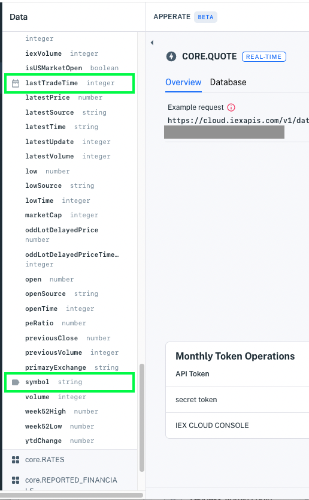

# Create a View

Views enable you to aggregate data from various datasets, transform the data, and share the resulting data with applications. An Apperate *view* is a virtual dataset created from a SQL query that joins multiple datasets. 

``` {important}
You can create views by joining private datasets and Core Datasets. QUOTE and COMPANY are the first real-time Core Dataset you can use in a view; support for more real-time Core Datasets is ongoing.
```

Here we'll create a view from two real-time Core Datasets.

## Creating a View

Here's how to create a view of stock prices and associated company information. We will use data from the [QUOTE](https://iexcloud.io/docs/core/QUOTE) and [COMPANY](https://iexcloud.io/docs/core/COMPANY) Core Datasets.

1. Determine equivalent index properties between the datasets. We will join the datasets on these properties. Here are two ways to find dataset index properties:

    - In the [API reference](https://iexcloud.io/docs/), go to the dataset endpoint's doc under [Core Datasets](https://iexcloud.io/docs/core) if it's a Core Dataset or under  [Your Datasets](https://iexcloud.io/docs/datasets) if it's a private dataset.
    
        In the **Response Attributes** section of the dataset endpoint doc, find the attributes labeled as the `key` index, `subkey` index (optional), or `date` index. These are index properties that you can compare with the other dataset's index properties. For example, the arrows in the image below point to the COMPANY dataset's date index property called `date` and its key index property called `symbol`.
  
        

    - Another way to look up index properties is by viewing the dataset properties in the Datasets navigation tree. In the console, click the **Data** icon to open the [Datasets](https://iexcloud.io/console/datasets) page, expand one of the namespaces (either **Core** or your workspace), and click one of the dataset names to show the dataset's property list.
    
        Icons on the left side of the property names indicate the dataset's `key` index, `subkey` index (optional), and `date` index properties. For example, the image below highlights the QUOTE dataset's date index property called `lastTradeTime` and its key index property called `symbol`.
  
        

1. Determine all the dataset properties you want to use in your view. You'll add them to your SQL query in the next step. For example, you can list properties you want from the datasets.

    **QUOTE properties:**

    - `symbol`
    - `latestPrice`
    - `latestUpdate`

    **COMPANY properties:**

    - `symbol`
    - `companyName`
    - `ceo`
    - `website`
    - `phone`

1. In a SQL editor in the console (e.g., in the [Datasets](https://iexcloud.io/console/datasets) page or in either dataset's **Database** page), construct a query that selects the properties you want (the properties you listed above) and joins the datasets on the equivalent index properties (i.e., the `symbol` properties).

    The following query, for example, selects properties from the COMPANY and QUOTE datasets, and joins on each dataset's `symbol` key index property.

    ```sql
    SELECT q.symbol, q.companyName, q.latestPrice, q.latestUpdate, c.ceo, c.website, c.phone 
      FROM CORE.COMPANY c 
      JOIN CORE.QUOTE q 
        ON c.symbol = q.symbol;
    ```

    ``` {important} WHERE clauses and ON clauses must only operate on indexed properties. See the Unique Index components [here](./understanding-datasets.md#indexing-with-unique-index).
    ```

    ``` {important} Apperate does not support using SELECT \* queries with views.
    ```

1. Test your query by clicking **Run** in the bottom right of the SQL editor. The results appear in a table below the SQL editor.

    

1. Start creating a view from the query by clicking **Create view** at the top right of the **Results** table. The **Create view** dialog appears.

    

1. Name your view (or go with the unique auto-generated name) <!-- TODO explain how to set unique indexes -->and then click **Create View**. A page appears for your new view. You can visit your view's **Overview** and **Database** pages.
    
    

    ``` {important} The *\_system prefix* (case-insensitive) is reserved for Apperate system tables and columns. You are forbidden to prefix view IDs, dataset IDs, and dataset property names with *\_system*.
    ```

Awesome! You created a view with data from two datasets. 

Apperate also auto-generated a REST endpoint for the view and an endpoint documentation page (click **Open Docs** in the **Overview**) for sharing with others (click **Share Docs**)! You can grant people endpoint Read access via a [token](../administration/access-and-security.md#creating-an-api-token).

Next let's get data from the view.

## Getting Data From a View

Here we'll get view data in two ways:

- Example request URL
- iexjs JavaScript client module

### Example Request URL

1. Click the **Overview** tab to see the view's example request URL.

    

1. Click the **Example request** to query your view.

    Query URL example:

    ```
    https://WORKSPACE.iex.cloud/v1/data/WORKSPACE/VIEW_COMPANY_QUOTES?token=your_token
    ```

    Response example:

    ```json
    [
        {
            "ceo": "Timothy Cook",
            "phone": "14089961010",
            "website": "https://www.apple.com/",
            "symbol": "AAPL",
            "companyName": "Apple Inc",
            "latestPrice": 152.74,
            "latestUpdate": 1663876800335
        }
    ]
    ```

    The example request returns the last result from the view's query.

    ``` {note} Some companies may not have a current price and some securities may not have company data.
    ```

The **Example request** is the quickest way to try out your view. You can of course use your favorite language and the REST endpoint to get view data. We'll use JavaScript and the iexjs module next.

### iexjs JavaScript Module

The iexjs module makes querying views a snap. 

For example, you can use the `apperate.queryData()` [iexjs](https://www.npmjs.com/package/@apperate/iexjs) JavaScript library method from JavaScript code or in an npmjs environment, such as [RunKit](https://npm.runkit.com/%40apperate%2Fiexjs).


Copy the following code into your RunKit editor and replace the CAPITALIZED parameter values mentioned below. 

```javascript
const {Client} = require("@apperate/iexjs")
const client = new Client({api_token: "SECRET_TOKEN", version: "VERSION"});
client.apperate.write({
    workspace: "WORKSPACE", 
    id: "VIEW"})
        .then((res) => {
            console.log(res);
});
```

**Replace in the Code**

| Placeholder | Replace with ... |
| --- | --- |
| `SECRET_TOKEN` | Your [secret API token](../reference/glossary.md#secret-token-secret-key) |
| `VERSION` | Apperate API version (`v1` is the current version) |
| `WORKSPACE` | Your [workspace](../reference/glossary.md#workspace) name |
| `VIEW` | Target view ID |

The view returns the last query result. For example,

```javascript
[
    {
    "ceo": "Ted Love",
    "phone": "16507417700",
    "website": "http://www.globalbloodtx.com/",
    "symbol": "0IVZ-LN",
    "companyName": "Global Blood Therapeutics Inc.",
    "latestPrice": 67.6049,
    "latestUpdate": 1664942400000
    }
]
```

Way to go! Now you know how to query views in your browser and in JavaScript.

## Related Topics

[Access and Security](../administration/access-and-security.md)

[Example: Creating a View](./example-creating-a-view.md)