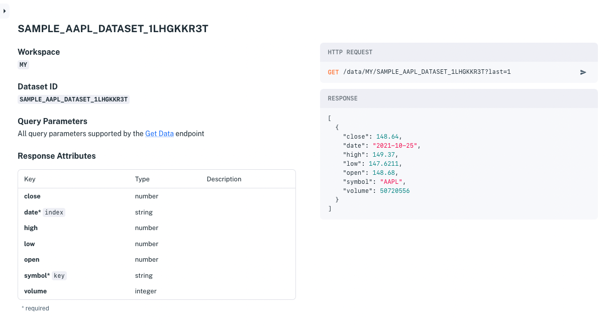

# Create a Dataset with the API

Here you will learn some datasets API basics by using the API to create a dataset, add data to it, and get that data using the dataset's the auto-generated REST API.

## Creating a Dataset

Here you will create a dataset as specified in a JSON file.

1. Create a `.json` file that has the following content. Replace `you@company.com`, `Your Company`, and `Your Dataset`, with your own values.

    ``` {important} The \_system prefix (case-insensitive) is reserved for Apperate system tables and columns. You must not prefix dataset IDs or dataset property names with \_system.
    ```

    ```javascript
    { 
        "dataset": { 
            "email": "you@company.com", 
            "schema": { 
                "properties": { 
                    "close": { 
                        "type": "number" 
                    }, 
                    "date": { 
                        "type": "string", 
                        "format": "date" 
                    }, 
                    "high": { 
                        "type": "number" 
                    }, 
                    "low": { 
                        "type": "number" 
                    }, 
                    "open": { 
                        "type": "number" 
                    }, 
                    "symbol": { 
                        "type": "string" 
                    }, 
                    "volume": { 
                        "type": "integer" 
                    } 
                }, 
                "required": [ 
                    "symbol", 
                    "date" 
                ], 
                "type": "object" 
            }, 
            "source": "Your Company", 
            "columnMapping": { 
                "key": "symbol", 
                "date": "date" 
            }, 
            "symbologyColumn": { 
                "name": "symbol", 
                "type": "E" 
            }, 
            "title": "SAMPLE AAPL DATASET YOU", 
            "datasetId": "SAMPLE_AAPL_DATASET_YOU" 
        } 
    }
    ```

1. Create a dataset from the `.json` file by running a `POST /datasets/:workspace` request as described in [Create a dataset](https://iexcloud.io/docs/apperate-apis/datasets/create-a-dataset). For example, run this command, replacing the `WORKSPACE`, `SECRET_TOKEN`, and `FILE` values with your own.

    ```bash
    curl -H "Content-Type: application/json" 
     -X POST "https://cloud.iexapis.com/v1/datasets/WORKSPACE?token=SECRET_TOKEN" 
     --data-binary @FILE.json
    ```

    **Sample response:**
    
    ```javascript
    {"success":true,"message":"Dataset has been created","datasetId":"YOUR_DATASET"}
    ```

1. Verify the dataset by running a `GET /datasets/:workspace` request as described in [List datasets](https://iexcloud.io/docs/apperate-apis/datasets/list-datasets). For example,

    ```bash
    curl -X GET https://cloud.iexapis.com/v1/datasets/WORKSPACE?token=SECRET_TOKEN
    ```

Let's add data to the dataset.

## Adding Data to Your Dataset

Here you will specify data in a CSV file and submit the file in your request to create a dataset

``` {note} You can specify data in text files that use CSV, JSON, and JSONL formats. The product supports CSV files that use the following common data delimiters: comma (,), tab, or pipe (\|) characters.
```

Here are the data file ingestion steps:

1. Specify the data in a CSV. Here's a CSV data file. 
     
    **[Data:** 

    ```
    close,date,high,low,open,symbol,volume
    27.72,2016-11-09,27.83,27.0125,27.47,AAPL,236705444
    27.9475,2016-11-25,27.9675,27.7375,27.7825,AAPL,45903688
    27.8925,2016-11-28,28.1163,27.8475,27.8575,AAPL,108775932
    ```

    ``` {tip} Create the file using the following Example Command for your operating system.
    ```

    **Example Command** 

    ```{tab} Linux/MacOS
        echo " close,date,high,low,open,symbol,volume
        27.72,2016-11-09,27.83,27.0125,27.47,AAPL,236705444
        27.9475,2016-11-25,27.9675,27.7375,27.7825,AAPL,45903688
        27.8925,2016-11-28,28.1163,27.8475,27.8575,AAPL,108775932
        " \
        >> aapl
    ```

    ```{tab} Windows
        (
        echo close,date,high,low,open,symbol,volume
        echo 27.72,2016-11-09,27.83,27.0125,27.47,AAPL,236705444
        echo 27.9475,2016-11-25,27.9675,27.7375,27.7825,AAPL,45903688
        echo 27.8925,2016-11-28,28.1163,27.8475,27.8575,AAPL,108775932
        )>aapl
    ```

1. Ingest the data to your dataset using a `POST /data/:workspace/:id` requestas described in [Ingest data](https://iexcloud.io/docs/apperate-apis/datasets/ingest-data). For example, use this command, replacing the `WORKSPACE`, `YOUR_DATASET`, and `SECRET_TOKEN` values with your own: 

    ```bash
    curl -H "Content-Type: application/json" \
        -X POST "https://cloud.iexapis.com/v1/data/WORKSPACE/YOUR_DATASET?token=SECRET_TOKEN" \
     --data-binary @aapl
    ```

    **Sample response:** 

    ```javascript
    {"success":true,"message":"Data upload of 579B for YOUR_DATASET completed, jobId: 887b948762ff4b5c889112afb21ea463 has been created","jobId":"887b948762ff4b5c889112afb21ea463","jobUrl":"/v1/jobs/WORKSPACE/ingest/887b948762ff4b5c889112afb21ea463"}
    ```

1. Validate your dataset's record count using a `GET /datasets/:workspace/:id` request as described in [Get a dataset](https://iexcloud.io/docs/apperate-apis/datasets/get-a-dataset). For example, use this command with your values:  

    ```bash
    curl -X GET https:/cloud.iexapis.com/v1/datasets/WORKSPACE/YOUR_DATASET?token=TOKEN
    ```

    **Sample response:** 

    ```javascript
    {" columnMapping":{" date":"date","key":"symbol"}," symbologyColumn":{" name":"symbol","type":"E"},"date":1650569968000,"updated":1650569968000,"datasetId":" YOUR_DATASET ","schema":{"properties":{"close":{" type":"number"},"date":{" format":"date","type":"string"},"high":{" type":"number"},"low":{" type":"number"},"open":{" type":"number"},"symbol":{" type":"string"},"volume":{" type":"integer"}},"required":[" symbol","date"]," type":"object"},"description":"","parentDatasetId":null,"keys":0,"records":3}
    ```

    The records value `"records":3` matches the number of records in your data file. Your data is ready for apps to access!

Lastly check out your dataset's auto-generated RESTful API and use it.

## Using Your Dataset

A RESTful API endpoint was automatically created for your dataset.

1. Visit your API docs in your browser at the following URL, replacing the dataset name. 

    **URL:** `https://iexcloud.io/docs/datasets/YOUR_DATASET` 

    

1. As a test, get your last record by copying this URL in your browser, replacing `WORKSPACE`, `YOUR_DATASET`, and `TOKEN`. 

    **URL:** `https://cloud.iexapis.com/v1/data/WORKSPACE/YOUR_DATASET?last=1&token=TOKEN`

    **Sample response:** 

    ```json
    [{"close":47.8925,"date":"2017-11-28","high":28.1163,"low":27.8475,"open":27.8575,"symbol":"AAPL","volume":108775932}]
    ```

Congratulations on making your data available using the datasets API!

## What's Next

Learn more about the Apperate APIs at [Using Apperate's APIs](../interacting-with-your-data/apperate-api-basics.md).