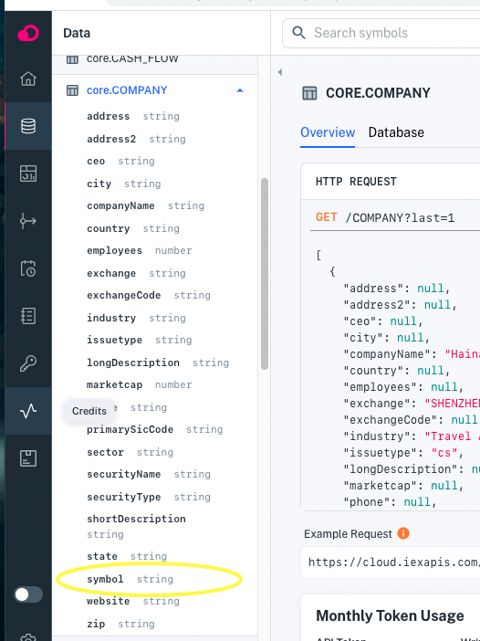
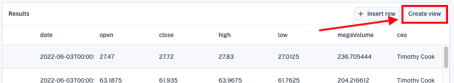
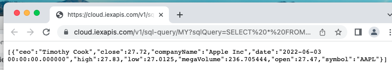

# Creating and Managing Views

```{toctree}
:maxdepth: 1

creating-and-managing-views/joining-on-core-data.md
```

Views enable you to aggregate data from various datasets, transform the data, and share the resulting data with applications. A *view* is a virtual dataset created by joining multiple datasets. The data aggregation and transformation enable you to enrich data for applications.

Here we'll demonstrate creating and using a view by way of example. We'll transform data from a custom equity dataset and combine the data with company details from IEX Cloud's Company dataset (a Core dataset) to create a view. Then we'll query the view and execute an auto-generated URL for sharing with applications.

> **Note:** You can apply these principles to combine data from any datasets that can be joined on equivalent indexed properties.

## Example: Creating a view of combined sample and company data

These steps demonstrate combining data from IEX Cloud's sample file (AAPL financial data) with IEX Cloud's Company dataset. 

Follow these steps to create the example view:

1. Create a dataset using IEX Cloud's sample file, making `symbol` the primary index. For reference, see [Getting Started with an Example Dataset](../getting-started/getting-started-with-an-example-dataset.md).

1. Browse the datasets in your workspace to identify another dataset, with an equivalent indexed property to add data from. The dataset could be one of your custom datasets or a Core dataset.

    For example, you could join with the Company dataset (`core.COMPANY`)  on its `symbol` property.

    

    > **Important:** In Core financial datasets, a `symbol` property is typically indexed and is referred to in SQL as *key*.

1. Go to your custom dataset's **Database** page (next to the dataset overview tab).

1. In the **Database** page's SQL editor, run a query that joins the datasets and transforms the *volume* property values into mega volume values by dividing them by one million.
    
      | **Datasets** |
      | ------------------------------------------------------ |
      | *YOUR_CUSTOM_DATASET* (created from IEX's sample file) |
      | core.COMPANY (Core dataset) |

      | **Transformation** |
      | ------------------ |
      | Create a *megaVolume* property by dividing the *volume* property by one million |

    Here's an example SQL statement:

    ```sql
    SELECT a.symbol, date, open, close, high, low, volume / 1000000 AS megaVolume, ceo, companyName
      FROM MY.SAMPLE_AAPL_DATASET_5OXUHCHVB a
      JOIN core.company c
        ON c.`key` = a.symbol
    ```

    > **Important:** The `symbol` property in Core financial datasets is typically referred to in SQL as `key`. You **must** reference the property as `key`.

    Data from both datasets appears in the **Results** table below the editor.
    
    

1. Create a view from the data results by clicking the **Create view** button at the top right of the results table.
    
    
    
    The **Create a view using SQL** dialog appears.
    
    

1. Name your view (or go with the unique auto-generated name) and click **Create View**. Your new view's **Overview** page appears.
    
    

    > **Important:** The `_system` prefix (case-insensitive) is reserved for Apperate system tables and columns. You are forbidden to prefix dataset IDs and dataset property names with `_system` (case-insensitive).

    View pages are equivalent to a dataset pages, and views also appear in the datasets navigation tree.

1. Execute the view's example request in your browser by copying the **Example Request** URL on the **Overview** page and pasting it into your browser. A result like this one appears:
    
    

Congratulations on combining and transforming data from a custom dataset and core dataset into a view for your app to use.

> **Note:** The Example Request returns just one record by using the LIMIT 1 condition. In your app, make sure to lift that limit by removing that condition from your URL's SQL query.

## Related Topics

[Using Tokens to Access APIs](https://iexcloud.io/docs/getting-started/api-tokens)