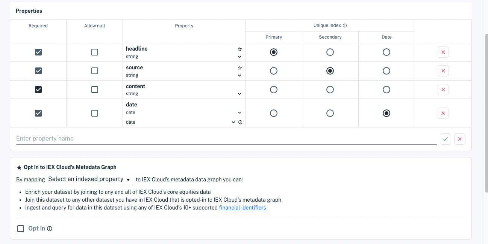

# Defining Schemas

```{toctree}
:maxdepth: 1

defining-schemas/define-a-schema.md
defining-schemas/data-model-examples.md
defining-schemas/normalization.md
```

Data schemas describe your tables, specifying what's valid and safe for your applications. Here you'll leverage what you learned in [Understanding Datasets](./understanding-datasets.md) to create datasets (tables) for your application data.



Here are the data schema topics:

[Define a Schema](./defining-schemas/define-a-schema.md) guides you through designing and implementing a schema for your data. You'll do this in a dataset that you can write data to.

[Data Model Examples](./defining-schemas/data-model-examples.md) demonstrates using datasets and the Unique Index to represent various data models.

[Normalization](./defining-schemas/normalization.md) shows how to query on and join datasets on financial symbols using any supported [financial identifier type](../reference/financial-identifiers.md).