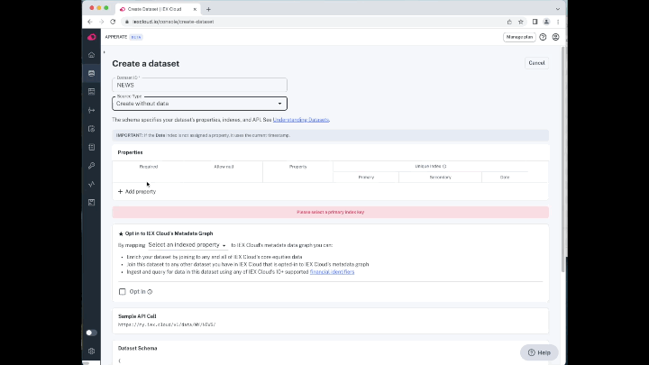
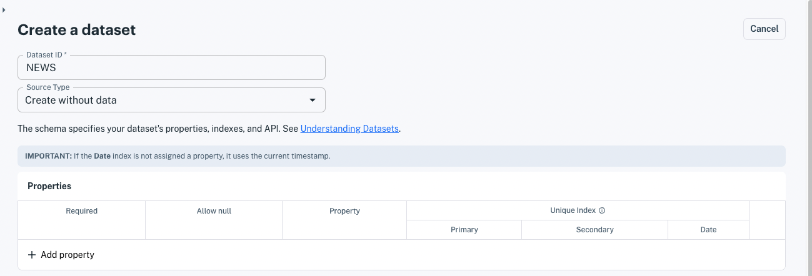
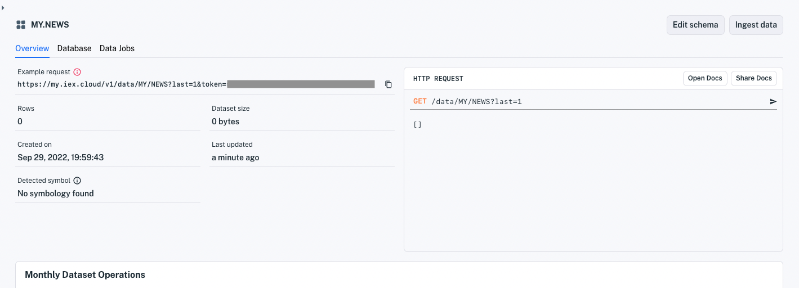

# Define a Schema

Here you'll learn how to define a schema in Apperate and apply it to a dataset, ready to receive data. We'll demonstrate this by designing and implementing a schema for financial-related news events.



Start with modeling your data and schema.

## Model Your Data and Schema

Here's an example record that we want to write to Apperate.

**Data record**

| **Property**   | **Value** |
| -------------- | --------------------------- |
| headline       | "New mobile device makes big splash!"  |
| source         | "IEX Underground" |
| content        | "blah blah blah" |
| date           | 2022-06-13 |

Here are some requirements for managing and using records like the one above.

### Specify Requirements

#### Search Requirement

We want the ability to search for news events by headline, source, and date. Headline is the primary differentiator; source is secondary.

**Solution:** Leverage Apperate's [Unique Index](../understanding-datasets.md#indexing-with-unique-index) concept by making `headline` the Primary index, `source` the Secondary index, and `date` the Date index. This allows you to search by `headline` and optionally refine that search by `source` and `date`.

#### Constraint Requirement

Require non-null values for all properties.

**Solution:** Mark all properties as required and specify that null is not allowed.

Let's design a schema that meets the requirements.

### Design a Schema

The schema below fits the above requirements.

**Schema:**

| Property | Index | Required | Allow null |
| -------- | ----- | -------- | ---------- |
| headline (string)       | Primary | x |   |
| source (string)         | Secondary | x |   |
| content (string) |   | x |   |
| date (date &rarr; date) | Date | x |   |

Let's create the schema in a new dataset that we can write data to.

## Define the Schema in a Dataset

1. In the console, click **Create a dataset**. The dataset creation page appears.

    

1. Enter an arbitrary **Dataset ID** (e.g., `NEWS`).

1. For **Source Type** select **Create without data**.

    

    The schema editor appears.

    

1. In the **Properties** section, click **+ Add Property** and enter your properties one by one. The properties appear in the **Properties** table.

    ```{tip} A fast way to add properties is enter their names only and hit **Enter** after each one. After adding them by name, update each property's type and attributes in the table.
    ```

1. Per your schema design, set your property types and constraints, and apply the **Primary**, **Secondary**, and **Date** Unique Index components. 

    

    ``` {note} The **Opt In...** section below the Properties table allows you to map your **Primary** or **Secondary** properties to IEX Cloud's financial metadata graph. This is ideal for properties that hold financial symbols/tickers, enabling them to be associated with equivalent financial symbols. See [Understanding Datasets](../understanding-datasets.md#normalizing-with-smartlinks) for details.
    ```
    
1. When you're done specifying the dataset, click **Create Dataset** at the bottom. The dataset overview appears.

    

You defined your schema in a dataset that is ready to receive data!

## What's Next?

[Write and Read Data](../../getting-started/write-and-read-data.md) demonstrates populating and querying datasets, just like the one you created above.

[Loading Data From a File](../../migrating-and-importing-data/loading-data-from-a-file.md) shows how to create a dataset based on data from a file (CSV, JSON, or JSONL). Apperate automatically makes a best effort to detect column data types and indexes.

<!--
Create a Data Source

Ingest Data
-->