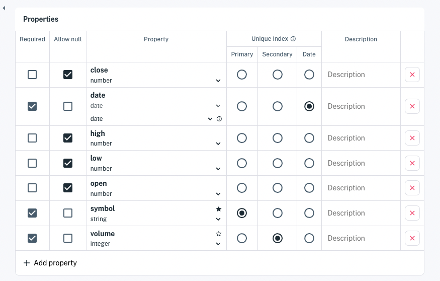
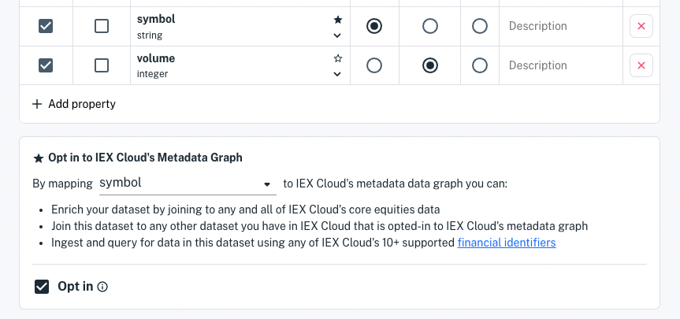

# Understanding Datasets

[Datasets](../reference/glossary.md#dataset) are schema-based, time series-optimized database tables that have auto-generated, permissioned APIs and API docs. You can query and operate on datasets in a codeless fasion in the console or programatically using [REST endpoints](../interacting-with-your-data/apperate-api-basics.md) or our open-source [client libraries](../developer-tools.md).

Apperate validates incoming data against the dataset's schema, giving you further confidence in your data. Each property (think database column) has a type, is required (or not), and allows null (or not).



``` {seealso} See the [Dataset Properties](../reference/dataset-properties.md) reference for details on property types, constraints, and mappings.
```

Here we'll introduce these dataset topics:

- Indexing with Unique Index
- Normalizing with SmartLinks
- Permisioning with Tokens

## Indexing with Unique Index

Each dataset has a **Unique Index** composed of a *primary index*, *secondary index* (optional), and *date index*. This index determines how the dataset records are identified, deduplicated, partitioned, and stored.

**Unique Index** = *primary + secondary + date*

**primary and secondary (optional) indexes:** Set these to any property. Indexes should ideally be assigned to properties that signify an important identifier and/or category for the dataset.

**date index:** Set this to any date property or leave it unset to use record creation timestamps. The property mapped to the date index is the primary mechanism by which data is time-sorted. 

### Querying on Key, Subkey, and Date

The [Data API](https://iexcloud.io/docs/apperate-apis/data) leverages the Unique Index components. It nicknames them as follows ...

- **Key** (primary index)
- **Subkey** (secondary index)
- **Date** (date index)

Here's an example of mapping for a company news dataset.

| Nickname | Property | Example |
| --- | --- | --- |
| key | `symbol` | A stock symbol `AAPL` |
| subkey | `source` | Information source `CNN` |
| date | `timestamp` | The record's date/time `2019-02-20` |

Here's a URL format that queries on all three components:

```
BASE_URL/data/WORKSPACE/DATASET/KEY/SUBKEY?token=TOKEN&on=DATE
```

Since your base URL, dataset, and workspace are already known, you can concentrate on plugging **key** (`AAPL`), **subkey** (`CNN`), and **date** (`2019-02-20`) values into your [`GET /data`](https://iexcloud.io/docs/apperate-apis/data/get-data.html) requests.

Examples (generic to specific):

```
https://myworkspace.iex.cloud/v1/data/MYWORKSPACE/MY_DATASET/AAPL?token=TOKEN
```
```
https://myworkspace.iex.cloud/v1/data/MYWORKSPACE/MY_DATASET/AAPL/CNN?token=TOKEN
```
```
https://myworkspace.iex.cloud/v1/data/MYWORKSPACE/MY_DATASET/AAPL?token=TOKEN&on=2019-02-20
```
```
https://myworkspace.iex.cloud/v1/data/MYWORKSPACE/MY_DATASET/AAPL/CNN?token=TOKEN&on=2019-02-20
```

## Normalizing with SmartLinks

You can opt-in (SmartLink) a primary or secondary index property with IEX Cloud's metadata graph. A SmartLink associates the property's values with equivalent values from any of Apperate's 10+ supported [financial identifier types](../reference/financial-identifiers.md).

The image below shows a dataset's `symbol` property opted in to SmartLinks.



For example, if you SmartLink a property that holds financial symbols that use FIGI, you can match the symbols using equivalent symbols that use other financial identiefier types, such as ISIN or CUSIP. 

By SmartLinking a property you can:

- Enrich your dataset by joining to any and all of IEX Cloud's core equities data
- Join this dataset to any other dataset you have in IEX Cloud that is opted-in to IEX Cloud's metadata graph
- Ingest and query for data in this dataset using any of IEX Cloud's 10+ supported financial identifiers

``` {seealso} See SmartLinks in action in the [Normalization](./defining-schemas/normalization.md) article
```

## Permissioning with Tokens

Your datasets are private by default. You can share a dataset's API with other parties by giving them a public API token that has access to the dataset.


``` {seealso} [Access and Security](../administration/access-and-security.md) shows you how to create API tokens with fine-grained permissions.
```

Now you know the fundamentals of Apperate dataset schemas and have been introduced to data normalization with SmartLinks and permissioning with tokens.

## What's Next

[Data Model Examples](./defining-schemas/data-model-examples.md) demonstrates using dataset schemas and the Unique Index to represent various data models.

[Updating Dataset Schemas](./defining-schemas/updating-dataset-schemas.md) shows you how to update dataset schemas and explains how updates work.

[Interacting with Your Data](../interacting-with-your-data.md) guides you through querying and manipulating your data through the console and via Apperate APIs.