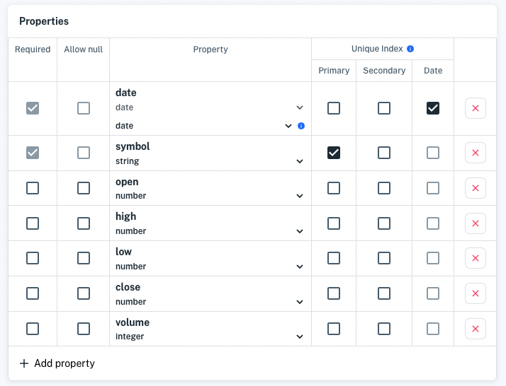

# Understanding Datasets

A schema is the "master plan" for your data and API. It defines your dataset by specifying data properties and indexes. On creating your dataset, the product immediately generates your API endpoint which your app can access to get data.

Here you will learn about the schema components and examine example schemas that fit different scenarios. Start with schema properties.

## Properties

Properties define the dataset's content. Each property has a type, is required or optional, and may or may not allow null. Here's an example dataset schema:



> **Important:** The  `_system` prefix (case-insensitive) is reserved for Apperate system tables and columns. You are forbidden to prefix dataset IDs or dataset property names with  `_system` (case-insensitive).

Let's visit each of the property characteristics, starting with type.

### Types

Here are the various property types:

| Type | Description |
| ---- | ----------- |
| **date** | A date, which can be specified using one of several different formats. (The schema editor lists the formats and includes examples.) |
| **number** | Floating point number. |
| **integer** | Any whole number, positive or negative, including zero. |
| **string** | A series of characters. |
| **object** | A JSON Object representation. |
| **array** | An indexed sequence of values. |
| **boolean** | `TRUE` or `FALSE`; `1` or `0`. |
| **any** | This JSON schema option supports using mixed types. It is useful in prototype situations when you are not sure what type you need or in situations where the downstream consumer does not care about type, and you want to move data quickly. Another case for using is when the upstream data is out of your control and is presented as a mixed type or a type that can change, and you want to avoid data ingestion failure. |

### Required

A property can be marked as **Required** or left as optional. Data ingestion fails for data that is missing any required properties.

### Allow null

Allows null values for the property when checked, *unselect* the **Allows null** option for properties that must never be null.

> **Note:** For CSV files, an empty field is interpreted as an empty string; it is never interpreted as null.

Indexing is next.

## Unique Index and Examples

Each dataset has a *Unique Index* composed of a primary index, secondary index (optional), and date index. The Unique Index determines how the dataset data is identified, deduplicated, partitioned, and stored.

**Unique Index** = *primary + secondary + date*

**primary and secondary (optional) indexes:** Set these to any property. Indexes should ideally be assigned to properties that signify an important identifier and/or category for the dataset.

**date index:** Set this to any date property or leave it unset to use the current date. The property mapped to the date index will be the primary mechanism by which your data is time-sorted. 

> **Note:** A property can be set to one index at most.

The following examples illustrate ways to use primary index, and date indexes with your data.

### Example 1: Using a primary, secondary, and date index

If your data has multiple properties that you can use to identify and aggregate data, consider specifying a primary and secondary index on the two most significant properties.

This example dataset stores data on favorite movies. The movie *title* is the main identifier, the movie *director* is the next most significant identifier, and the *date viewed* provides chronological context.

Here is the example data:

```
title,director,cinematography,date viewed 
CODA,Sian Heder,Paula Huidobro,2021-08-13 
Dune,Greig Fraser,Greig Fraser,2021-11-06 
Drive My Car,Ryusuke Hamaguchi,Hidetoshi Shinomiya,2022-04-01 
Wheel of Fortune and Fantasy,Ryusuke Hamaguchi,Yukiko Iioka,2021-05-23
```

After uploading the data and editing the schema, the Movie Favorites Unique Index follows this format.

**Unique Index** = *title + director + date viewed*

Here is a figurative sample Unique Index for the first data row.

**Unique Index** = CODA-SianHeder-20210813

The Movie Favorites dataset *explicitly* specifies the primary index, secondary index, and date components. Next, examine a dataset that *implicitly* uses the ingestion date.

### Example 2: Using an implicit date index

If you have no date data or want time-series data but your date properties are unsuitable, do not specify a date index. Instead, you can implicitly use the current date: the date the data is ingested.

For example, a shopping list needs only a list of items and has no obvious need for a date. So go with the default date. The dates may be useful later. For example, you may want to analyze the frequency you added an item (e.g., toilet paper) and schedule a reminder for that item. The following content represents data for a Shopping List:

```
item 
toothpaste 
apples 
lettuce 
mineral water
```

You can ingest the data into a dataset that explicitly specifies only a primary index. The dataset will use the current date as date index automatically. The Unique Index for the Shopping List is illustrated below.

Format:

**Unique Index** = *item + (nothing) + current date*

Sample:

**Unique Index** = toothpaste-20220411

Now you know how to use a Unique Index to fit your data needs.

## What's Next

After you create your dataset, there is more you can start doing from your dataset's overview page:

- Add more data (click **Ingest data**)
- Query your data (click the **Data Viewer** tab)
- Get data via the API (click **Open API Docs**)

Interested in creating datasets programmatically? Checkout [Using Apperate's APIs](../interacting-with-your-data/apperate-api-basics.md).