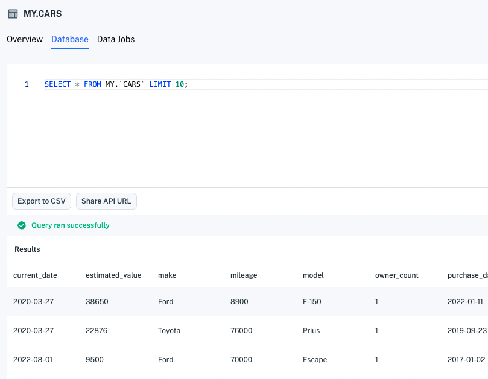
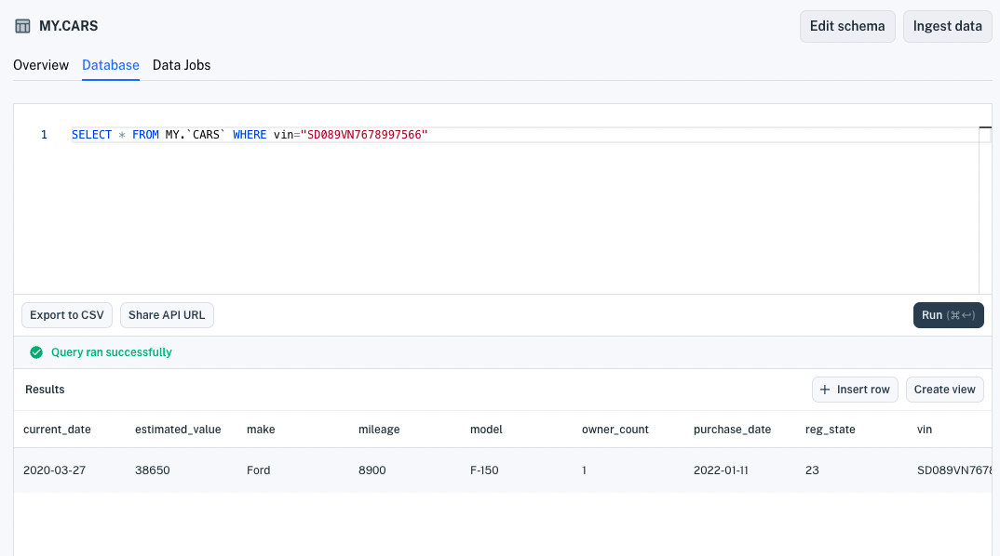
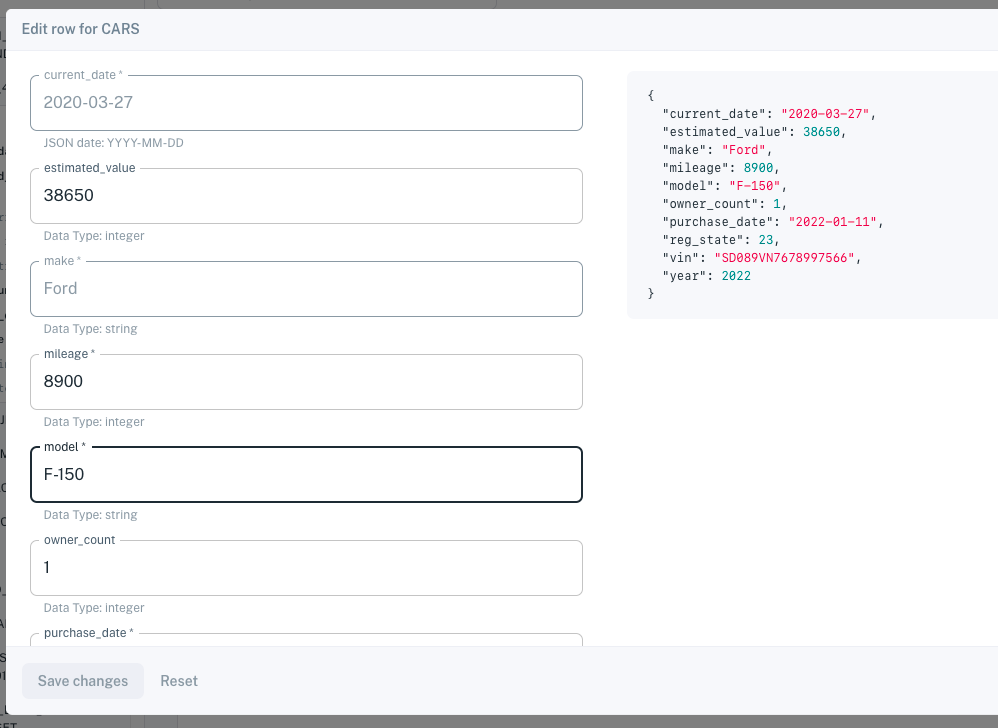
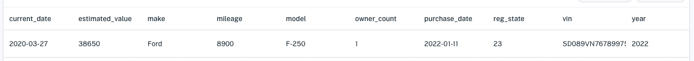

# Update Data

You can update records using the UI, the Data API, or SQL. Here we'll demonstrate updating a record using the UI and the Data API. 

``` {note} Since index properties are immutable, you can't update any of a record's index property values. You can however delete such a record and add a new record with the index property value you want.
```

## Updating a Record in the UI

Here's how to update a record in the UI. 

1. Go to a SQL editor in either the **Datasets** page or in a dataset's **Database** tab. The SQL editor appears.

    

1. Enter a [query](../search-data.md) to return the data record you want to update. Then click **Run**. Apperate executes the statement and returns the matching data record.

    

    ``` {important} WHERE clauses must only operate on indexed properties (columns). See the Unique Index components [here](./understanding-datasets.md#indexing-with-unique-index).
    ```

1. Double click on the row that represents the record. The row editor appears.

    

1. Make the field value modifications you want to any editable field. Then save your changes.

You've updated the data record. Editing records using the API is easy too.

## Overwriting a Record Using the API

The Data API [`POST /record/:workspace/:id`](https://iexcloud.io/docs/apperate-apis/data/write-data) endpoint's `duplicateKeyHandling=true` query parameter setting enables you to replace (overwrite) records with an incoming matching records. 

``` {important} An incoming record must match the existing record's [Unique Index](./understanding-datasets.md#indexing-with-unique-index).
```

Let's use the API to replace a record.

1. To specify your overwrite, you'll need to know its Unique Index values (i.e., primary, secondary, and date indexes) and you'll probably want to know its existing values so you can decide ones to preserve and ones to overwrite. You can fetch the record using the console's SQL editor or using the Data API's `GET /data/:workspace/:id/:key?/:subkey?` method, as demonstrated in [Querying Datasets](../search-data/querying-datasets.md).

    The following JSON object for example, represents data for a car:

    ```
    {"current_date":"2020-03-27","estimated_value":38650,"make":"Ford","mileage":8900,"model":"F-150","owner_count":1,"purchase_date":"2022-01-11","reg_state":23,"vin":"SD089VN7678997566","year":2022}
    ```

1. Use the [`POST /record/:workspace/:id`](https://iexcloud.io/docs/apperate-apis/data/write-data) endpoint and the `duplicateKeyHandling=true` parameter setting to replace the existing record. For example, you could change the above car record's `model` value to `F-250` by running a cURL command like the one below.

    ```bash
    curl -H "Content-Type: application/json" \
    -X POST "https://cloud.iexapis.com/v1/record/WORKSPACE/CARS?duplicateKeyHandling=true&wait=true&token=SECRET_TOKEN" \
    -d '[{"current_date":"2020-03-27","estimated_value":38650,"make":"Ford","mileage":8900,"model":"F-250","owner_count":1,"purchase_date":"2022-01-11","vin":"SD089VN7678997566","year":2022}]'
    ```

    Since the command specifies `duplicateKeyHandling=true`, the new record replaces the matching existing record.

    

    Since the command specifies `wait=true`, the response returns *after* the update is complete and available. By default, the `POST /record/:workspace/:id` endpoint returns immediately after sending the request. If you prefer to block until the update is complete and available for querying, set `wait=true`.

    The response looks like this:

    ```javascript
    [
        {
            "success":true,
            "message":"wrote 1 records"
        }
    ]
    ```

You can replace records using similar requests to the [`POST /record/:workspace/:id`](https://iexcloud.io/docs/apperate-apis/data/write-data) endpoint. Just copy the above request, replace `WORKSPACE`, `CARS` dataset name, and `SECRET_TOKEN` with your own values, and pass in your replacement record.

Now you can update data records like a champ!

## What's Next

[Delete Data](https://iexcloud.io/docs/apperate-apis/data/delete-data): This reference page describes the `DELETE /data/:workspace/:id/:key/:subkey?/:date?` endpoint for deleting data.

[Querying Data](../search-data.md): Describes the various ways to query (get) data.

[Create Views](./create-a-view.md): Demonstrates joining datasets to create views.