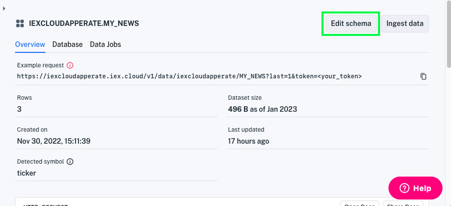

# Modify a Data Schema

Whether you hand-crafted your schema or Apperate inferred your schema from a data sampling, it's good to test your schema and fine-tune it to fit your needs. Here are some possible reasons to update a schema:

- Add property descriptions
- Add a new property
- Remove a deprecated property
- Change a property type
- Index a property
- SmartLink a property
- Require values for a property
- Forbid null values for a property
- Rename your dataset

Let's tour schema editing.

``` {warning} Changing the schema of a parent dataset can break or alter its associated [views](../reference/glossary.md#view).
```

``` {important} If you update your schema, it's best to update it early before you add lots of data to it.
```

## Open the Schema Editor

From your dataset's **Overview** page, click **Edit schema**.



The schema editor appears.


Here are the editor sections:

**Dataset ID:** This field allows you to rename the dataset.

**Select action for existing data:** This drop-down menu provides options for updating the dataset's *existing data* with regards to any schema modifications you apply. The [Specify how to handle existing data](#specify-how-to-handle-existing-data) step below explains the options and how they relate to various schema changes.

**Properties:** This table shows your dataset columns, their types and constraints, indexes, and descriptions. For details, see [Dataset Properties](../reference/dataset-properties.md).

**Opt-in to IEX Cloud's metadata graph:** This section enables you to [SmartLink](../reference/glossary.md#smartlink) a primary (or secondary) index property to the financial metadata graph. See [Understanding Datasets](./understanding-datasets.md) to learn more about SmartLinks.

## Update Your Properties

In the **Properties** table, make any property modifications you want, delete unneeded properties, and or add any new properties. You can change a property's type, constraints, and description, and designate the property as one of the dataset's three indexes.

``` {seealso} [Dataset Properties](../reference/dataset-properties.md) details the properties options.
```

``` {note} You can't change a property's name. Instead, add a new property as a replacement and remove the existing property.
```

## Update Your SmartLink Selection

If you want to [SmartLink](../reference/glossary.md#smartlink) one of the index properties to leverage Appearte's securities identifier resolution capability, select that property in the **Opt-in to IEX Cloud's metadata graph** section. See [Understanding Datasets](./understanding-datasets.md) to learn more about SmartLinks.

``` {important} Opting in a new or different index property requires reingesting all the existing data. This way, Apperate can tie in the property values to the metadata graph.
```

## Specify How to Handle Existing Data

Before you update the schema, you must inform Apperate how to handle the existing data. Here are the options:

- **Leave existing data as is:** Preserves the existing data.
- **Delete all existing data:** Removes ALL the existing data. Before doing this, MAKE SURE to back up any data you want to preserve. 
- **Update existing data:** Immediately modifies the data to adhere to the schema.
- **Reingest data using a new schema:** Reloads the existing data, validating it with the new schema and replacing the existing data, indexes, and metadata graph mappings (SmartLinks).

``` {important} **Reingestion is only for datasets with 1,000,000 records or less.** Reingestion is only intended at the beginning of a dataset's lifetime.
```

### Data Handling Best Practices

Here are some best practices to consider for existing data with regards to specific schema modifications.

| Modification | Considerations |
| --- | --- |
| 
Specify a new/different index | Select **Reingest data using a new schema**. |
| Specify a new/different SmartLink | Select **Reingest data using a new schema**. |
| Allow/forbid null for a property | If you want to update existing data, select **Reingest data using a new schema**.<br><br>If you are forbidding null values for the property, existing records that have null values are dropped. See Troubleshooting Schema Update Issues below for guidance on handling these records. |
| Require values for a property | If you want to update existing data, select **Update existing data**. Existing records missing the property are dropped. See Troubleshooting Schema Update Issues below for guidance on handling these records. |
| Change a property type | If you want to update existing data, select **Update existing data**.<br><br>Supported conversions:<br>- integer &rarr; number<br>- date &rarr; string<br>- string &rarr; date |
| Add a plain (unindexed, unmapped) property | If you want to update existing data, select **Update existing data** to add the new property with the type's default value.<br><br>The **Reingest data using a new schema** existing data action is unnecessary. |
| Remove a plain (unindexed, unmapped) property | No particular best practices. |

Select the action that best fits your scenario.

## Apply Your Changes

When you're done modifying the schema and selecting your existing data action, click **Update Dataset**. Apperate applies the schema modifications to your data and your dataset **Overview** appears.

If you have schema update issues, see how you can troubleshoot them next. Otherwise, enjoy your updated schema!

## Troubleshooting Any Update Issues

**If data reingestion fails** for a schema update, the invalid records are excluded from ingestion. Here's how to troubleshoot the invalid records.

1. Go to the [Ingestion Logs](https://iexcloud.io/console/logs).

1. Select the **Ingestion Jobs** tab.

1. Check the job's **Invalid Records** column. The document icon in the Invalid Records column links to the ingestion job's invalid record list.

    

1. Click the Invalid Records icon to view or download the invalid records CSV file.

    

1. Copy the record data and fix it to make it valid.

1. Add the record to the dataset using one of these ways:

  - [Database Page](../managing-your-data/update-data.md)
  - [Data API](./creating-a-dataset-with-the-api.md)
  - [File](../load-data/loading-data-from-a-file.md)

Terrific! You're becoming a schema management expert.

## Related Topics

[Understanding Datasets](./understanding-datasets.md) explains what datasets are and how they work.

[Dataset Properties](../reference/dataset-properties.md) describes dataset property options.

[Load More Data into a Dataset](../load-data/load-more-data-into-a-dataset.md) explains how to ingest more data from a new or existing data source.