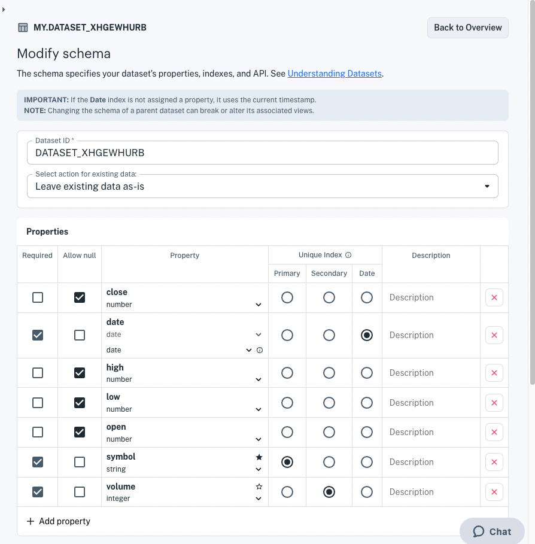
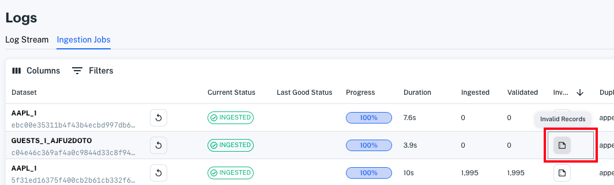
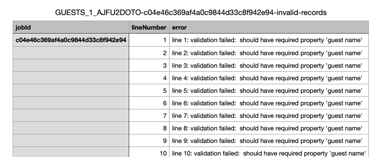

# Modify a Data Schema

There are various reasons you may have for modifying a schema. Here are some possible reasons:

- Enrich your dataset with a new property
- Remove a deprecated property
- Change a property type
- Require values for a property
- Forbid null values for a property
- Index a property
- SmartLink a property
- Rename your dataset

Whether you hand-crafted your schema or Apperate inferred your schema from a data sampling, it's good to check your schema after creating it and testing it.

Here's what's involved with updating your schema:

- Edit your schema
- Specify how to handle existing data
- Save your changes
- Troubleshoot any update issues

``` {warning} Changing the schema of a parent dataset can break or alter its associated views.
```

``` {important} If you update your schema, it's best to update it early.
```

## Edit Your Schema

From your dataset's **Overview** page, click **Edit schema** to view your schema. The schema editor appears.



Here are the editor sections:

**Select action for existing data:** This drop-down menu provides options for updating the dataset's existing data with regards to any schema modifications you apply. The next section [Specify how to handle existing data](#specify-how-to-handle-existing-data) explains the options and how they relate to various schema changes.

**Properties:** This table shows your dataset columns, their types and constraints, and indexes.

**Opt-in to IEX Cloud's metadata graph:** This section enables you to SmartLink a primary (or secondary) index property to the financial metadata graph. See [Understanding Datasets](./understanding-datasets.md) to learn more about SmartLinks.

Update your metadata-graph mapping and modify your schema properties the way you want. Before executing the update, consider how you want to handle existing data in light of the schema changes.

## Specify How to Handle Existing Data

You must select one of the following options for handling your existing data.

- **Leave existing data as is:** Preserves the existing data.
- **Delete all existing data:** Removes ALL the existing data. Before doing this, MAKE SURE you don't need any of the data. 
- **Update existing data:** Immediately modifies the data to adhere to the schema.
- **Reingest data using a new schema:** Reloads the existing data, validating it with the new schema and replacing the existing data, indexes, and metadata graph mappings (SmartLinks).

``` {important} **Reingestion is only for datasets with 1,000,000 records or less.** Reingestion is only intended at the beginning of a dataset's lifetime.
```

Here are some best practices to consider for existing data with regards to specific schema modifications.

| Modification | Considerations |
| --- | --- |
| Add a plain (unindexed, unmapped) property | If you want to update existing data, select **Update existing data** to add the new property with the type's default value.<br><br>The **Reingest data using a new schema** existing data action is unnecessary. |
| Remove a plain (unindexed, unmapped) property | No particular best practices. |
| Change a property type | If you want to update existing data, select **Update existing data**.<br><br>Supported conversions:<br>- integer &rarr; number<br>- date &rarr; string<br>- string &rarr; date |
| Allow/forbid null for a property | If you want to update existing data, select **Reingest data using a new schema**.<br><br>If you are forbidding null values for the property, existing records that have null values are dropped. See Troubleshooting Schema Update Issues below for guidance on handling these records. |
| Require values for a property | If you want to update existing data, select **Update existing data**. Existing records missing the property are dropped. See Troubleshooting Schema Update Issues below for guidance on handling these records. |
| Add/modify an index | Select **Reingest data using a new schema**. |
| Add/modify a SmartLink | Select **Reingest data using a new schema**. |

Select the existing data action that best fits your scenario.

## Save Your Changes

When you're done modifying the schema and selecting your existing data action, click **Update Dataset**. Apperate applies the schema modifications to your data and your dataset **Overview** appears.

If you have schema update issues, see how you can handle them next.

## Troubleshooting Any Update Issues

**If data reingestion fails** in a schema update, the invalid records are excluded from ingestion. Go to the Ingestion Logs page and check the ingestion job's **Invalid Records** column. The document icon in the Invalid Records column links to the ingestion job's invalid record list.



Click the Invalid Records icon to view or download the invalid records CSV file.



Copy the record data and make if valid. Then add it back to the dataset using one of these ways:

- [Database Page](../managing-your-data/update-data.md)
- [Data API](./creating-a-dataset-with-the-api.md)
- [File](../load-data/loading-data-from-a-file.md).

Now you know how to update a dataset schema.

## Related Topics

[Understanding Datasets](./understanding-datasets.md) explains what datasets are and how they work.

[Dataset Properties](../reference/dataset-properties.md) describes dataset property options.

[Load More Data into a Dataset](../load-data/load-more-data-into-a-dataset.md) explains how to ingest more data from a new or existing data source.