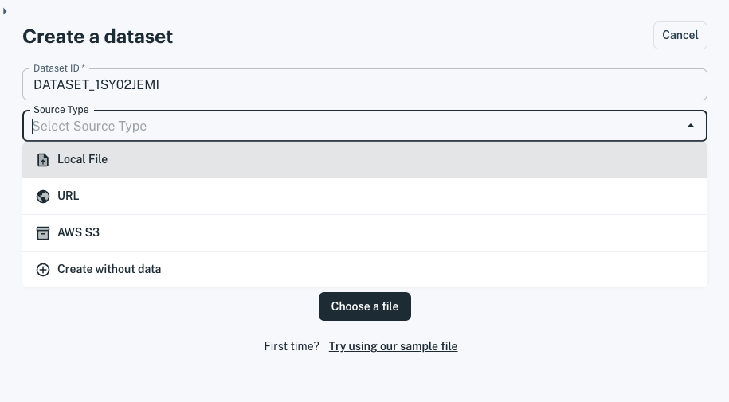
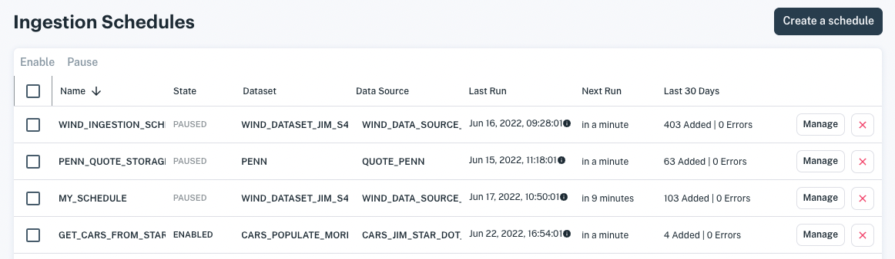

# Migrate and Import Data

```{toctree}
:maxdepth: 1

migrating-and-importing-data/loading-data-from-aws-s3.md
migrating-and-importing-data/loading-data-from-a-url.md
migrating-and-importing-data/loading-data-from-a-file.md
migrating-and-importing-data/load-more-data-into-a-dataset.md
migrating-and-importing-data/scheduling-data-ingestion.md
migrating-and-importing-data/accessing-nested-json-data.md
migrating-and-importing-data/accessing-s3-via-storage-integration.md
migrating-and-importing-data/accessing-s3-via-your-access-key.md
```

## Uploading Your Data

Here you can learn how to load data from the following sources:

- [AWS S3 bucket](./migrating-and-importing-data/loading-data-from-aws-s3.md)
- [URL](./migrating-and-importing-data/loading-data-from-a-url.md)
- [File](./migrating-and-importing-data/loading-data-from-a-file.md)

``` {important} **In fact, you can create a dataset instantaneously by dropping a CSV or JSON file onto the console.** On the spot, Apperate infers the schema and indexes automatically and creates the dataset.
```



## Scheduling Data Ingestion

When you're ready to import data regularly per a schedule, see [Schedule Data Ingestion](./migrating-and-importing-data/scheduling-data-ingestion.md). 



You'll have data flowing like clockwork!

## Supporting Articles

If you're parsing JSON response objects for the data you need or configuring access to AWS S3 buckets, check out these articles:

- [Access Nested JSON Data](./migrating-and-importing-data/accessing-nested-json-data.md)
- [Access S3 via AWS Integration](./migrating-and-importing-data/accessing-s3-via-storage-integration.md)
- [Access S3 via Your Access Key](./migrating-and-importing-data/accessing-s3-via-your-access-key.md)