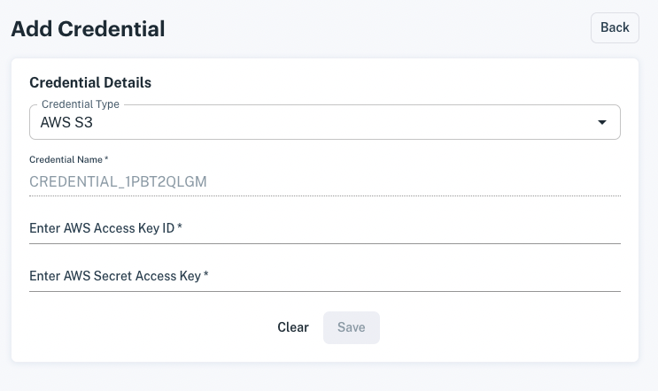

# Accessing S3 via Your Access Key

An easy way to connect with your AWS S3 bucket is using your [AWS access key](https://docs.aws.amazon.com/general/latest/gr/aws-sec-cred-types.html). An access key and secret can be stored (encrypted) and accessed in your Apperate workspace as credentials instance. Each credentials instance has an access key and secret access key value.

## Adding your AWS S3 credentials

Here's how to add your AWS S3 credentials:

1. Go to the **Credentials** page by navigating to **Sources > Credentials**. The Credentials page appears.

    

1. Click **Add credential**. The Add Credential page appears.

    

    Enter your AWS IAM user's **access key ID** and **secret access key**. For information on managing access keys, refer to the [AWS documentation](https://docs.aws.amazon.com/IAM/latest/UserGuide/id_credentials_access-keys.html?icmpid=docs_iam_console#Using_CreateAccessKey). After entering your ID and key, click **Save**. The credentials list appears and includes your newly added credential.

Now your credentials are available to use with your AWS S3 buckets.

> **Note:** Access key IDs and access secrets are encrypted in the IEX Cloud database. Your credential access key IDs and access secrets are visible only in your workspace.

## What's Next?

Now that you've configured credentials for your bucket, you can [load your bucket data into Apperate](./loading-data-from-aws-s3.md) for delivering to your apps.

If you're interested in granting Apperate's S3 user read access to the bucket instead of using AWS credentials, see [Accessing S3 via Storage Integration](./accessing-s3-via-storage-integration.md).

---
[Go to Docs Home](https://github.com/iexcloud/docs/blob/main/README.md)