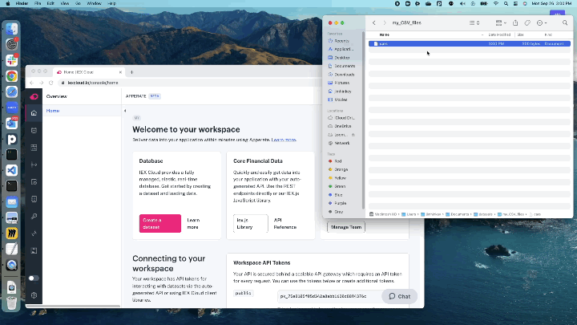
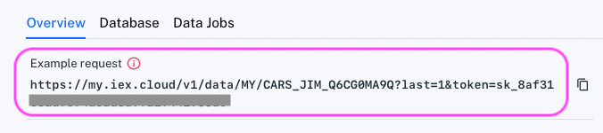

# Load Data from a File

You can load data into Apperate from a CSV, JSON, or JSONL file. Apperate infers a schema from a sampling of the file, validates the data using that schema, ingests the data, and generates a REST endpoint and endpoint documentation. What's more is that Apperate does this in **one step**. Just drop your file onto the console and Apperte does the rest.

## Load Data in One Step

Simply drag your CSV, JSON, or JSONL file onto the Apperate console and drop it in, as shown in the following animation.

``` {tip} If you need a sample file to load, see [Appendix: Create a Data File](#appendix-create-a-data-file).
```



Your new dataset's **Overview** page appears.


Here's the heavy lifting Apperate did for you:

- Inferred a data schema, including data types, constraints, indexes, and SmartLinks to Apperate's financial metadata graph.
- Validated the records against the schema
- Loaded the data into a table
- Generated an API endpoint and a corresponding API docs page

To view the schema and optionally modify it, see [Modify a Data Schema](../managing-your-data/updating-a-dataset-schema.md).

``` {tip} If data ingestion fails or you suspect issues, check the ingestion details in the **Data Jobs**  tab or navigate to **Logs**, and check  the **Log Stream** or **Ingestion Logs**. For guidance, see [Monitor Deployments](../administration/monitoring-deployments.md).
```

``` {important} 20,000,000 record limit per ingestion.
```

``` {note} Apperate supports CSV files that use the following common data delimiters: comma (,), tab, or pipe (\|) characters. JSON and JSONL files are also supported.
```

## Retrieve the Data

In the **Overview** page, get the data by clicking the **Example Request** URL.

 

The URL opens in a new browser tab and the last data record appears in a JSON object like this.

```javascript
[
    {
        "current_date": "2020-03-27",
        "estimated_value": 38650,
        "make": "Ford",
        "mileage": 8900,
        "model": "F-150",
        "owner_count": 1,
        "purchase_date": "2022-01-11",
        "vin": "SD089VN7678997566",
        "year": 2022
    }
]
```

It's that easy for your apps to use data!

Congratulations on making data available in Apperate!

## What's Next

Now that you've created a dataset, you can examine it and or modify it in the schema editor (click **Edit Schema**). You can also add more data to it (click **Ingest data**) or [modify its data](../interacting-with-your-data/updating-a-data-record.md) via the dataset's **Database** page.

Here are some more topics you can learn:

[Load More Data into a Dataset](./load-more-data-into-a-dataset.md)

[Loading Data from a URL](./loading-data-from-a-url.md) demonstrates getting data from a URL.

[Using Apperate's APIs](../interacting-with-your-data/apperate-api-basics.md) shows how to query datasets and operate on resources programmatically.

[Understanding Datasets](../managing-your-data/understanding-datasets.md) explains dataset properties, constraints, indexes, and mappings.

## Appendix: Create a Data File

If you don't already have a file to load into Apperate, you can create a simple CSV file (has three records) using a command below for your operating system.

```{tab} Linux/MacOS
    echo "vin,make,model,year,current_date,purchase_date,estimated_value,mileage,owner_count
    XV859643N98D98E7C,Chevrolet,Camaro,2020,2020-03-27,2020-03-13,45955.00,32000,2
    SD089VN7678997566,Ford,F-150,2022,2020-03-27,2022-01-11,38650.00,8900,1
    59ADFG60929087DAH,Toyota,Prius,2018,2020-03-27,2019-09-23,22876.00,76000,1" \
    >>cars
```

``` {tab} Windows
    (
    echo vin,make,model,year,current_date,purchase_date,estimated_value,mileage,owner_count
    echo XV859643N98D98E7C,Chevrolet,Camaro,2020-03-27,2020,2020-03-13,45955.00,32000,2
    echo SD089VN7678997566,Ford,F-150,2022,2020-03-27,2022-01-11,38650.00,8900,1
    echo 59ADFG60929087DAH,Toyota,Prius,2018,2020-03-27,2019-09-23,22876.00,76000,1
    )>cars
```

Load your file into Apperate following the instructions at [Load Data in One Step](#load-data-in-one-step).