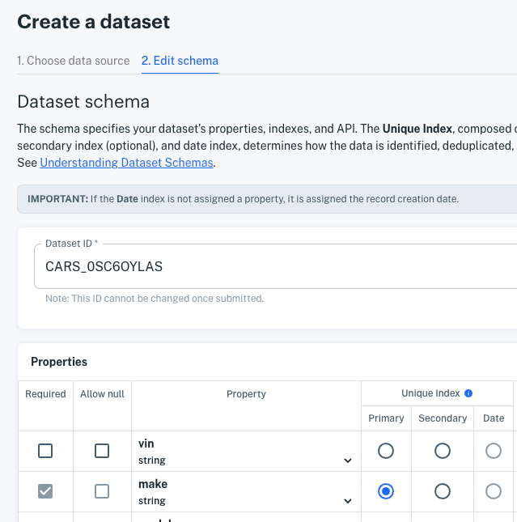
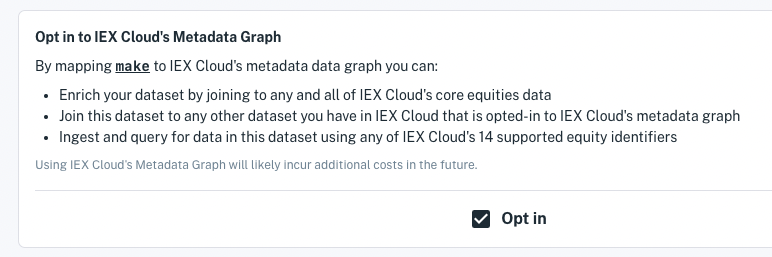

# Loading Data from a File

We're excited to show you how to make data from a file accessible via a RESTful API endpoint in minutes. Here you will create a dataset from a CSV file of example data. You will define the dataset schema, store the dataset, and read the data immediately from an auto-generated API.

> **Note:** You can of course, follow along using your own data, but for creating a dataset your first time we suggest using this small example data.

## File Ingestion Example

Start ingesting your file, following these steps:

1.  Click **Create a Dataset** at the top of the console or from the **Datasets** page. The **Create a Dataset** page appears.

    

    > **Important:** 20,000,000 record limit per ingestion.

1.  Before continuing in the Create a Dataset page, create a data file on your local machine by adding the following example car data (it's in CSV format) into a plain text file.

    > **Note:** Apperate supports CSV files that use the following common data delimiters: comma (,), tab, or pipe (\|) characters. JSON and JSONL files are also supported.

    **Data**

    ```
    vin,make,model,year,current_date,purchase_date,estimated_value,mileage,owner_count
    XV859643N98D98E7C,Chevrolet,Camaro,2020,2020-03-27,2020-03-13,45955.00,32000,2
    SD089VN7678997566,Ford,F-150,2022,2020-03-27,2022-01-11,38650.00,8900,1
    59ADFG60929087DAH,Toyota,Prius,2018,2020-03-27,2019-09-23,22876.00,76000,1
    ```

    **Example Command**
    
    These commands create the data file on Linux, MacOS, and Windows.

    Linux/MacOS

    ```bash
    echo "vin,make,model,year,current_date,purchase_date,estimated_value,mileage,owner_count
    XV859643N98D98E7C,Chevrolet,Camaro,2020,2020-03-27,2020-03-13,45955.00,32000,2
    SD089VN7678997566,Ford,F-150,2022,2020-03-27,2022-01-11,38650.00,8900,1
    59ADFG60929087DAH,Toyota,Prius,2018,2020-03-27,2019-09-23,22876.00,76000,1" \
    >>cars
    ```

    Windows

    ```
    (
    echo vin,make,model,year,current_date,purchase_date,estimated_value,mileage,owner_count
    echo XV859643N98D98E7C,Chevrolet,Camaro,2020-03-27,2020,2020-03-13,45955.00,32000,2
    echo SD089VN7678997566,Ford,F-150,2022,2020-03-27,2022-01-11,38650.00,8900,1
    echo 59ADFG60929087DAH,Toyota,Prius,2018,2020-03-27,2019-09-23,22876.00,76000,1
    )>cars
    ```

1.  In the Create a Dataset page's **Choose Source Type** menu, **File** is selected by default. Keep that setting for uploading your file.

    Upload your CSV file you by either dragging it into the file upload area or by clicking **Choose file** to browse to it and select it. The file uploads and the **Edit schema** interface appears.

    

    Apperate ingested your file and made a best effort to name your dataset (see *Dataset ID*) and specify your properties (see the *Properties* table) and your data's Unique Index, composed of primary, secondary, and date indexes.

    > **Note:** The *Dataset ID* cannot be changed once you've submitted your dataset. Make sure to specify the ID you want in this step.

    Below the *Properties* table there's more.

    

    Apperate created a **Sample API Call** for getting the data by the value of the date property that is currently assigned the *Date* index (see in the properties table under *Unique Index*).

    Your current *Unique Index* shows in the **Unique Index Example**. The Unique Index is composed of the Primary index, Secondary index (optional), and Date index. You have not yet assigned the Primary index or a Secondary index. The Date index, in this example, is currently assigned to the *purchase_date* property. In the next step, you will set your Unique Index by setting these three indexes.

    The **Sample Data Preview** table at the bottom shows your ingested data.

    Lastly, the **Opt in to IEX Cloud's Metadata Graph** section provides the opportunity to map a [financial identifier](../reference/financial-identifiers.md) property to IEX Cloud's metadata data graph. This allows you to enrich your dataset by joining it to IEX Cloud core equities data or any other dataset that is also opted in. Furthermore, you can ingest data into and query for data in this dataset using IEX Cloud's supported [financial identifiers](../reference/financial-identifiers.md).

    

    Let's edit the schema.

1.  In the **Edit schema** interface, modify the schema to specify the dataset ID, property characteristics, and Unique Index using the following values.

    **Dataset ID:** `CARS`

    **Unique ID related Properties**

    | Required | Allow null | Property | Index |
    | -------- | ---------- | -------- | ----- |
    | x |   | vin (string)| Primary |
    | x |   | make (string) | Secondary |
    | x |   | current_date (date) | Date |

    **Remaining Properties**

    | Required       | Allow null       | Property |
    | -------------- | ---------------- | -------- |
    | x |  | model (string) |
    | x |  | year (integer) |
    |   |  | estimated_value (number) |
    | x |  | mileage (integer) |
    |   |  | owner_count (integer) |
    | x |  | purchase_date (date) | Date |

    > **Important:** The `_system` prefix (case-insensitive) is reserved for Apperate system tables and columns. You are forbidden to prefix your dataset ID or dataset property names with `_system`.

    **Opt in to IEX Cloud's Metadata Graph:** unselect

    Make sure to unselect the **Opt in** check box, since the example cars data has no relevant financial identifier properties.
    
    Notice the Sample API Call value and Unique Index Example values in sync with your property settings.

    

    When you're done specifying the schema values, click **Create Dataset Now**. Your dataset builds and your dataset overview appears.

    

    > **Note:** If data ingestion fails or you suspect issues, check the ingestion details in the overview's **Data Jobs**  page or navigate to **Logs**, and check  the **Log Stream** or **Ingestion Logs**. For guidance, see [Monitoring Deployments](../administration/monitoring-deployments.md).

    From here you can manage and monitor your dataset, open/share the API docs, execute an example request on your dataset, and create different views to your data.

6.  In your dataset overview page, get your data by clicking the **Example Request** URL. The URL opens in a new browser tab and the dataset data response (in JSON) appears.

    

    It's that easy for apps to use your data!

7.  **Bonus step - visit your API docs** by clicking **API Docs**
    in your dataset's overview page. Your API docs open in a new tab.

    

    Your auto-documented dataset is ready for consumption.

Congratulations on making data available using a dataset!

## What's Next

Now that you are familiar with creating a dataset from a CSV file, you can create datasets using your own CSV, JSON, or JSONL file. You can also add more data to your datasets (click **Ingest data**) in the dataset overview or modify data via the dataset's **Database** page.

Got a URL you want to tap into for data? See [Loading Data from a URL](../migrating-and-importing-data/loading-data-from-a-url.md).

Interested in creating datasets programmatically? Checkout [Using Apperate's APIs](../interacting-with-your-data/apperate-api-basics.md).

Want to learn more about creating and managing datasets? Read [Understanding Datasets](../managing-your-data/understanding-datasets.md).

Want to get more teammates involved? [Add them to your team](../administration/managing-users.md).