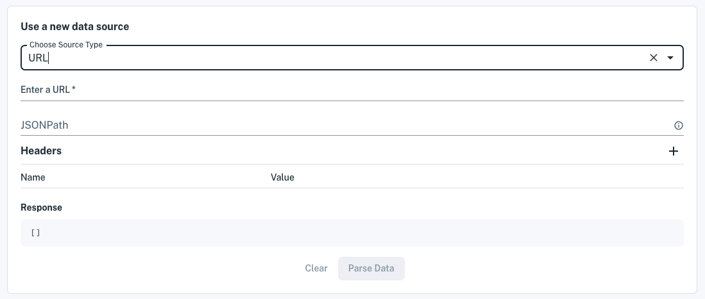
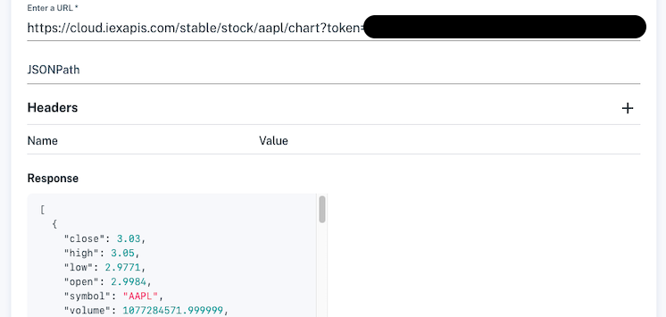

# Loading Data from a URL

If there's a URL that you would like to load data from, you can connect to it and store its data in a dataset for publishing to your apps. Here you will do just that.

## Creating a Dataset with Data from a URL

1. Click **Create a Dataset** at the top of the console or from the **Datasets** page. The **Create a dataset** page appears.

    

1. In the **Use a new data source** section, choose **URL** in the source type. The URL fields appear.

    

1. Specify the data at a URL by entering these details:

    **Enter a URL:** (the URL)

    **JSONPath:** (see below)

    **Headers:** (add any required name/value pairs)

    If the URL returns a JSON response, check your data's location in the **Response** panel.

    - If the data you want is in the top level records (as shown in the image below), leave JSONPath blank.
    - If the data you want is nested deeper within the JSON object, specify the path to it using JSONPath. Refer to [Accessing Nested JSON Data](./accessing-nested-json-data.md) for details.

    > **Important:** The URL response passed to Apperate must be an array of objects.

    The URL below, for example, is good because it returns a JSON object array with all data in the top level objects.

    

    When you're done specifying the data source, click **Parse data**. The schema editor appears.

    

1. In the schema editor, name your dataset, check the property types and indexes, and specify whether to opt in an indexed property to the metadata graph. 

    > **Note:** the metadata graph opt-in, provides the opportunity to map a property to IEX Cloud's metadata data graph of [financial identifiers](../reference/financial-identifiers.md). This allows you to enrich your dataset by joining it to IEX Cloud core equities data or any other dataset that is also opted in. Furthermore, you can ingest data into and query for data in this dataset using IEX Cloud's supported financial identifiers. See [Normalization](../managing-your-data/defining-schemas/normalization.md) for examples.

    When you're happy with the schema, click **Create dataset now**.

    Apperate creates the dataset, loads the data into it, and shows the dataset's **Overview** page.

    

    > **Note:** If data ingestion fails or you suspect issues, check the ingestion details in the overview's **Data Jobs**  page or navigate to **Logs**, and check  the **Log Stream** or **Ingestion Logs**. For guidance, see [Monitoring Logs](../administration/monitoring-deployments.md).

1. In the **Overview** page, fetch the last record by clicking on the **Example Request** URL. A browser tab opens to the URL and Apperate returns the record in a JSON object array. Here's an example array:

    ```json
    [{"change":-0.75,"changeOverTime":47.831683168316836,"changePercent":-0.005,"close":147.96,"date":"2022-06-08","fClose":147.96,"fHigh":149.8697,"fLow":147.46,"fOpen":148.58,"fVolume":53950201,"high":149.8697,"id":"HISTORICAL_PRICES","key":"AAPL","label":"Jun 8, 22","low":147.46,"marketChangeOverTime":47.831683168316836,"open":148.58,"subkey":"","symbol":"AAPL","uClose":147.96,"uHigh":149.8697,"uLow":147.46,"uOpen":148.58,"updated":1654736422000,"uVolume":53950201,"volume":53950201}]
    ```

Congratulations! You loaded data from a URL into a dataset and that's ready to deliver that data to your apps.

## What's Next

Here are some things to explore doing with your new data and data source.

- Schedule data ingestion on your new data source. Learn how at [Scheduling Data Ingestion](./scheduling-data-ingestion.md).

- Provide custom views to the data by joining your dataset with a Core Dataset or one of your other datasets. See [Creating and Managing Views](../managing-your-data/creating-and-managing-views.md) for details.

- Use the data in your apps via your dataset API endpoints. Query for the exact data you want as demonstrated in [Apperate Query Basics](../interacting-with-your-data/apperate-api-basics.md).