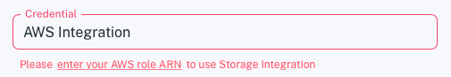
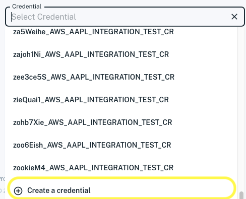
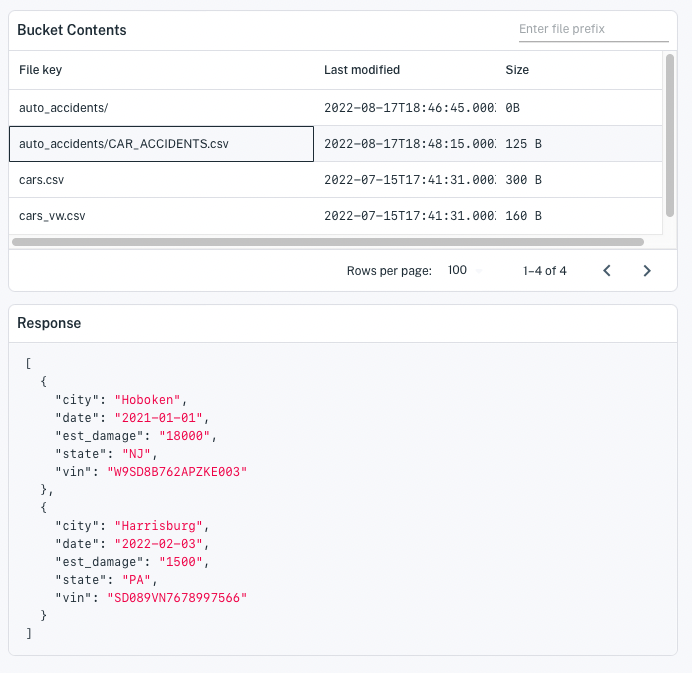
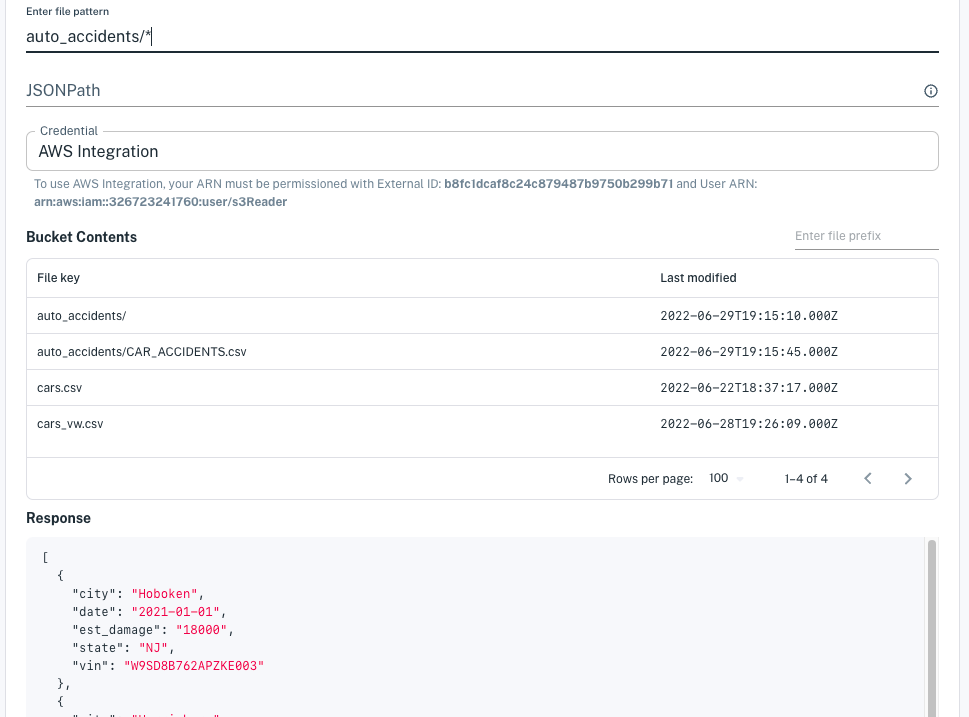
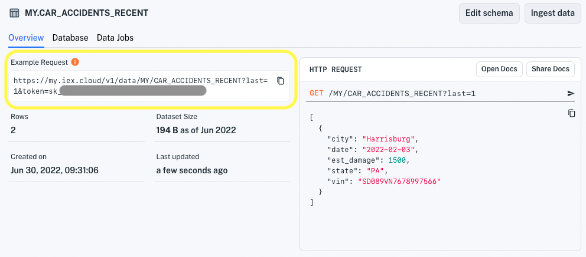

# Load Data from an AWS S3 Bucket

In few steps, you can import data from a CSV, JSON, or JSONL data file in your S3 bucket.

## Creating a Dataset From an S3 Bucket File

1. Click **Create a Dataset** at the top of the console or from the **Datasets** page. The **Create a Dataset** page appears.

    

1. Enter an ID for your dataset.

1. For **Source Type**, select **AWS S3**.

    

    The AWS data source fields appear.

    

1. For **Data Source**, select the bottom-most option **Create a source**.

    

    The bucket-related fields and **Save this data source** option appear.

    

1. If you want to save the data source for loading more data later, select the **Save this data source?** option.

    

    ``` {note} After creating the dataset, the data source will be saved with an auto-generated name. To find the data source, navigate to **Sources** and sort the list by **Last Updated**. The data source should be one most recently updated.
    ```

1. There are various credential options.

    If you haven't already created AWS Integration as a credential, the **Credential** field appears in red.

    

    If you want to configure AWS Integration, select **enter your AWS role ARN** link and then enter your AWS IAM Role ARN in the field.

    

    ``` {important} Make sure to grant Apperate's S3 user access to your role by configuring the returned S3 User and External ID in your role. See [Access S3 via AWS Integration](./accessing-s3-via-storage-integration.md) for details.
    ```

    If you want to use an access key credential, you can select an existing one from the **Credential** selector or select the bottom-most option **Create a credential**.

    

    ``` {seealso} For more information on configuring access to S3 buckets via access keys, see [Access S3 via Your Access Key](./accessing-s3-via-your-access-key.md).
    ```

1. Enter your AWS bucket name. All of your bucket files (file keys) appear in the Bucket Contents panel on the right.

    

1. Specify a file to load data by selecting a file key or entering a file pattern.      

    - **Select a file key** - Select a file from the Bucket Contents list. The *Response* panel updates to reflect the selected file's content.

        

        ``` {tip} You can filter on files in a particular folder by entering a folder name in the *file prefix* field at the top-right of Bucket Contents.
        ```

    - **Enter a File pattern** - Enter a file pattern (filename glob) using `*`, `?`, and `[]` to match the file(s) you want to ingest. Inside brackets `[]`, you can put "or" options to match individual characters or a character range (e.g., `foo[2-4]` matches `foo2` and `foo3` but not `foo5`). The Response panel updates to show contents of a matching file that has the oldest modified timestamp in the bucket.

        An array of JSON objects based on a sample of the oldest matching file's data appears in the **Response** panel. Apperate uses this sample to build the dataset schema.

         

    ``` {important} To load JSON data, the data must be an array of objects.
    ```

    If you specified a JSON file(s) and the Response panel shows the object array you want, leave the JSONPath field empty. Otherwise, use the JSONPath field to specify the path to a desired object array in the JSON file. A **JSON Response** panel on the bottom right shows the data found at the JSONPath.

    ``` {seealso} [Access Nested JSON Data](./accessing-nested-json-data.md) for guidance on specifying JSONPath for JSON file data.
    ```

1. When you're done specifying the data, click **Create Dataset**. Apperate creates the dataset, loads the file data into the dataset, and shows the dataset's **Overview** page.

    

    ``` {note} If data ingestion fails or you suspect issues, check the ingestion details in the overview's **Data Jobs**  page or navigate to **Logs**, and check  the **Log Stream** or **Ingestion Logs**. For guidance, see [Monitor Deployments](../administration/monitoring-deployments.md).
    ```

1. In the **Overview** page, fetch the last record by clicking on the **Example Request** URL. A browser tab opens to the URL and Apperate returns the record in a JSON object array. Here's an example array:

    ```json
    [
        {
            "city": "Harrisburg",
            "date": "2022-02-03",
            "est_damage": 1500,
            "state": "PA",
            "vin": "SD089VN7678997566"
        }
    ]
    ```

Congratulations! You loaded data from your AWS S3 bucket into a dataset and it is ready to deliver that data to apps.

``` {note} To view the schema and optionally modify it, see [Modify a Data Schema](../managing-your-data/updating-a-dataset-schema.md).
```

## What's Next

Here are some things to explore doing with your new data and data source.

- [Schedule Data Ingestion](./scheduling-data-ingestion.md) shows you how to load data regularly per a schedule.

- [Load More Data into a Dataset](./load-more-data-into-a-dataset.md) explains how to ingest more data from a new or existing data source.

- [Create Views](../managing-your-data/creating-and-managing-views.md) demonstrates joining datasets to create views.

- [Use Apperate's APIs](../developer-tools/use-apperate-apis.md) introduces Apperate REST endpoints to query for the exact data you want and CRUD endpoints to use Apperate programatically.