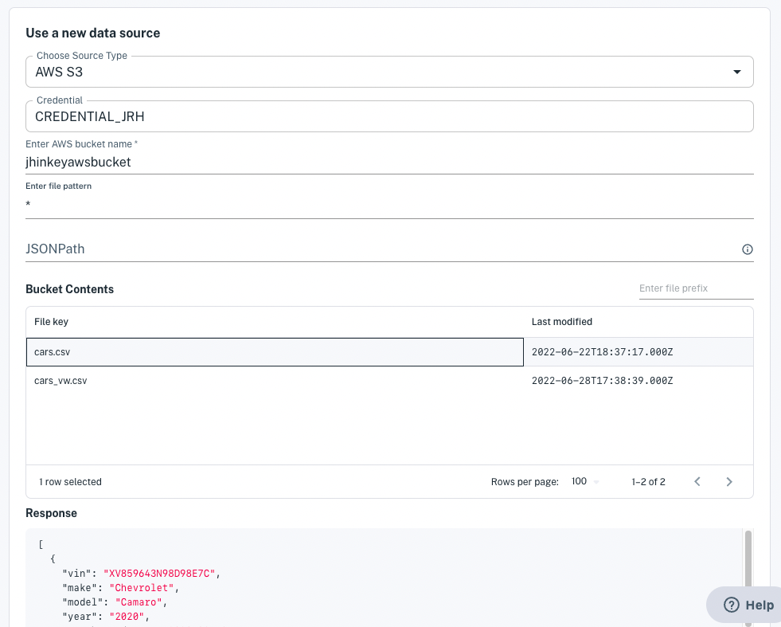

# Loading Data from AWS S3

In few steps, you can import data from CSV, JSON, or JSONL data files in your S3 buckets. Accessing a bucket requires specifying the bucket and credentials to access it. You must configure bucket access *before* you create a dataset from that bucket's files. Here are the access types:

- **Access Key:** Specify credentials composed of an access key and secret access key. For details, see [Accessing S3 via Your Access Key](./accessing-s3-via-your-access-key.md).
- **AWS storage integration:** Grant Apperate's S3 user read access to your bucket. Learn how at [Accessing S3 via Storage Integration](./accessing-s3-via-storage-integration.md).

Here we'll create a dataset from an S3 bucket file.

## Creating a Dataset with Data from an S3 Bucket

1. Click **Create a Dataset** at the top of the console or from the **Datasets** page. The **Create a Dataset** page appears.

    

1. In the **Use a new data source** section, choose **AWS S3** in the source type. The AWS S3 bucket fields appear.

    

1. Select your credential for accessing the bucket.

    

    - If you have AWS integration configured, you can select **AWS ingtegration**. 
    - If you have an access key credential, you can select that credential.

1. Enter your AWS bucket name. Your bucket files (file keys) appear in a Bucket Contents list.

    

1. Specify a file pattern for matching the files you want to load data from. The files matching the name pattern continue to show in the lists.

1. Select the file key to base your schema on and to load data from. A sample of the file contents appears in the Response panel.

    > **Important:** To load data from JSON, the data must be specified in an array of objects.

    If the resulting data shown in the panel specifies the object array you want, leave the JSONNPath field empty. Otherwise, use the JSONPath field to specify the path to the desired object array in your data. A panel on the bottom right shows the data resulting from your JSONPath.

    > **See also** [Accessing Nested JSON Data](./accessing-nested-json-data.md) for guidance on specifying JSONPath.

    When you're done specifying the path to your data, click **Parse Data**. The schema editor appears.

    

1. In the schema editor, check the property types and indexes, and specify whether to opt in an indexed property to the metadata graph. 

    > **Note:** the metadata graph opt-in, provides the opportunity to map a property to IEX Cloud's metadata data graph of [financial identifiers](../reference/financial-identifiers.md). This allows you to enrich your dataset by joining it to IEX Cloud core equities data or any other dataset that is also opted in. Furthermore, you can ingest data into and query for data in this dataset using IEX Cloud's supported financial identifiers.

    > **See Also:** [Normalization](../managing-your-data/defining-schemas/normalization.md).

    When you're done confirming the schema, click **Create dataset now**.

    Apperate ingests your data into a dataset and the dataset's **Overview** page appears.

Congratulations on creating a dataset from your AWS S3 bucket file!

## What's Next

Here are some things to explore doing with your new data and data source.

- Schedule data ingestion on your new data source. Learn how at [Scheduling Data Ingestion](./scheduling-data-ingestion.md).

- Provide custom views to the data by joining your dataset with a Core Dataset or one of your other datasets. See [Creating and Managing Views](../managing-your-data/creating-and-managing-views.md) for details.

- Use the data in your apps via your dataset API endpoints. Query for the exact data you want as demonstrated in [Apperate Query Basics](../interacting-with-your-data/apperate-api-basics.md).