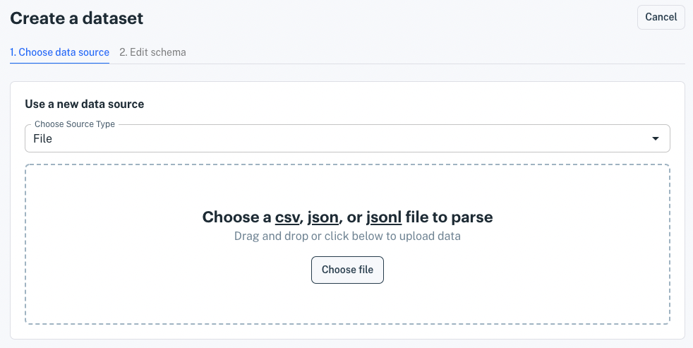
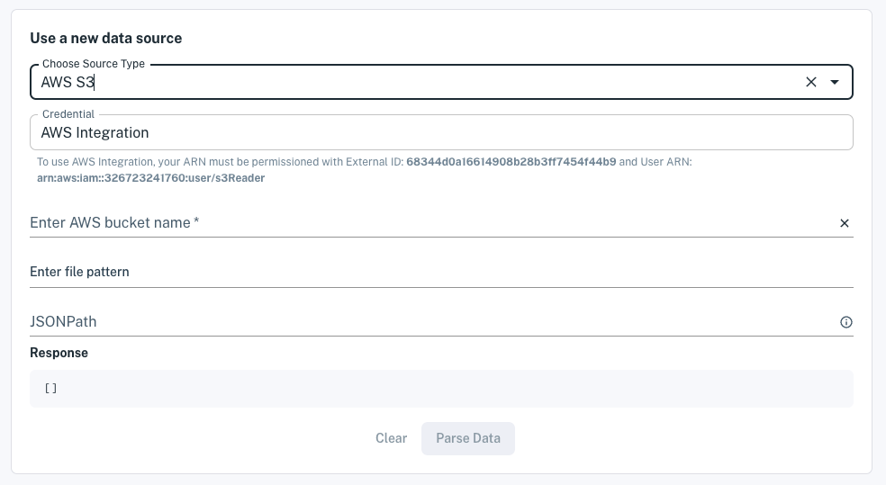
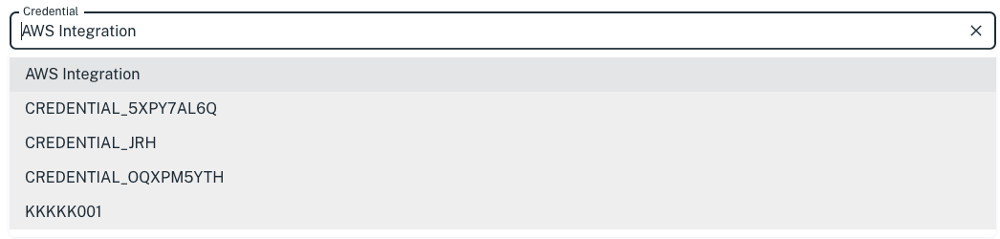
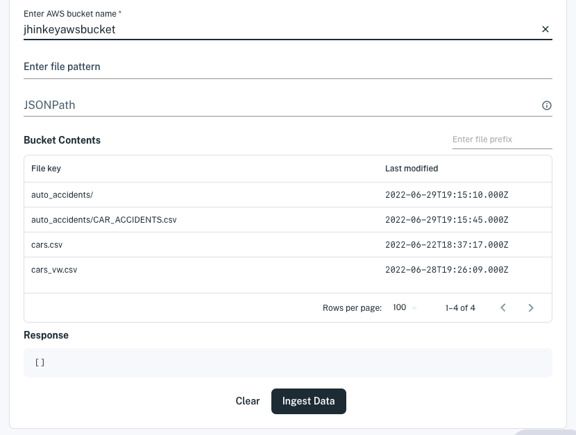
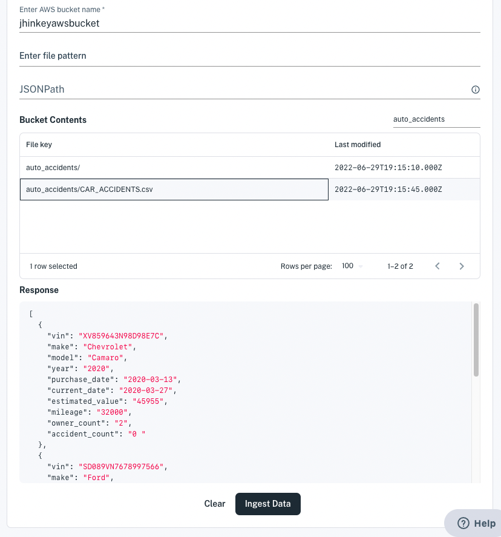
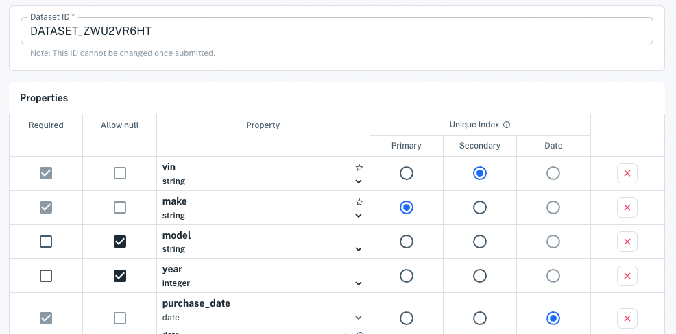

# Loading Data from AWS S3

In few steps, you can import data from CSV, JSON, or JSONL data files in your S3 buckets. Before creating a dataset that uses bucket files, you must configure credentials for accessing the bucket. Here are the credential types:

- **AWS Integration:** Grant Apperate's S3 user bucket read access. Learn how at [Accessing S3 via AWS Integration](./accessing-s3-via-storage-integration.md).
- **Access Key:** Specify your bucket access key and secret access key. For details, see [Accessing S3 via Your Access Key](./accessing-s3-via-your-access-key.md). (**Important:** This option is currently broken for creating a new dataset.)

Here we'll create a dataset from an S3 bucket file.

## Creating a Dataset with Data from an S3 Bucket

1. Click **Create a Dataset** at the top of the console or from the **Datasets** page. The **Create a Dataset** page appears.

    

1. In the **Use a new data source** section, choose **AWS S3** in the source type. The AWS S3 bucket fields appear.

    

1. Select the **AWS Integration** credential type.<!-- Select your credential for accessing the bucket.-->

    

    > **Note:** The ability to access an AWS S3 source for creating a dataset is currently broken.

    <!--
    - If you have configured AWS Integration, you can select **AWS Ingtegration**. 
    - If you have an access key credential, you can select that credential.
    -->

1. Enter your AWS bucket name. All of your bucket files (file keys) appear in the Bucket Contents list.

    

1. Use a combination of the following options to specify the file(s) to load data from.

    **File pattern** - Enter a file pattern using `*`, `?`, and `[]` to match the file(s). You can specify a file path (bucket prefix + file key) too. The Bucket Contents updates to show files that match the pattern.

    **Prefix** - Pare down the Bucket Contents by entering an S3 bucket prefix (i.e., a folder path) in the **Enter file prefix** field at the top-right of the Bucket Contents section.

    **Select a file key** - Select a specific file.

    An array of JSON objects based on a sample of the first matching file's data appears in the **Response** panel. Apperate uses this sample to build the dataset schema.

    

    > **Important:** To load data from JSON, the data must be specified in an array of objects.

    If you selected a JSON file and the Response panel shows the object array you want, leave the JSONNPath field empty. Otherwise, use the JSONPath field to specify the path to the desired object array in the JSON file. A **JSON Response** panel on the bottom right shows the data found at the JSONPath.

    > **See also** [Accessing Nested JSON Data](./accessing-nested-json-data.md) for guidance on specifying JSONPath for JSON file data.

    When you're done specifying the file data, click **Parse Data**. The schema editor appears.

    

1. In the schema editor, name your dataset, check the property types and indexes, and specify whether to opt in an indexed property to the metadata graph. 

    > **Note:** the metadata graph opt-in, provides the opportunity to map a property to IEX Cloud's metadata data graph of [financial identifiers](../reference/financial-identifiers.md). This allows you to enrich your dataset by joining it to IEX Cloud core equities data or any other dataset that is also opted in. Furthermore, you can ingest data into and query for data in this dataset using IEX Cloud's supported financial identifiers. See [Normalization](../managing-your-data/defining-schemas/normalization.md) for examples.

    When you're happy with the schema, click **Create dataset now**.

    Apperate creates the dataset, loads the data into it, and shows the dataset's **Overview** page.

    

1. In the **Overview** page, fetch the last record by clicking on the **Example Request** URL. A browser tab opens to the URL and Apperate returns the record in a JSON object array. Here's an example array:

    ```json
    [{"change":-0.75,"changeOverTime":47.831683168316836,"changePercent":-0.005,"close":147.96,"date":"2022-06-08","fClose":147.96,"fHigh":149.8697,"fLow":147.46,"fOpen":148.58,"fVolume":53950201,"high":149.8697,"id":"HISTORICAL_PRICES","key":"AAPL","label":"Jun 8, 22","low":147.46,"marketChangeOverTime":47.831683168316836,"open":148.58,"subkey":"","symbol":"AAPL","uClose":147.96,"uHigh":149.8697,"uLow":147.46,"uOpen":148.58,"updated":1654736422000,"uVolume":53950201,"volume":53950201}]
    ```

Congratulations! You loaded data from your AWS S3 bucket into a dataset and that's ready to deliver that data to your apps.

## What's Next

Here are some things to explore doing with your new data and data source.

- Schedule data ingestion on your new data source. Learn how at [Scheduling Data Ingestion](./scheduling-data-ingestion.md).

- Provide custom views to the data by joining your dataset with a Core Dataset or one of your other datasets. See [Creating and Managing Views](../managing-your-data/creating-and-managing-views.md) for details.

- Use the data in your apps via your dataset API endpoints. Query for the exact data you want as demonstrated in [Apperate Query Basics](../interacting-with-your-data/apperate-api-basics.md).