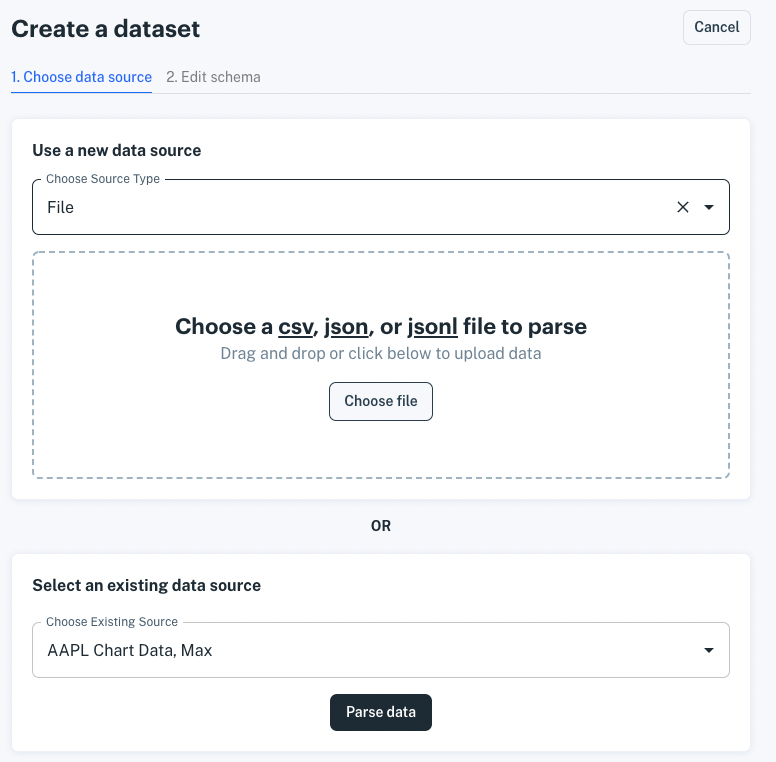

# Loading Data from AWS S3

In few steps, you can import data from CSV, JSON, or JSONL data files in your S3 buckets. Accessing a bucket requires specifying bucket and authorization to it. You can authorize access using credentials (access key and secret access key) or an AWS storage integration (granting Apperate's S3 user bucket read access). 

The access options are explained in these articles:

- [Accessing S3 via Your Access Key](./accessing-s3-via-your-access-key.md)
- [Accessing S3 via Storage Integration](./accessing-s3-via-storage-integration.md)

You can configure bucket access ahead of time or as you're creating a dataset from your bucket data. The articles mentioned above provide key instructions for configuring bucket access.

## Creating a Dataset with Data from an AWS S3 Bucket

1. Click **Create a Dataset** at the top of the console or from the **Datasets** page. The **Create a Dataset** page appears.

    

1. In the **Use a new data source** section, choose **AWS S3 (storage integration)** in the source selector.

    

    The AWS S3 bucket fields appear.

    TODO add image

1. Enter your AWS bucket name. 

1. Select your authorization mechanism.

    - If you have AWS integration configured already, there's no need to select anything. 
    - If you have a credential for the bucket in Apperate already, you can select that credential.
    - Otherwise, you can 1) create an AWS integration or 2) add credentials for accessing your bucket. Then select the option you just created.

    When you've connected with your bucket, your bucket filenames appear in a list.

1. Select the bucket file to load data from. A sample of the file contents appear in the response panel on the bottom left.

    **If your file is a CSV file**, click **Parse Data**. The **Dataset Schema** page appears.

    **If your file is a JSON file or JSONL file**, a sample of the data appears in a panel on the bottom left.

    ```{important}
    To load data from JSON, the data must be specified in an array of objects.
    ```

    If the resulting data shown in the panel specifies the object array you want, leave the JSONNPath field empty. Otherwise, use the JSONPath field to specify the path to the desired object array in your data. A panel on the bottom right shows the data resulting from your JSONPath.

    ```{seealso}
    See [Working with Nested JSON Data](./working-with-nested-json-data.md) for guidance on specifying JSONPath.
    ```

    When you're done specifying the path to your data, click **Parse Data**. Apperate ingests your data into a dataset and the dataset's **Overview** page appears.

TODO

## What's Next

Here are some things to explore doing with your new data and data source.

- Schedule data ingestion on your new data source. Learn how at [Scheduling Data Ingestion](./scheduling-data-ingestion.md).

- Provide custom views to the data by joining your dataset with a Core Dataset or one of your other datasets. See [Creating and Managing Views](../managing-your-data/creating-and-managing-views.md) for details.

- Use the data in your apps via your dataset API endpoints. Query for the exact data you want as demonstrated in [Apperate Query API](../interacting-with-your-data/apperate-query-api.md).