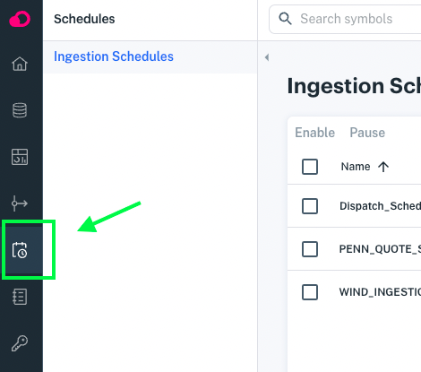
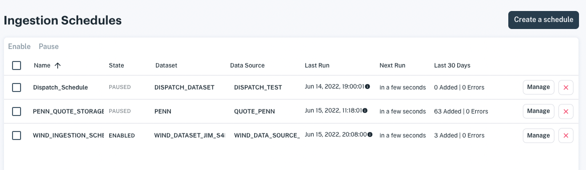
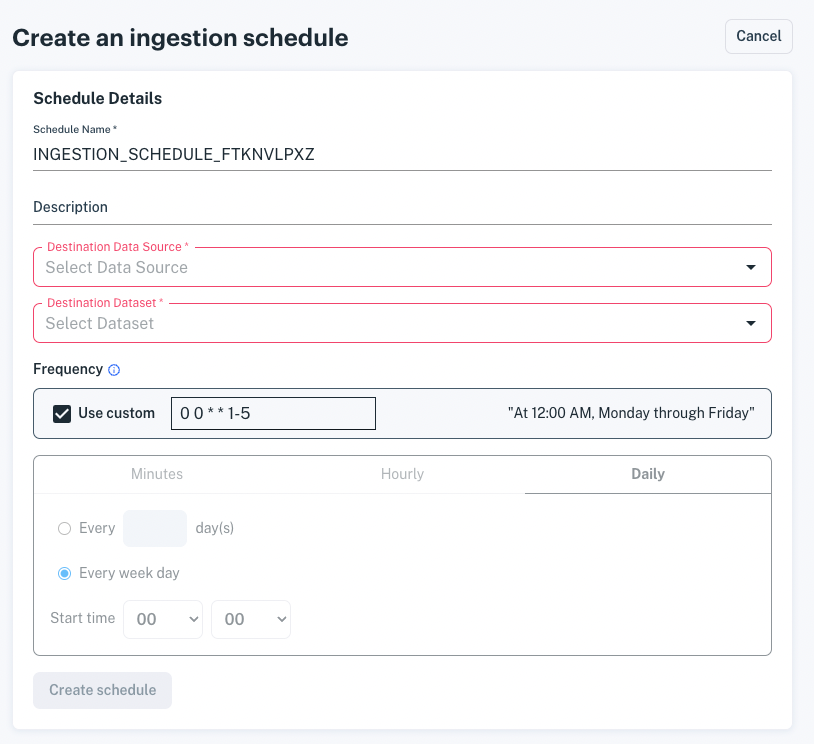

# Scheduling Data Ingestion

Apperate facilitates loading (ingesting) data into a dataset at regular intervals. Schedules are easy to set up, manage, and monitor. You can enable a schedule and disable/pause it as you like.

**Requirements**

- Source: AWS S3 bucket or URL
- Dataset: Provides the table and schema for storing and indexing the data.

```{tip}
You can create a data source automatically as your create a dataset. After you create the dataset, you can verify the data source on the Data Sources page by sorting the data sources on the **Last updated** column.
```

```{note}
**Coming soon!** Apperate will provide the ability to schedule data ingestions for a new dataset (and its data source) as you create the dataset.
```

## Configure Your Schedule

1. Go to **Schedules > Ingestions Schedules**.

    

    The Ingestion Schedules page appears.

    

1. Start creating an ingestion schedule by clicking **Create a schedule**. The **Create an ingestion schedule** page appears.

    

1. Specify the schedule details--you'll tackle the frequency in the next step.

    **Schedule Name:** A unique name for your schedule.

    **Description (optional):** Describe your scheduled ingestion.

    **Destination Data Source:** An existing data source. To browse your data sources, go to **Sources > Data Sources**.

    **Dataset:** The data destination. To browse your datasets, go to **Data** and select your workspace dropdown.

1. In the **Frequency** section, specify the start time and interval for data ingestion.

    You can specify the frequency using either of these ways:

    - Leave **Use custom** selected and specify the start time and frequency using cron notation. 
    
    - Unselect **Use custom** and specify the start time and frequency in the Minutes, Hour, or Daily tab.

    When you've completed entering the frequency, click **Create Schedule**.
    
    Your schedule is created and enabled. The **Ingestion Schedules** page appears with your schedule in the list.
    
    Here's what a schedule looks like in the list.

    

If your schedule has a start time, data ingestion starts then. Otherwise, the ingestion starts immediately.

Ingestions run per the interval specified in your schedule. The **Last Run** and **Next Run** values show the timestamp of the last data ingestion and the time remaining until the next data ingestion. The **Last 30 Days** column notes the dataset rows added and error count.

## Pausing Your Schedule

You can pause your schedule whenever you like. This disables further ingestions.

To pause ingestions for your schedule, select on your schedule in the list and click **Pause** at the top of the list.


```{important}
Pausing a schedule DOES NOT stop any current ingestion, it only disables upcoming ingestions.
``` 

```{note}
The **Ingestion Schedules** page continues to show the time until the next data ingestion for each schedule. This gives you context for enabling the schedules with regards to their upcoming ingestions.
```

## Re-enabling Your Schedule

To re-enable your ingestion schedule, select on your schedule in the list and click **Enable** at the top of the list. Your ingestions run per your schedule.


## What's Next

To create views, see [Creating and Managing Views](../managing-your-data/creating-and-managing-views.md).

If you want to understand schema indexing better, visit [Understanding Dataset Schemas](https://iexcloud.zendesk.com./5403333387667-Understanding-Dataset-Schemas).