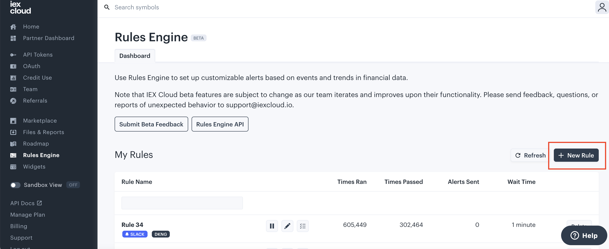

# Creating Rules and Sending Alerts

Getting started with Rules Engine is simple and requires minimal technical setup. 

To create a rule, log into your IEX Cloud Console and navigate to **Product &rarr; [Rules Engine](https://iexcloud.io/console/rules)**. The Rules Engine Dashboard will display all your existing rules. Rules can be paused, un-paused, created, edited, and deleted at any time. 

## Creating a Rule

Set up a new rule by clicking the “+ New Rule” button. 



**As the first step, specify the symbol(s) for which the rule should apply.** To have the rule apply to all available symbols, select the top option “Any Symbol.” 

**Customize the conditions for your rule.** Start by selecting the datapoint you want to monitor under “Topic,” such as “Next Earnings” or “PEG Ratio.” 

```{note} You can link together multiple conditions with “and” or “or” logic using the toggle in the header. You can also set conditions to compare two different data points by clicking “Use a data point,” such as the example below.  
```


**Choose your alert type.** Data can be delivered in multiple formats. Check out “Alert Types” below to learn more. 

**Give your rule a name, and you’re all set!** At the bottom left-hand corner, you’ll see the data weight for your rule, or how many messages will be used each time the alert is triggered.  

## Alert Types  

Use different Rules Engine alert types to get data where you need it and in different formats.  

**SMS:** Sends a single-sentence update via text message.  

**Email:** Delivers a data table with a set of values. 

**Webhook:** Delivers a JSON object payload. 

**Google Cloud Function:** Delivers a JSON object payload. 

**Save to logs:** Saves a JSON object to IEX Cloud’s servers, accessible via the IEX Cloud Console or via the logs API endpoint [here](https://iexcloud.io/docs/api/#get-log-output). 

**Mattermost:** Delivers a data table with a set of values. 

**Slack:** Delivers a data table with a set of values. 

## Additional Examples 

Get dividends for a stock delivered right to your email as soon as they’re available.  


Get intraday minute-by-minute prices sent via webhook throughout the day. 


Combine multiple datasets to get alerts when the market satisfies precise conditions. For instance, see when any symbol is trading below its 30-day average price, is undervalued by a P/B ratio below 1, has a market cap above 200M, and pays a dividend. 


Save end-of-day price files to logs on IEX Cloud whenever that symbol had a price change of over 5% from the previous trading day. This data will then be available to you throughout the future in one place.


As seen below, you can access logs to see saved data in the "edit" view of a given rule.


**Coming soon:** Combine equities data with other asset classes. For instance, find any symbol that is trading up above 2% when the dollar to euro exchange rate is also above 1%, the market is open, and it’s between 9:30 a.m. and 10:30 a.m. ET.   

## Other FAQs 

**Who can access Rules Engine?**
: Rules Engine is available in beta to all paid customers on IEX Cloud. Learn more about pricing for Rules Engine here. 

**Which symbols are available on Rules Engine?**
: Rules Engine currently supports U.S. stocks and ETFs. We are working on adding non-U.S. symbols in the future.  

**Can I use Rules Engine to download historical data?**
: Rules Engine cannot currently be used to download historical prices and values. As an alerting feature, Rules Engine is intended to alert you as future conditions are met. Learn more about how to download historical data in [Use IEX Cloud Core Financial Data](../../using-core-data.md). 