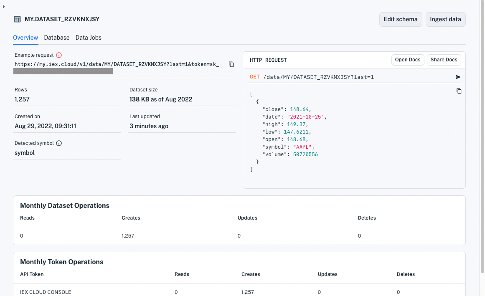

# Dataset Overview Page

The **Overview** page summarizes the dataset's characteristics, links to dataset management pages, and provides a means to share permissioned access to the dataset's API endpoint.

Here are the various parts of the overview.

## General Information

The following fields include an example request and general dataset details.

**Example request** is a clickable REST endpoint URL that returns the dataset's last row. It's a helpful starting point to base data queries on.

**Rows:** Row count

**Dataset size:** Storage space used by the dataset, including its indexes

**Created on:** Dataset creation timestamp

**Last updated:** Timestamp of last data modification 

**Detected symbol:** Dataset property mapped to IEX Cloud's symbolic metadata graph. This associates the property's values with equivalent [supported financial identifiers](../reference/financial-identifiers.md). See [Understanding Datasets](../managing-your-data/understanding-datasets.md) for complete details.

## Edit Schema

The **Edit schema** button opens a page for viewing and modifying the dataset and its schema.

## Ingest Data

The **Ingest data** button opens a page for loading additional data into the dataset from configured data sources.

## HTTP Request

The section's main area shows an example `GET /data` request and the resulting response. 

The top of the section has two buttons:

- **API Docs** opens the dataset's API documentation page.

- **Share Docs** opens a page for copying a shareable API docs URL, including a permissioned, public token for accessing the dataset's API.

## Monthly Dataset Operations

The **Monthly Dataset Operations** section lists the number of dataset record reads, writes, updates, and deletes.

## Monthly Token Operations

The **Monthly Token Operations** section aggregates the record reads, writes, updates, and deletes by API token.

## Delete Dataset

The **Delete Dataset** button enables you to remove the dataset.

## Related Topics

[Managing Your Data](../managing-your-data.md): These guides explain dataset schema fundamentals, creating views, and creating datasets via the  Datasets API.

[Search Data](../interacting-with-your-data.md): These articles show how to query data.