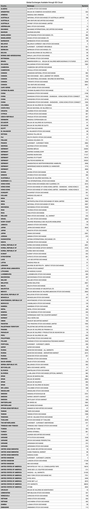

# Supported Stock Exchanges

IEX Cloud offers real-time {sup}`**`, 15-minute delayed, intraday, and historical prices for securities listed on U.S. equity exchanges. The platform also offers historical end-of-day stock prices for securities listed on non-U.S. exchanges.

## Current Exchange Coverage

Following our platform's expansion on December 1, 2020, the [**Historical Prices** endpoint](https://iexcloud.io/docs/core/HISTORICAL_PRICES) offers end-of-day historical prices from an even wider range of exchanges around the world. You can see a full list of these exchanges below, plus the approximate number of symbols that will be covered through our Historical Prices endpoint from each venue.

**Due to licensing requirements, we are not able to provide historical stock prices for certain non-U.S. exchanges.** These additional exchanges will still show up in our ref data, as we may serve data for symbols listed on those exchanges for other endpoints. See below for more details.

``` {note} The number of symbols available with each exchange below is subject to change and fluctuate.
```


 
## Partial Data Coverage from Other Exchanges

In addition to the exchanges listed above, for a handful of other non-U.S. exchanges, we have partial coverage across a limited number of endpoints and fields due to exchange-specific licensing requirements.

For instance, you may find data for a given symbol on our **Company** endpoint, but not see coverage for that symbol on our **Historical Prices** endpoint.

For this reason, the following exchanges and their symbols are still returned in our reference data. 

- Australian Stock Exchange (XASX)
- Bursa Malaysia (XKLS)
- Bucharest Stock Exchange (XBSE)
- Italian Stock Exchange (MTAA)
- Kazakhstan Stock Exchange (XKAZ)
- Moscow Exchange (MISX)
- NZX, New Zealand’s Exchange (XNZX)
- Philippine Stock Exchange Inc. (XPHS)
- Sarajevo Stock Exchange (XSSE)
- Singapore Exchange (XSES)
- Stock Exchange of Thailand (XBKK)
- Tokyo Stock Exchange (XJPX)
- Vienna Stock Exchange (XWBO)

{sup}`*` For Nasdaq-listed stocks only, certain data is only available through IEX Cloud if you are authorized by UTP directly, and also are under a paid plan with IEX Cloud. Learn more [here](../using-core-data/getting-nasdaq-listed-utp-otc-stock-data.md).

{sup}`**` Real-time data available through IEX Cloud is different from real-time data available from the Investors Exchange via direct connection.