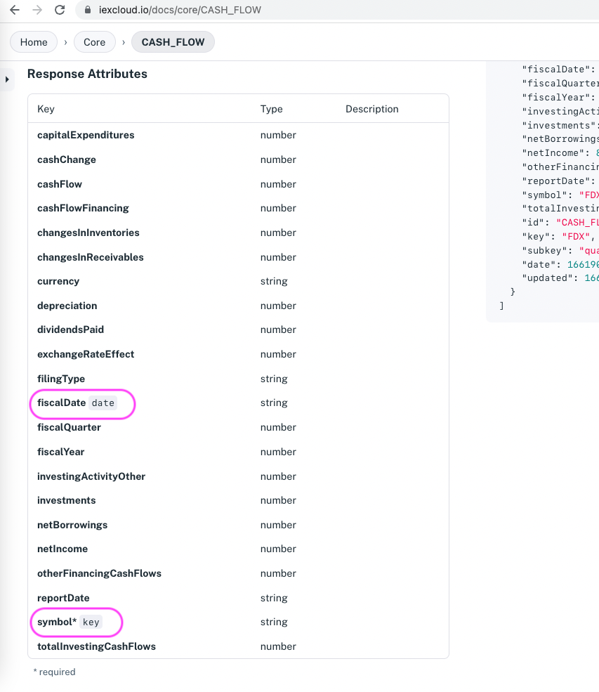

# Querying Datasets with iex.js

Use the [iexjs library](../developer-tools/iexjs-library.md) `queryDataset` method to search any Apperate [dataset](../reference/glossary.md#dataset) (Core or private) you have a [token](../administration/access-and-security.md) for. 

## Example: Searching a Dataset 

Once you've installed the [iexjs](../developer-tools/iexjs-library.md) package, instantiate a `Client` (passing in your API token and API version in place of `TOKEN` and `VERSION` below) and call `queryDataset` with the `key` (primary index), workspace, and dataset of the equity you want data for.

For example, if you want Apple cash flow records, pass in the Apple symbol `AAPL` for the `key`, `CORE` for the workspace, and `CASH_FLOW` for the dataset.

```javascript
const {Client} = require("@apperate/iexjs")
const client = new Client({api_token: "TOKEN", version: "VERSION"});
client.apperate.queryData({key: "AAPL", workspace: "CORE", id: "CASH_FLOW"}).then((res) => {
    console.log(res);
});
```

Like all Core datasets, the `CASH_FLOW` dataset is in the `CORE` workspace. The `CASH_FLOW` dataset's `key` property is `symbol`.

A dataset's API doc shows the `key`, `subkey` (if any), and `date` properties. For example, the image below highlights the `CASH_FLOW` dataset's `key` and `date` indexes in the <https://iexcloud.io/docs/core/CASH_FLOW> page's **Response Attributes** section.



You can fine-tune your search by specifying additional [`GET /data`](https://iexcloud.io/docs/apperate-apis/get-data) query parameters.

For example, you can limit results to a particular time range using the `from` and `to` query parameters.

```javascript
client.apperate.queryData({
    key: "AAPL", workspace: "CORE", id: "CASH_FLOW",
    from: "2019-01-01", to: "2019-07-01"}).then((res) => {
        console.log(res);
});
```

It's that easy to query datasets from your JavaScript apps!

## What's Next?

[iex.js Core Data Methods](../developer-tools/iexjs-library/iexjs-core-data-methods.md) provides a Core Financial Data reference for current plans and legacy plans.

[iex.js Apperate CRUD Methods](../developer-tools/iexjs-library/iexjs-apperate-crud-methods) references methods for invoking Apperate CRUD operations on data, datasets, and more.