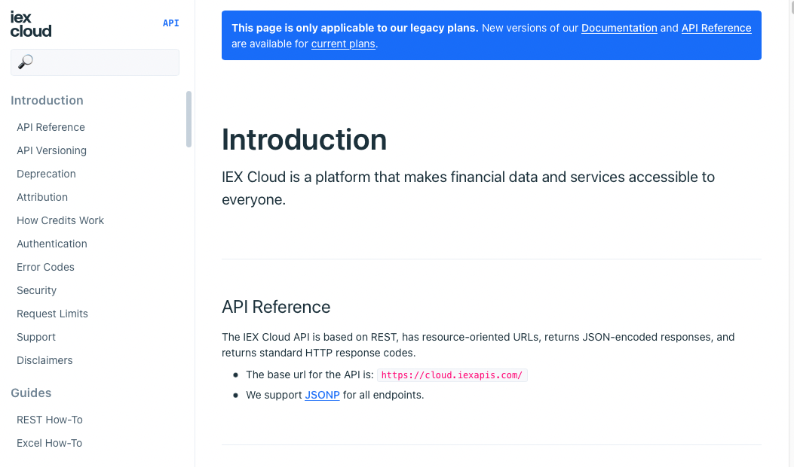
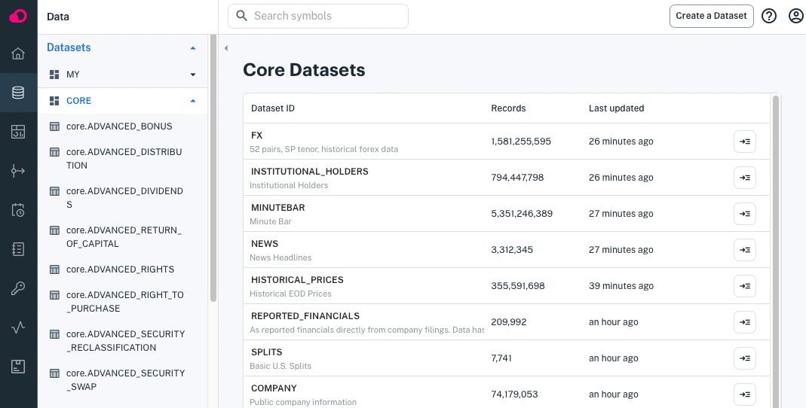

# Using Core Data

```{toctree}
:maxdepth: 1

using-core-data/getting-iex-cloud-financial-data.md
using-core-data/getting-core-time-series-financial-data.md
```

```{important} Apperate includes only historical time series Core Data at this time. We are in the process of migrating real-time IEX Cloud data, including stock quotes, into Apperate. In the meantime, please see the [Legacy API Reference](https://iexcloud.io/docs/api/) for the IEX Cloud real-time data.
```

[Current plans](https://iexcloud.io/pricing/) include Apperate's historical time series financial data and IEX Cloud's real-time financial data. Both types of data are described here.

##  IEX Cloud Financial Data

IEX Cloud provides real-time financial data. The [Legacy IEX Cloud API Reference](https://iexcloud.io/docs/api/) describes everything you need to get IEX Cloud real-time data.



Here's an overview of the site:

- [Introduction](https://iexcloud.io/docs/api/#introduction) - Covers API basics including how credits work, authentication, limits, support, and more.
- [Guides](https://iexcloud.io/docs/api/#guides) - Shows how to call REST endpoints and use the API in Microsoft Excel.
- [Developer Tools and Open Source](https://iexcloud.io/docs/api/#developer-tools-and-open-source) - Describes JavaScript and Python SDK libraries and a sandbox for testing API calls.
- [API Usage](https://iexcloud.io/docs/api/#api-usage) - Demonstrates using query parameters, querying time series data, making batch requests, streaming data, and more.
- [Rules Engine](https://iexcloud.io/docs/api/#rules-engine-beta) - Details configuring event-based notifications.
- [Account](https://iexcloud.io/docs/api/#account) - Provides service management information. 
- [API System Metadata](https://iexcloud.io/docs/api/#api-system-metadata) - Links to a live status dashboard and describes the status API.
- [Changelog](https://iexcloud.io/docs/api/#changelog) - Lists notable IEX Cloud data and software changes.
- [Core Data](https://iexcloud.io/docs/api/#core-data) - Describes REST API endpoints for all kinds of financial data, including these:

    - [Stocks / Equities](https://iexcloud.io/docs/api/#stocks-equities)
    - [News](https://iexcloud.io/docs/api/#news)
    - [Cryptocurrency](https://iexcloud.io/docs/api/#cryptocurrency)
    - [Forex / Currencies](https://iexcloud.io/docs/api/#forex-currencies)
    - [Options](https://iexcloud.io/docs/api/#options)
    - [Futures](https://iexcloud.io/docs/api/#futures)
    - [Treasuries](https://iexcloud.io/docs/api/#treasuries)
    - [Commodities](https://iexcloud.io/docs/api/#commodities)
    - [Economic Data](https://iexcloud.io/docs/api/#economic-data)
    - [Rates](https://iexcloud.io/docs/api/#rates)
    - [Mortgage](https://iexcloud.io/docs/api/#mortgage)
    - [Reference Data](https://iexcloud.io/docs/api/#reference-data)
    - [Investors Exchange Data](https://iexcloud.io/docs/api/#investors-exchange-data)

Each endpoint reference description includes the HTTP request structure, data weighting (for legacy subscriptions), data timing and schedule, data sources, examples, path/query parameters, and response attributes.

## Apperate Core Datasets

Apperate's built-in historical time series data is available as [datasets](./reference/glossary.md#dataset) (a.k.a. Core Datasets) that you can join with other datasets for creating views.
You can browse them in the console at [**Data > Datasets > Core**](https://iexcloud.io/console/datasets/core).



Each dataset's **Overview** page provides an example request URL that returns the dataset's last record. You can get a dataset's last record by clicking the **Example Request** URL.

For example, clicking on the **CORE.ADVANCED_BONUS** dataset's **Example Request** returns a record like this:

```javascript
[
    {
        "countryCode": "US",
        "created": "2022-02-01",
        "currency": "",
        "description": "Global X MSCI China Industrials ETF",
        "exDate": "2022-12-29",
        "figi": "BBG000PYH302",
        "flag": "",
        "fromFactor": 0,
        "lastUpdated": "2022-02-01",
        "notes": null,
        "parValue": 0,
        "parValueCurrency": "USD",
        "paymentDate": "2023-01-09",
        "recordDate": "2022-12-30",
        "refid": "2433108",
        "securityType": "Exchange Traded Fund",
        "symbol": "CHII",
        "toFactor": 0,
        "id": "ADVANCED_BONUS",
        "key": "CHII",
        "subkey": "2433108",
        "date": 1672272000000,
        "updated": 1652531939424.008
    }
]
```

Now you're familiar with the API references for the [real-time IEX Cloud financial data](https://iexcloud.io/docs/api/) and the [historical time-series financial data](https://iexcloud.io/docs).

## What's Next

If you want to get real-time IEX Cloud financial data, see [Getting IEX Cloud Financial Data](./using-core-data/getting-iex-cloud-financial-data.md).

If you're interested in historical time series data, check out [Getting Core Time Series Financial Data](./using-core-data/getting-core-time-series-financial-data.md).

If you need to store application data, learn how at [Writing and Fetching a Data Record](../getting-started/writing-and-fetching-a-record.md)